# Authentix DB Handbook (Tables + Storage + RLS + Usage)

Last updated: 2026-01-15  
Applies to: Supabase Postgres (public schema) + Supabase Storage bucket `authentix`

This handbook is meant to be **the single source of truth** for:
- what each table is for (and what *not* to use it for),
- how tables relate,
- how RLS/policies are intended to work,
- how Storage paths must be formed,
- which table to query for each UI screen (“query cookbook”),
- how categories/subcategories evolve over time (defaults + org overrides).

> **Important**: Authentix uses Supabase Auth for passwords, login sessions, email verification, password reset flows.  
> We **do not** store raw passwords in any public table.


---

## 0) Big picture: the system in 4 modules

1) **Identity & Tenant**  
   Organizations + members + roles + invitations + profiles.

2) **Templates**  
   Upload template file, generate preview, store template metadata.

3) **Generate & Issue Certificates**  
   Pick template → place fields → import recipients → generate → store certificates + verification artifacts.

4) **Deliver & Bill**  
   Send certificates via WhatsApp/email, track statuses, record usage, generate invoices.

---

## 1) Storage (Supabase bucket)

### Bucket
- **Bucket name**: `authentix` (private)
- **Root folders currently used/expected**:
  - `templates/`
  - `imports/`
  - `certificates/`
  - `bundles/`
  - `branding/`
  - `deliveries/` (optional attachments)
  - `invoices/` (PDF invoices)
  - `exports/` (bulk exports)
  - `profiles/` (avatars / user profile images)

> **Rule of thumb**: storage is **organization-scoped** except user avatars (user-scoped).

### Canonical rule: files are registered in DB
All uploaded objects must have a corresponding row in **`public.files`**:
- `files.bucket = 'authentix'`
- `files.path = <storage path>`
- `files.kind = enum` (template_source, template_preview, import_source, certificate_pdf, …)

Other tables reference `files.id`, not raw bucket/path.

### Path structure (final)
Common folders are top-level; org folder is one level below:

- **Templates**
  - `templates/<org_id>/<template_id>/source.<ext>`
  - `templates/<org_id>/<template_id>/preview.<ext>`
- **Imports**
  - `imports/<org_id>/<import_job_id>/source.<ext>`
- **Certificates**
  - `certificates/<org_id>/<certificate_id>/certificate.pdf`
  - `certificates/<org_id>/<certificate_id>/preview.png`
- **Bundles**
  - `bundles/<org_id>/<bundle_id>/certificates.zip`
- **Branding**
  - `branding/<org_id>/logo/<file_id>.<ext>`
  - `branding/<org_id>/signatures/<file_id>.<ext>`
  - `branding/<org_id>/stamps/<file_id>.<ext>`
- **Profiles (avatars)**
  - `profiles/<user_id>/avatar/<file_id>.<ext>`

✅ **Do**
- Always use these prefixes so `files_path_chk` & storage RLS work.
- Keep `<org_id>` and `<user_id>` as UUIDs.

❌ **Don’t**
- Don’t store “version folders” unless you explicitly support versioning UX.
  In Authentix requirement: templates are replaced by “upload new + delete old”, so version folders are **not needed**.

---

## 2) Entity Relationship Diagram (Mermaid)

```mermaid
erDiagram
  organizations ||--o{ organization_members : has
  profiles ||--o{ organization_members : joins
  organizations ||--o{ organization_roles : defines
  organization_roles ||--o{ role_permissions : grants
  organizations ||--o{ organization_invitations : invites

  industries ||--o{ organizations : classifies
  industries ||--o{ certificate_categories : provides

  certificate_categories ||--o{ certificate_subcategories : contains
  organizations ||--o{ organization_category_overrides : overrides
  organizations ||--o{ organization_subcategory_overrides : overrides

  organizations ||--o{ files : owns

  organizations ||--o{ certificate_templates : owns
  certificate_templates ||--o{ certificate_template_versions : versions
  certificate_template_versions ||--o{ certificate_template_fields : fields
  files ||--o{ certificate_template_versions : source_preview

  organizations ||--o{ file_import_jobs : owns
  file_import_jobs ||--o{ file_import_rows : rows
  files ||--o{ file_import_jobs : source_file

  organizations ||--o{ certificate_generation_jobs : owns
  certificate_generation_jobs ||--o{ generation_job_recipients : recipients
  certificate_generation_jobs ||--o{ generation_job_templates : used_templates

  certificate_generation_jobs ||--o{ certificates : produces
  certificate_templates ||--o{ certificates : used_for
  certificate_template_versions ||--o{ certificates : rendered_from
  files ||--o{ certificates : pdf_preview

  organizations ||--o{ delivery_integrations : has
  delivery_integrations ||--|| delivery_integration_secrets : stores_secrets
  organizations ||--o{ delivery_templates : uses
  organizations ||--o{ delivery_messages : sends
  delivery_messages ||--o{ delivery_message_items : includes
  delivery_provider_webhook_events }o--|| organizations : receives

  organizations ||--o{ billing_periods : bills
  billing_periods ||--o{ billing_usage_events : aggregates
  organizations ||--o{ billing_invoices : invoices
  billing_invoices ||--o{ billing_invoice_items : lines
```



---

## 3) Query Cookbook (which table/view for which screen)

### Auth & Onboarding
- **Signup / Login / Verification**: Supabase Auth (`auth.users`) + backend bootstrap.
- **Post-login bootstrap** (create org/membership/roles): writes to  
  `profiles`, `organizations`, `organization_roles`, `organization_members`, `app_audit_logs`.

### Dashboard home (stats)
- **Fast stats**: `dashboard_stats_cache` (precomputed)  
  fallback to counting:
  - templates: `certificate_templates` (non-deleted)
  - certificates: `certificates`
  - imports: `file_import_jobs`
  - verifications: `certificate_verification_events`

### Templates list page
Use **`v_templates_list`** (preferred) to avoid N+1 joins.
- Shows: title, status, category/subcategory names, latest preview path.
- Delete: soft delete in `certificate_templates` + cleanup `files` rows (and optionally storage objects).

### Template upload dialog
Write sequence:
1) Upload storage object(s) → create `files` rows (source + preview)  
2) Create `certificate_templates` row  
3) Create `certificate_template_versions` row  
4) Create `certificate_template_fields` rows (later, after designer)

### Generate certificate flow
- List selectable templates: `v_templates_list` filtered by status=active and deleted_at is null
- “Recently used” templates: derived from `certificate_generation_jobs` / `generation_job_templates`
- Field placement: reads/writes `certificate_template_fields` for the chosen `template_version_id`
- Import recipients:
  - create job: `file_import_jobs`
  - rows: `file_import_rows`
  - recipients normalization: `generation_job_recipients`
- Generate:
  - create `certificate_generation_jobs`
  - create `certificates`
  - store pdf/preview in `files`, link into `certificates`

### Certificate list
Use **`v_certificates_list`** (preferred) for display, plus filters.

### Certificate verification public page
Use **`v_certificate_verification`** (single view, no backend join logic).

### Delivery (email / WhatsApp) status UI
- Integration config list: `delivery_integrations` (non-deleted)
- Templates for delivery messages: `delivery_templates`
- Outbound queue/status: `delivery_messages` + `delivery_message_items`
- Webhook logs: `delivery_provider_webhook_events`

### Billing UI
- Current month pricing: `get_org_effective_pricing()` or `organization_pricing_overrides` + defaults in `organizations`
- Periods: `billing_periods`
- Usage: `billing_usage_events`
- Invoices: `billing_invoices` + `billing_invoice_items`
- Payments: `billing_orders`, `billing_payments`, `billing_refunds`
- Provider events: `billing_provider_events_safe` for UI, raw in `billing_provider_events`

---

## 4) Table-by-table reference (Purpose + Do/Don't)

Below are the **tables you will touch most often**.
For each table:
- **Purpose**
- **Stores**
- **Relations**
- ✅ Do
- ❌ Don’t

---

### organizations

**Purpose**: the tenant record (one org/company).

**Stores**
- Identity: `name`, `legal_name`, `email`, `phone`, address fields, `website_url`, `tax_id`, `gstin`
- Tenant identifiers: `application_id` (public-ish), `api_key_hash` (never store raw key)
- Certificate numbering: `certificate_prefix`, `certificate_seq`, `certificate_number_format`
- Billing baseline: `billing_status`, trial fields, default prices, invoice sequence fields
- Branding reference: `logo_file_id` (FK → `files`)
- Industry: `industry_id` (FK → `industries`)

**Relations**
- 1 org → many: templates, certificates, imports, deliveries, billing rows, files, members

✅ **Do**
- Generate `api_key_hash` server-side only (store hash, return raw key once to user).
- Use `industry_id` to drive default categories.
- Use `next_certificate_number()` RPC to avoid race conditions.

❌ **Don’t**
- Don’t expose `api_key_hash` or any secret fields to client.
- Don’t compute certificate numbers in frontend.

---

### profiles

**Purpose**: app-level user profile for an auth user (non-sensitive).

**Stores**
- `id` = auth uid
- `first_name`, `last_name`, `email`
- timestamps + soft delete

**Avatar**
- Storage: `profiles/<user_id>/avatar/<file_id>.<ext>`
- Future DB: add `profiles.avatar_file_id → files.id`

✅ **Do**
- Treat this as display/profile metadata only.

❌ **Don’t**
- Don’t store passwords or tokens here.

---

### organization_roles

**Purpose**: roles within an organization (owner/admin/member + custom roles).

**Stores**
- `organization_id`, `key`, `name`, `is_system` (seeded roles)

✅ **Do**
- Ensure `is_system` exists with default false; seed owner/admin/member with `true`.

❌ **Don’t**
- Don’t hardcode role IDs in code; look up by `key`.

---

### role_permissions

**Purpose**: permission matrix per role.

✅ **Do**
- Enforce permissions server-side for privileged actions.

❌ **Don’t**
- Don’t rely on frontend-only gating.

---

### organization_members

**Purpose**: membership mapping (user ↔ org) including role.

**Stores**
- `organization_id`, `user_id`, `role_id`, `status`, `username`

✅ **Do**
- Use this to derive the “current org” and enforce RLS membership checks.
- Use `status='active'` + `deleted_at is null` in checks.

❌ **Don’t**
- Don’t store role names here; join to `organization_roles`.

---

### organization_invitations

**Purpose**: invite flow to add members.

✅ **Do**
- Store only `token_hash` (never raw token).

---

### industries

**Purpose**: industry taxonomy.

✅ **Do**
- Keep global and stable.

---

### certificate_categories

**Purpose**: base categories (industry defaults) + optional org-defined categories.

**Stores**
- `industry_id` (required for base)
- `organization_id` (optional for org custom)
- `key`, `name`, `group_key`, `sort_order`

✅ **Do**
- Use `v_effective_categories` for UI.

❌ **Don’t**
- Don’t duplicate category names in templates; store IDs.

---

### certificate_subcategories

**Purpose**: base subcategories + optional org-defined subcategories.

✅ **Do**
- Use `v_effective_subcategories` for UI.

---

### organization_category_overrides

**Purpose**: org rename/hide/reorder of base categories.

✅ **Do**
- Use overrides instead of editing base categories.

---

### organization_subcategory_overrides

**Purpose**: org rename/hide/reorder of base subcategories.

---

### certificate_templates

**Purpose**: one uploaded design record.

✅ **Do**
- After successful upload, set `status='active'`.

❌ **Don’t**
- Don’t implement reupload/version UX unless product adds it.

---

### certificate_template_versions

**Purpose**: technical version artifact pointer.

✅ **Do**
- Keep version table even if UX doesn’t show versions.

---

### certificate_template_fields

**Purpose**: field placements for designer & generation.

---

### files

**Purpose**: canonical registry for storage objects.

✅ **Do**
- Enforce path rules; never store signed URLs.

---

### file_import_jobs / file_import_rows

**Purpose**: import source and parsed rows.

✅ **Do**
- Use `files.original_name` rather than adding file_name columns.

---

### certificate_generation_jobs / generation_job_templates / generation_job_recipients

**Purpose**: capture generation runs and allow “recently used templates”.

---

### certificates / certificate_verification_events

**Purpose**: issued certificates + verification analytics.

---

### delivery_* tables

**Purpose**: provider config, templates, messages, webhook logs.

---

### app_audit_logs / dashboard_stats_cache

**Purpose**: audit + fast dashboard.

---

### billing_* tables

**Purpose**: pricing, periods, usage, invoices, payments.

---

## 5) RLS & Security model (high level)

- Most org-owned tables should allow access only to authenticated users who are active org members.
- Secrets are never exposed client-side.

---

## 6) Category/Subcategory future plan

✅ **Do**
- Keep base categories per industry.
- Apply org overrides for naming/hiding/reordering.
- If adding org-defined categories later, insert into base tables with `organization_id=<org>`.

❌ **Don’t**
- Don’t hardcode categories in frontend.

---

## Appendix A — Complete DB snapshot (verbatim)

The following section is the raw extracted DB inventory you provided:

```markdown
# AUTHENTIX DATABASE + STORAGE DOCUMENTATION (COMPLETE)

Last updated: 2026-01-15
Sources:
- Supabase Snippet All tables + columns (types, defaults, nullable, identity, generated, comments).csv
- Supabase Snippet Constraints (PK _ UK _ FK _ CHECK) + full definitions.csv
- Supabase Snippet Foreign Key Relationships Overview.csv
- Supabase Snippet Indexes (btree_gin_gist, unique, partial, expressions).csv
- Supabase Snippet RLS status + all policies per table.csv
- Supabase Snippet Row-Level Security Policies for storage.objects.csv
- Supabase Snippet Functions_RPC (SQL + PL_pgSQL) + source code.csv
- Supabase Snippet Triggers and Function Definitions.csv
- Supabase Snippet Storage schema constraints and triggers.csv
- Supabase Snippet Views + definitions.csv
- Supabase Snippet List of storage buckets.csv
- Supabase Snippet Basic context (schemas, extensions, enums).csv

## Overview
- Schemas (non-system): 6
- Tables: 82
- Views: 11
- Functions: 227
- Indexes: 246
- Constraints: 291
- Policies: 51
- Triggers: 30

Note: System schemas (pg_toast, pg_catalog, information_schema) are excluded for readability.

## Schemas summary
| Schema | Tables | Views | Functions | Policies | Indexes | Constraints |
| --- | --- | --- | --- | --- | --- | --- |
| auth | 20 | 0 | 4 | 0 | 75 | 68 |
| extensions | 0 | 4 | 67 | 0 | 0 | 0 |
| public | 42 | 6 | 110 | 43 | 128 | 196 |
| realtime | 10 | 0 | 12 | 0 | 20 | 10 |
| storage | 9 | 0 | 29 | 8 | 21 | 16 |
| vault | 1 | 1 | 5 | 0 | 2 | 1 |

## Storage
### Bucket: authentix
- id: authentix
- name: authentix
- public: false
- file_size_limit: 52428800 bytes
- allowed_mime_types: ["application/pdf","text/csv","application/zip","application/json","application/vnd.ms-excel","application/vnd.openxmlformats-officedocument.spreadsheetml.sheet","application/vnd.openxmlformats-officedocument.wordprocessingml.document","application/vnd.openxmlformats-officedocument.presentationml.presentation","image/png","image/jpeg","image/webp","image/gif","image/svg+xml","image/heic","image/heif","image/tiff","image/bmp","image/avif"]
- created_at: 2026-01-11 10:39:04.502872+00
- updated_at: 2026-01-11 10:39:04.502872+00

### Storage folder roots (from policies)
- certificate_templates
- certificates
- deliveries
- exports
- file_imports
- invoices
- org_branding

### Storage objects policies
| Policy | Command | Roles | Permissive | Using | With check |
| --- | --- | --- | --- | --- | --- |
| authentix_delete | DELETE | {authenticated} | PERMISSIVE | ((bucket_id = 'authentix'::text) AND (auth.role() = 'authenticated'::text) AND CASE     WHEN (name ~ '^(org_branding\|certificate_templates\|file_imports\|certificates\|exports\|deliveries\|invoices)/([0-9a-fA-F-]{36})/'::text) THEN is_member_of_org(((regexp_match(name, '^(org_branding\|certificate_templates\|file_imports\|certificates\|exports\|deliveries\|invoices)/([0-9a-fA-F-]{36})/'::text))[2])::uuid)     ELSE false END) |  |
| authentix_insert | INSERT | {authenticated} | PERMISSIVE |  | ((bucket_id = 'authentix'::text) AND (auth.role() = 'authenticated'::text) AND CASE     WHEN (name ~ '^(org_branding\|certificate_templates\|file_imports\|certificates\|exports\|deliveries\|invoices)/([0-9a-fA-F-]{36})/'::text) THEN is_member_of_org(((regexp_match(name, '^(org_branding\|certificate_templates\|file_imports\|certificates\|exports\|deliveries\|invoices)/([0-9a-fA-F-]{36})/'::text))[2])::uuid)     ELSE false END) |
| authentix_read | SELECT | {authenticated} | PERMISSIVE | ((bucket_id = 'authentix'::text) AND (auth.role() = 'authenticated'::text) AND CASE     WHEN (name ~ '^(org_branding\|certificate_templates\|file_imports\|certificates\|exports\|deliveries\|invoices)/([0-9a-fA-F-]{36})/'::text) THEN is_member_of_org(((regexp_match(name, '^(org_branding\|certificate_templates\|file_imports\|certificates\|exports\|deliveries\|invoices)/([0-9a-fA-F-]{36})/'::text))[2])::uuid)     ELSE false END) |  |
| authentix_update | UPDATE | {authenticated} | PERMISSIVE | ((bucket_id = 'authentix'::text) AND (auth.role() = 'authenticated'::text) AND CASE     WHEN (name ~ '^(org_branding\|certificate_templates\|file_imports\|certificates\|exports\|deliveries\|invoices)/([0-9a-fA-F-]{36})/'::text) THEN is_member_of_org(((regexp_match(name, '^(org_branding\|certificate_templates\|file_imports\|certificates\|exports\|deliveries\|invoices)/([0-9a-fA-F-]{36})/'::text))[2])::uuid)     ELSE false END) | ((bucket_id = 'authentix'::text) AND (auth.role() = 'authenticated'::text) AND CASE     WHEN (name ~ '^(org_branding\|certificate_templates\|file_imports\|certificates\|exports\|deliveries\|invoices)/([0-9a-fA-F-]{36})/'::text) THEN is_member_of_org(((regexp_match(name, '^(org_branding\|certificate_templates\|file_imports\|certificates\|exports\|deliveries\|invoices)/([0-9a-fA-F-]{36})/'::text))[2])::uuid)     ELSE false END) |

### Storage triggers
| Schema | Table | Trigger | Definition |
| --- | --- | --- | --- |
| storage | buckets | enforce_bucket_name_length_trigger | CREATE TRIGGER enforce_bucket_name_length_trigger BEFORE INSERT OR UPDATE OF name ON storage.buckets FOR EACH ROW EXECUTE FUNCTION storage.enforce_bucket_name_length() |
| storage | objects | objects_delete_delete_prefix | CREATE TRIGGER objects_delete_delete_prefix AFTER DELETE ON storage.objects FOR EACH ROW EXECUTE FUNCTION storage.delete_prefix_hierarchy_trigger() |
| storage | objects | objects_insert_create_prefix | CREATE TRIGGER objects_insert_create_prefix BEFORE INSERT ON storage.objects FOR EACH ROW EXECUTE FUNCTION storage.objects_insert_prefix_trigger() |
| storage | objects | objects_update_create_prefix | CREATE TRIGGER objects_update_create_prefix BEFORE UPDATE ON storage.objects FOR EACH ROW WHEN (new.name <> old.name OR new.bucket_id <> old.bucket_id) EXECUTE FUNCTION storage.objects_update_prefix_trigger() |
| storage | objects | update_objects_updated_at | CREATE TRIGGER update_objects_updated_at BEFORE UPDATE ON storage.objects FOR EACH ROW EXECUTE FUNCTION storage.update_updated_at_column() |
| storage | prefixes | prefixes_create_hierarchy | CREATE TRIGGER prefixes_create_hierarchy BEFORE INSERT ON storage.prefixes FOR EACH ROW WHEN (pg_trigger_depth() < 1) EXECUTE FUNCTION storage.prefixes_insert_trigger() |
| storage | prefixes | prefixes_delete_hierarchy | CREATE TRIGGER prefixes_delete_hierarchy AFTER DELETE ON storage.prefixes FOR EACH ROW EXECUTE FUNCTION storage.delete_prefix_hierarchy_trigger() |

## Enums
### auth
- aal_level: aal1, aal2, aal3
- code_challenge_method: s256, plain
- factor_status: unverified, verified
- factor_type: totp, webauthn, phone
- oauth_authorization_status: pending, approved, denied, expired
- oauth_client_type: public, confidential
- oauth_registration_type: dynamic, manual
- oauth_response_type: code
- one_time_token_type: confirmation_token, reauthentication_token, recovery_token, email_change_token_new, email_change_token_current, phone_change_token

### public
- billing_invoice_status: draft, issued, paid, partially_paid, void, expired, refunded
- billing_line_item_type: platform_fee, certificate_usage, adjustment
- billing_order_status: created, paid, attempted, failed, cancelled
- billing_payment_status: created, authorized, captured, failed, refunded
- billing_period_status: open, locked, invoiced, paid, void
- billing_provider: razorpay
- billing_refund_status: created, processed, failed
- certificate_status: issued, expired, revoked, reissued
- delivery_channel: email, whatsapp
- delivery_secret_type: whatsapp_access_token, whatsapp_webhook_verify_token, smtp_password, email_api_key
- delivery_status: queued, sent, delivered, read, failed
- file_kind: template_source, template_preview, import_source, certificate_pdf, certificate_preview, zip_bundle, org_logo, other
- import_status: queued, processing, completed, failed
- invite_status: pending, accepted, expired, revoked
- job_status: queued, running, completed, failed, cancelled
- member_status: invited, active, suspended
- organization_billing_status: trialing, active, past_due, disabled
- provider_event_status: received, verified, processed, ignored, failed
- template_field_type: text, date, qrcode, custom
- template_status: draft, active, archived

### realtime
- action: INSERT, UPDATE, DELETE, TRUNCATE, ERROR
- equality_op: eq, neq, lt, lte, gt, gte, in

### storage
- buckettype: STANDARD, ANALYTICS, VECTOR

## Views
### extensions
#### hypopg_hidden_indexes
Definition:
```sql
SELECT h.indexid AS indexrelid,
    i.relname AS index_name,
    n.nspname AS schema_name,
    t.relname AS table_name,
    m.amname AS am_name,
    false AS is_hypo
   FROM (((((hypopg_hidden_indexes() h(indexid)
     JOIN pg_index x ON ((x.indexrelid = h.indexid)))
     JOIN pg_class i ON ((i.oid = h.indexid)))
     JOIN pg_namespace n ON ((n.oid = i.relnamespace)))
     JOIN pg_class t ON ((t.oid = x.indrelid)))
     JOIN pg_am m ON ((m.oid = i.relam)))
UNION ALL
 SELECT hl.indexrelid,
    hl.index_name,
    hl.schema_name,
    hl.table_name,
    hl.am_name,
    true AS is_hypo
   FROM (hypopg_hidden_indexes() hi(indexid)
     JOIN hypopg_list_indexes hl ON ((hl.indexrelid = hi.indexid)))
  ORDER BY 2;
```
#### hypopg_list_indexes
Definition:
```sql
SELECT h.indexrelid,
    h.indexname AS index_name,
    n.nspname AS schema_name,
    COALESCE(c.relname, '<dropped>'::name) AS table_name,
    am.amname AS am_name
   FROM (((hypopg() h(indexname, indexrelid, indrelid, innatts, indisunique, indkey, indcollation, indclass, indoption, indexprs, indpred, amid)
     LEFT JOIN pg_class c ON ((c.oid = h.indrelid)))
     LEFT JOIN pg_namespace n ON ((n.oid = c.relnamespace)))
     LEFT JOIN pg_am am ON ((am.oid = h.amid)));
```
#### pg_stat_statements
Definition:
```sql
SELECT userid,
    dbid,
    toplevel,
    queryid,
    query,
    plans,
    total_plan_time,
    min_plan_time,
    max_plan_time,
    mean_plan_time,
    stddev_plan_time,
    calls,
    total_exec_time,
    min_exec_time,
    max_exec_time,
    mean_exec_time,
    stddev_exec_time,
    rows,
    shared_blks_hit,
    shared_blks_read,
    shared_blks_dirtied,
    shared_blks_written,
    local_blks_hit,
    local_blks_read,
    local_blks_dirtied,
    local_blks_written,
    temp_blks_read,
    temp_blks_written,
    shared_blk_read_time,
    shared_blk_write_time,
    local_blk_read_time,
    local_blk_write_time,
    temp_blk_read_time,
    temp_blk_write_time,
    wal_records,
    wal_fpi,
    wal_bytes,
    jit_functions,
    jit_generation_time,
    jit_inlining_count,
    jit_inlining_time,
    jit_optimization_count,
    jit_optimization_time,
    jit_emission_count,
    jit_emission_time,
    jit_deform_count,
    jit_deform_time,
    stats_since,
    minmax_stats_since
   FROM pg_stat_statements(true) pg_stat_statements(userid, dbid, toplevel, queryid, query, plans, total_plan_time, min_plan_time, max_plan_time, mean_plan_time, stddev_plan_time, calls, total_exec_time, min_exec_time, max_exec_time, mean_exec_time, stddev_exec_time, rows, shared_blks_hit, shared_blks_read, shared_blks_dirtied, shared_blks_written, local_blks_hit, local_blks_read, local_blks_dirtied, local_blks_written, temp_blks_read, temp_blks_written, shared_blk_read_time, shared_blk_write_time, local_blk_read_time, local_blk_write_time, temp_blk_read_time, temp_blk_write_time, wal_records, wal_fpi, wal_bytes, jit_functions, jit_generation_time, jit_inlining_count, jit_inlining_time, jit_optimization_count, jit_optimization_time, jit_emission_count, jit_emission_time, jit_deform_count, jit_deform_time, stats_since, minmax_stats_since);
```
#### pg_stat_statements_info
Definition:
```sql
SELECT dealloc,
    stats_reset
   FROM pg_stat_statements_info() pg_stat_statements_info(dealloc, stats_reset);
```

### public
#### billing_provider_events_safe
Definition:
```sql
SELECT id,
    provider,
    event_name,
    status,
    received_at,
    processed_at,
    processing_error,
    organization_id,
    razorpay_order_id,
    razorpay_payment_id,
    razorpay_refund_id,
    is_signature_valid
   FROM billing_provider_events;
```
#### v_certificate_verification
Definition:
```sql
SELECT cert.id AS certificate_id,
    cert.organization_id,
    org.name AS organization_name,
    org.slug AS organization_slug,
    org.website_url,
    org.logo_file_id,
    lf.bucket AS logo_bucket,
    lf.path AS logo_path,
    cert.certificate_number,
    cert.status,
    cert.issued_at,
    cert.expires_at,
    cert.revoked_at,
    cert.revoked_reason,
    cert.recipient_name,
    cert.recipient_email,
    cert.recipient_phone,
    cat.name AS category_name,
    sub.name AS subcategory_name,
    cert.certificate_preview_file_id,
    pf.bucket AS preview_bucket,
    pf.path AS preview_path,
    cert.verification_path,
    cert.qr_payload_url,
    cert.verification_token_hash
   FROM (((((certificates cert
     JOIN organizations org ON ((org.id = cert.organization_id)))
     JOIN certificate_categories cat ON ((cat.id = cert.category_id)))
     JOIN certificate_subcategories sub ON ((sub.id = cert.subcategory_id)))
     LEFT JOIN files lf ON ((lf.id = org.logo_file_id)))
     LEFT JOIN files pf ON ((pf.id = cert.certificate_preview_file_id)));
```
#### v_certificates_list
Definition:
```sql
SELECT cert.id AS certificate_id,
    cert.organization_id,
    cert.certificate_number,
    cert.status,
    cert.issued_at,
    cert.expires_at,
    cert.revoked_at,
    cert.revoked_reason,
    cert.recipient_name,
    cert.recipient_email,
    cert.recipient_phone,
    cert.category_id,
    cat.name AS category_name,
    cert.subcategory_id,
    sub.name AS subcategory_name,
    cert.template_id,
    t.title AS template_title,
    cert.template_version_id,
    cert.certificate_file_id,
    f1.bucket AS certificate_bucket,
    f1.path AS certificate_path,
    cert.certificate_preview_file_id,
    f2.bucket AS preview_bucket,
    f2.path AS preview_path,
    cert.verification_path,
    cert.qr_payload_url,
    cert.created_at
   FROM (((((certificates cert
     JOIN certificate_categories cat ON ((cat.id = cert.category_id)))
     JOIN certificate_subcategories sub ON ((sub.id = cert.subcategory_id)))
     JOIN certificate_templates t ON ((t.id = cert.template_id)))
     LEFT JOIN files f1 ON ((f1.id = cert.certificate_file_id)))
     LEFT JOIN files f2 ON ((f2.id = cert.certificate_preview_file_id)));
```
#### v_effective_categories
Definition:
```sql
SELECT o.id AS organization_id,
    c.id AS category_id,
    c.key,
    COALESCE(oc.name_override, c.name) AS name,
    c.group_key,
    COALESCE(oc.sort_order, c.sort_order) AS sort_order,
    (c.organization_id IS NOT NULL) AS is_org_custom,
    COALESCE(oc.is_hidden, false) AS is_hidden
   FROM ((organizations o
     JOIN certificate_categories c ON ((((c.organization_id IS NULL) AND (c.industry_id = o.industry_id)) OR (c.organization_id = o.id))))
     LEFT JOIN organization_category_overrides oc ON (((oc.organization_id = o.id) AND (oc.base_category_id = c.id))))
  WHERE (COALESCE(oc.is_hidden, false) = false);
```
#### v_effective_subcategories
Definition:
```sql
SELECT o.id AS organization_id,
    s.id AS subcategory_id,
    s.category_id,
    s.key,
    COALESCE(os.name_override, s.name) AS name,
    COALESCE(os.sort_order, s.sort_order) AS sort_order,
    (s.organization_id IS NOT NULL) AS is_org_custom,
    COALESCE(os.is_hidden, false) AS is_hidden
   FROM ((organizations o
     JOIN certificate_subcategories s ON (((s.organization_id IS NULL) OR (s.organization_id = o.id))))
     LEFT JOIN organization_subcategory_overrides os ON (((os.organization_id = o.id) AND (os.base_subcategory_id = s.id))))
  WHERE ((s.deleted_at IS NULL) AND (COALESCE(os.is_hidden, false) = false));
```
#### v_templates_list
Definition:
```sql
SELECT t.id AS template_id,
    t.organization_id,
    t.title,
    t.status,
    t.created_at,
    t.updated_at,
    t.category_id,
    c.name AS category_name,
    t.subcategory_id,
    s.name AS subcategory_name,
    t.latest_version_id,
    v.version_number AS latest_version_number,
    v.page_count AS latest_page_count,
    v.source_file_id AS latest_source_file_id,
    v.preview_file_id AS latest_preview_file_id,
    f.bucket AS preview_bucket,
    f.path AS preview_path
   FROM ((((certificate_templates t
     JOIN certificate_categories c ON ((c.id = t.category_id)))
     JOIN certificate_subcategories s ON ((s.id = t.subcategory_id)))
     LEFT JOIN certificate_template_versions v ON ((v.id = t.latest_version_id)))
     LEFT JOIN files f ON ((f.id = v.preview_file_id)));
```

### vault
#### decrypted_secrets
Definition:
```sql
SELECT id,
    name,
    description,
    secret,
    convert_from(vault._crypto_aead_det_decrypt(message => decode(secret, 'base64'::text), additional => convert_to((id)::text, 'utf8'::name), key_id => (0)::bigint, context => '\x7067736f6469756d'::bytea, nonce => nonce), 'utf8'::name) AS decrypted_secret,
    key_id,
    nonce,
    created_at,
    updated_at
   FROM vault.secrets s;
```

## Schema map (foreign keys)
- auth.identities(user_id) -> auth.users(id) (N:1)
- auth.mfa_amr_claims(session_id) -> auth.sessions(id) (N:1)
- auth.mfa_challenges(factor_id) -> auth.mfa_factors(id) (N:1)
- auth.mfa_factors(user_id) -> auth.users(id) (N:1)
- auth.oauth_authorizations(client_id) -> auth.oauth_clients(id) (N:1)
- auth.oauth_authorizations(user_id) -> auth.users(id) (N:1)
- auth.oauth_consents(client_id) -> auth.oauth_clients(id) (N:1)
- auth.oauth_consents(user_id) -> auth.users(id) (N:1)
- auth.one_time_tokens(user_id) -> auth.users(id) (N:1)
- auth.refresh_tokens(session_id) -> auth.sessions(id) (N:1)
- auth.saml_providers(sso_provider_id) -> auth.sso_providers(id) (N:1)
- auth.saml_relay_states(flow_state_id) -> auth.flow_state(id) (N:1)
- auth.saml_relay_states(sso_provider_id) -> auth.sso_providers(id) (N:1)
- auth.sessions(oauth_client_id) -> auth.oauth_clients(id) (N:1)
- auth.sessions(user_id) -> auth.users(id) (N:1)
- auth.sso_domains(sso_provider_id) -> auth.sso_providers(id) (N:1)
- public.app_audit_logs(actor_user_id) -> public.profiles(id) (N:1)
- public.app_audit_logs(organization_id) -> public.organizations(id) (N:1)
- public.billing_credits_debits(applied_to_invoice_id) -> public.billing_invoices(id) (N:1)
- public.billing_credits_debits(organization_id) -> public.organizations(id) (N:1)
- public.billing_invoice_items(invoice_id) -> public.billing_invoices(id) (N:1)
- public.billing_invoices(organization_id) -> public.organizations(id) (N:1)
- public.billing_invoices(pdf_file_id) -> public.files(id) (N:1)
- public.billing_invoices(period_id) -> public.billing_periods(id) (N:1)
- public.billing_orders(invoice_id) -> public.billing_invoices(id) (N:1)
- public.billing_orders(organization_id) -> public.organizations(id) (N:1)
- public.billing_payments(invoice_id) -> public.billing_invoices(id) (N:1)
- public.billing_payments(organization_id) -> public.organizations(id) (N:1)
- public.billing_periods(organization_id) -> public.organizations(id) (N:1)
- public.billing_provider_events(organization_id) -> public.organizations(id) (N:1)
- public.billing_refunds(organization_id) -> public.organizations(id) (N:1)
- public.billing_usage_events(certificate_id) -> public.certificates(id) (N:1)
- public.billing_usage_events(organization_id) -> public.organizations(id) (N:1)
- public.billing_usage_events(period_id) -> public.billing_periods(id) (N:1)
- public.certificate_categories(industry_id) -> public.industries(id) (N:1)
- public.certificate_categories(organization_id) -> public.organizations(id) (N:1)
- public.certificate_generation_jobs(organization_id) -> public.organizations(id) (N:1)
- public.certificate_generation_jobs(requested_by_user_id) -> public.profiles(id) (N:1)
- public.certificate_subcategories(category_id) -> public.certificate_categories(id) (N:1)
- public.certificate_subcategories(organization_id) -> public.organizations(id) (N:1)
- public.certificate_template_fields(template_version_id) -> public.certificate_template_versions(id) (N:1)
- public.certificate_template_versions(created_by_user_id) -> public.profiles(id) (N:1)
- public.certificate_template_versions(preview_file_id) -> public.files(id) (N:1)
- public.certificate_template_versions(source_file_id) -> public.files(id) (N:1)
- public.certificate_template_versions(template_id) -> public.certificate_templates(id) (N:1)
- public.certificate_templates(category_id) -> public.certificate_categories(id) (N:1)
- public.certificate_templates(created_by_user_id) -> public.profiles(id) (N:1)
- public.certificate_templates(latest_version_id) -> public.certificate_template_versions(id) (N:1)
- public.certificate_templates(organization_id) -> public.organizations(id) (N:1)
- public.certificate_templates(subcategory_id) -> public.certificate_subcategories(id) (N:1)
- public.certificate_verification_events(certificate_id) -> public.certificates(id) (N:1)
- public.certificate_verification_events(organization_id) -> public.organizations(id) (N:1)
- public.certificates(category_id) -> public.certificate_categories(id) (N:1)
- public.certificates(certificate_file_id) -> public.files(id) (N:1)
- public.certificates(certificate_preview_file_id) -> public.files(id) (N:1)
- public.certificates(generation_job_id) -> public.certificate_generation_jobs(id) (N:1)
- public.certificates(organization_id) -> public.organizations(id) (N:1)
- public.certificates(reissued_from_certificate_id) -> public.certificates(id) (N:1)
- public.certificates(revoked_by_user_id) -> public.profiles(id) (N:1)
- public.certificates(subcategory_id) -> public.certificate_subcategories(id) (N:1)
- public.certificates(template_id) -> public.certificate_templates(id) (N:1)
- public.certificates(template_version_id) -> public.certificate_template_versions(id) (N:1)
- public.dashboard_stats_cache(organization_id) -> public.organizations(id) (N:1)
- public.delivery_integration_secrets(integration_id) -> public.delivery_integrations(id) (N:1)
- public.delivery_integrations(created_by) -> auth.users(id) (N:1)
- public.delivery_integrations(organization_id) -> public.organizations(id) (N:1)
- public.delivery_message_items(attachment_file_id) -> public.files(id) (N:1)
- public.delivery_message_items(certificate_id) -> public.certificates(id) (N:1)
- public.delivery_message_items(message_id) -> public.delivery_messages(id) (N:1)
- public.delivery_messages(generation_job_id) -> public.certificate_generation_jobs(id) (N:1)
- public.delivery_messages(organization_id) -> public.organizations(id) (N:1)
- public.delivery_messages(recipient_id) -> public.generation_job_recipients(id) (N:1)
- public.delivery_provider_webhook_events(organization_id) -> public.organizations(id) (N:1)
- public.delivery_templates(organization_id) -> public.organizations(id) (N:1)
- public.file_import_jobs(category_id) -> public.certificate_categories(id) (N:1)
- public.file_import_jobs(created_by_user_id) -> public.profiles(id) (N:1)
- public.file_import_jobs(organization_id) -> public.organizations(id) (N:1)
- public.file_import_jobs(source_file_id) -> public.files(id) (N:1)
- public.file_import_jobs(subcategory_id) -> public.certificate_subcategories(id) (N:1)
- public.file_import_jobs(template_id) -> public.certificate_templates(id) (N:1)
- public.file_import_jobs(template_version_id) -> public.certificate_template_versions(id) (N:1)
- public.file_import_rows(import_job_id) -> public.file_import_jobs(id) (N:1)
- public.files(created_by_user_id) -> public.profiles(id) (N:1)
- public.files(organization_id) -> public.organizations(id) (N:1)
- public.generation_job_recipients(job_id) -> public.certificate_generation_jobs(id) (N:1)
- public.generation_job_templates(category_id) -> public.certificate_categories(id) (N:1)
- public.generation_job_templates(job_id) -> public.certificate_generation_jobs(id) (N:1)
- public.generation_job_templates(subcategory_id) -> public.certificate_subcategories(id) (N:1)
- public.generation_job_templates(template_id) -> public.certificate_templates(id) (N:1)
- public.generation_job_templates(template_version_id) -> public.certificate_template_versions(id) (N:1)
- public.organization_category_overrides(base_category_id) -> public.certificate_categories(id) (N:1)
- public.organization_category_overrides(organization_id) -> public.organizations(id) (N:1)
- public.organization_invitations(invited_by_user_id) -> public.profiles(id) (N:1)
- public.organization_invitations(organization_id) -> public.organizations(id) (N:1)
- public.organization_invitations(role_id) -> public.organization_roles(id) (N:1)
- public.organization_members(organization_id) -> public.organizations(id) (N:1)
- public.organization_members(role_id) -> public.organization_roles(id) (N:1)
- public.organization_members(user_id) -> public.profiles(id) (N:1)
- public.organization_pricing_overrides(organization_id) -> public.organizations(id) (N:1)
- public.organization_roles(organization_id) -> public.organizations(id) (N:1)
- public.organization_subcategory_overrides(base_subcategory_id) -> public.certificate_subcategories(id) (N:1)
- public.organization_subcategory_overrides(organization_id) -> public.organizations(id) (N:1)
- public.organizations(industry_id) -> public.industries(id) (N:1)
- public.profiles(id) -> auth.users(id) (N:1)
- public.role_permissions(role_id) -> public.organization_roles(id) (N:1)
- storage.objects(bucket_id) -> storage.buckets(id) (N:1)
- storage.prefixes(bucket_id) -> storage.buckets(id) (N:1)
- storage.s3_multipart_uploads(bucket_id) -> storage.buckets(id) (N:1)
- storage.s3_multipart_uploads_parts(bucket_id) -> storage.buckets(id) (N:1)
- storage.s3_multipart_uploads_parts(upload_id) -> storage.s3_multipart_uploads(id) (N:1)
- storage.vector_indexes(bucket_id) -> storage.buckets_vectors(id) (N:1)

## Tables by schema
### auth
#### auth.audit_log_entries
Purpose: not documented in metadata.

| Column | Type | Nullable | Default | Description |
| --- | --- | --- | --- | --- |
| instance_id | uuid | yes |  |  |
| id | uuid | no |  |  |
| payload | json | yes |  |  |
| created_at | timestamp with time zone | yes |  |  |
| ip_address | varchar(64) | no | ''::character varying |  |

Keys/Constraints:
| Type | Name | Definition |
| --- | --- | --- |
| PRIMARY KEY | audit_log_entries_pkey | PRIMARY KEY (id) |

Indexes:
| Name | Unique | Primary | Method | Definition |
| --- | --- | --- | --- | --- |
| audit_log_entries_pkey | true | true | btree | CREATE UNIQUE INDEX audit_log_entries_pkey ON auth.audit_log_entries USING btree (id) |
| audit_logs_instance_id_idx | false | false | btree | CREATE INDEX audit_logs_instance_id_idx ON auth.audit_log_entries USING btree (instance_id) |

RLS/Policies:
- (no policies found)

Triggers:
- (no triggers found)

#### auth.flow_state
Purpose: not documented in metadata.

| Column | Type | Nullable | Default | Description |
| --- | --- | --- | --- | --- |
| id | uuid | no |  |  |
| user_id | uuid | yes |  |  |
| auth_code | text | no |  |  |
| code_challenge_method | auth.code_challenge_method | no |  |  |
| code_challenge | text | no |  |  |
| provider_type | text | no |  |  |
| provider_access_token | text | yes |  |  |
| provider_refresh_token | text | yes |  |  |
| created_at | timestamp with time zone | yes |  |  |
| updated_at | timestamp with time zone | yes |  |  |
| authentication_method | text | no |  |  |
| auth_code_issued_at | timestamp with time zone | yes |  |  |

Keys/Constraints:
| Type | Name | Definition |
| --- | --- | --- |
| PRIMARY KEY | flow_state_pkey | PRIMARY KEY (id) |

Indexes:
| Name | Unique | Primary | Method | Definition |
| --- | --- | --- | --- | --- |
| flow_state_created_at_idx | false | false | btree | CREATE INDEX flow_state_created_at_idx ON auth.flow_state USING btree (created_at DESC) |
| flow_state_pkey | true | true | btree | CREATE UNIQUE INDEX flow_state_pkey ON auth.flow_state USING btree (id) |
| idx_auth_code | false | false | btree | CREATE INDEX idx_auth_code ON auth.flow_state USING btree (auth_code) |
| idx_user_id_auth_method | false | false | btree | CREATE INDEX idx_user_id_auth_method ON auth.flow_state USING btree (user_id, authentication_method) |

RLS/Policies:
- (no policies found)

Triggers:
- (no triggers found)

#### auth.identities
Purpose: not documented in metadata.

| Column | Type | Nullable | Default | Description |
| --- | --- | --- | --- | --- |
| provider_id | text | no |  |  |
| user_id | uuid | no |  |  |
| identity_data | jsonb | no |  |  |
| provider | text | no |  |  |
| last_sign_in_at | timestamp with time zone | yes |  |  |
| created_at | timestamp with time zone | yes |  |  |
| updated_at | timestamp with time zone | yes |  |  |
| email | text | yes |  | Auth: Email is a generated column that references the optional email property in the identity_data \| generated: lower((identity_data ->> 'email'::text)) |
| id | uuid | no | gen_random_uuid() |  |

Keys/Constraints:
| Type | Name | Definition |
| --- | --- | --- |
| PRIMARY KEY | identities_pkey | PRIMARY KEY (id) |
| UNIQUE | identities_provider_id_provider_unique | UNIQUE (provider_id, provider) |
| FOREIGN KEY | identities_user_id_fkey | FOREIGN KEY (user_id) REFERENCES auth.users(id) ON DELETE CASCADE |

Indexes:
| Name | Unique | Primary | Method | Definition |
| --- | --- | --- | --- | --- |
| identities_email_idx | false | false | btree | CREATE INDEX identities_email_idx ON auth.identities USING btree (email text_pattern_ops) |
| identities_pkey | true | true | btree | CREATE UNIQUE INDEX identities_pkey ON auth.identities USING btree (id) |
| identities_provider_id_provider_unique | true | false | btree | CREATE UNIQUE INDEX identities_provider_id_provider_unique ON auth.identities USING btree (provider_id, provider) |
| identities_user_id_idx | false | false | btree | CREATE INDEX identities_user_id_idx ON auth.identities USING btree (user_id) |

RLS/Policies:
- (no policies found)

Triggers:
- (no triggers found)

#### auth.instances
Purpose: not documented in metadata.

| Column | Type | Nullable | Default | Description |
| --- | --- | --- | --- | --- |
| id | uuid | no |  |  |
| uuid | uuid | yes |  |  |
| raw_base_config | text | yes |  |  |
| created_at | timestamp with time zone | yes |  |  |
| updated_at | timestamp with time zone | yes |  |  |

Keys/Constraints:
| Type | Name | Definition |
| --- | --- | --- |
| PRIMARY KEY | instances_pkey | PRIMARY KEY (id) |

Indexes:
| Name | Unique | Primary | Method | Definition |
| --- | --- | --- | --- | --- |
| instances_pkey | true | true | btree | CREATE UNIQUE INDEX instances_pkey ON auth.instances USING btree (id) |

RLS/Policies:
- (no policies found)

Triggers:
- (no triggers found)

#### auth.mfa_amr_claims
Purpose: not documented in metadata.

| Column | Type | Nullable | Default | Description |
| --- | --- | --- | --- | --- |
| session_id | uuid | no |  |  |
| created_at | timestamp with time zone | no |  |  |
| updated_at | timestamp with time zone | no |  |  |
| authentication_method | text | no |  |  |
| id | uuid | no |  |  |

Keys/Constraints:
| Type | Name | Definition |
| --- | --- | --- |
| PRIMARY KEY | amr_id_pk | PRIMARY KEY (id) |
| UNIQUE | mfa_amr_claims_session_id_authentication_method_pkey | UNIQUE (session_id, authentication_method) |
| FOREIGN KEY | mfa_amr_claims_session_id_fkey | FOREIGN KEY (session_id) REFERENCES auth.sessions(id) ON DELETE CASCADE |

Indexes:
| Name | Unique | Primary | Method | Definition |
| --- | --- | --- | --- | --- |
| amr_id_pk | true | true | btree | CREATE UNIQUE INDEX amr_id_pk ON auth.mfa_amr_claims USING btree (id) |
| mfa_amr_claims_session_id_authentication_method_pkey | true | false | btree | CREATE UNIQUE INDEX mfa_amr_claims_session_id_authentication_method_pkey ON auth.mfa_amr_claims USING btree (session_id, authentication_method) |

RLS/Policies:
- (no policies found)

Triggers:
- (no triggers found)

#### auth.mfa_challenges
Purpose: not documented in metadata.

| Column | Type | Nullable | Default | Description |
| --- | --- | --- | --- | --- |
| id | uuid | no |  |  |
| factor_id | uuid | no |  |  |
| created_at | timestamp with time zone | no |  |  |
| verified_at | timestamp with time zone | yes |  |  |
| ip_address | inet | no |  |  |
| otp_code | text | yes |  |  |
| web_authn_session_data | jsonb | yes |  |  |

Keys/Constraints:
| Type | Name | Definition |
| --- | --- | --- |
| FOREIGN KEY | mfa_challenges_auth_factor_id_fkey | FOREIGN KEY (factor_id) REFERENCES auth.mfa_factors(id) ON DELETE CASCADE |
| PRIMARY KEY | mfa_challenges_pkey | PRIMARY KEY (id) |

Indexes:
| Name | Unique | Primary | Method | Definition |
| --- | --- | --- | --- | --- |
| mfa_challenge_created_at_idx | false | false | btree | CREATE INDEX mfa_challenge_created_at_idx ON auth.mfa_challenges USING btree (created_at DESC) |
| mfa_challenges_pkey | true | true | btree | CREATE UNIQUE INDEX mfa_challenges_pkey ON auth.mfa_challenges USING btree (id) |

RLS/Policies:
- (no policies found)

Triggers:
- (no triggers found)

#### auth.mfa_factors
Purpose: not documented in metadata.

| Column | Type | Nullable | Default | Description |
| --- | --- | --- | --- | --- |
| id | uuid | no |  |  |
| user_id | uuid | no |  |  |
| friendly_name | text | yes |  |  |
| factor_type | auth.factor_type | no |  |  |
| status | auth.factor_status | no |  |  |
| created_at | timestamp with time zone | no |  |  |
| updated_at | timestamp with time zone | no |  |  |
| secret | text | yes |  |  |
| phone | text | yes |  |  |
| last_challenged_at | timestamp with time zone | yes |  |  |
| web_authn_credential | jsonb | yes |  |  |
| web_authn_aaguid | uuid | yes |  |  |
| last_webauthn_challenge_data | jsonb | yes |  | Stores the latest WebAuthn challenge data including attestation/assertion for customer verification |

Keys/Constraints:
| Type | Name | Definition |
| --- | --- | --- |
| UNIQUE | mfa_factors_last_challenged_at_key | UNIQUE (last_challenged_at) |
| PRIMARY KEY | mfa_factors_pkey | PRIMARY KEY (id) |
| FOREIGN KEY | mfa_factors_user_id_fkey | FOREIGN KEY (user_id) REFERENCES auth.users(id) ON DELETE CASCADE |

Indexes:
| Name | Unique | Primary | Method | Definition |
| --- | --- | --- | --- | --- |
| factor_id_created_at_idx | false | false | btree | CREATE INDEX factor_id_created_at_idx ON auth.mfa_factors USING btree (user_id, created_at) |
| mfa_factors_last_challenged_at_key | true | false | btree | CREATE UNIQUE INDEX mfa_factors_last_challenged_at_key ON auth.mfa_factors USING btree (last_challenged_at) |
| mfa_factors_pkey | true | true | btree | CREATE UNIQUE INDEX mfa_factors_pkey ON auth.mfa_factors USING btree (id) |
| mfa_factors_user_friendly_name_unique | true | false | btree | CREATE UNIQUE INDEX mfa_factors_user_friendly_name_unique ON auth.mfa_factors USING btree (friendly_name, user_id) WHERE (TRIM(BOTH FROM friendly_name) <> ''::text) |
| mfa_factors_user_id_idx | false | false | btree | CREATE INDEX mfa_factors_user_id_idx ON auth.mfa_factors USING btree (user_id) |
| unique_phone_factor_per_user | true | false | btree | CREATE UNIQUE INDEX unique_phone_factor_per_user ON auth.mfa_factors USING btree (user_id, phone) |

RLS/Policies:
- (no policies found)

Triggers:
- (no triggers found)

#### auth.oauth_authorizations
Purpose: not documented in metadata.

| Column | Type | Nullable | Default | Description |
| --- | --- | --- | --- | --- |
| id | uuid | no |  |  |
| authorization_id | text | no |  |  |
| client_id | uuid | no |  |  |
| user_id | uuid | yes |  |  |
| redirect_uri | text | no |  |  |
| scope | text | no |  |  |
| state | text | yes |  |  |
| resource | text | yes |  |  |
| code_challenge | text | yes |  |  |
| code_challenge_method | auth.code_challenge_method | yes |  |  |
| response_type | auth.oauth_response_type | no | 'code'::auth.oauth_response_type |  |
| status | auth.oauth_authorization_status | no | 'pending'::auth.oauth_authorization_status |  |
| authorization_code | text | yes |  |  |
| created_at | timestamp with time zone | no | now() |  |
| expires_at | timestamp with time zone | no | (now() + '00:03:00'::interval) |  |
| approved_at | timestamp with time zone | yes |  |  |
| nonce | text | yes |  |  |

Keys/Constraints:
| Type | Name | Definition |
| --- | --- | --- |
| UNIQUE | oauth_authorizations_authorization_code_key | UNIQUE (authorization_code) |
| CHECK | oauth_authorizations_authorization_code_length | CHECK (char_length(authorization_code) <= 255) |
| UNIQUE | oauth_authorizations_authorization_id_key | UNIQUE (authorization_id) |
| FOREIGN KEY | oauth_authorizations_client_id_fkey | FOREIGN KEY (client_id) REFERENCES auth.oauth_clients(id) ON DELETE CASCADE |
| CHECK | oauth_authorizations_code_challenge_length | CHECK (char_length(code_challenge) <= 128) |
| CHECK | oauth_authorizations_expires_at_future | CHECK (expires_at > created_at) |
| CHECK | oauth_authorizations_nonce_length | CHECK (char_length(nonce) <= 255) |
| PRIMARY KEY | oauth_authorizations_pkey | PRIMARY KEY (id) |
| CHECK | oauth_authorizations_redirect_uri_length | CHECK (char_length(redirect_uri) <= 2048) |
| CHECK | oauth_authorizations_resource_length | CHECK (char_length(resource) <= 2048) |
| CHECK | oauth_authorizations_scope_length | CHECK (char_length(scope) <= 4096) |
| CHECK | oauth_authorizations_state_length | CHECK (char_length(state) <= 4096) |
| FOREIGN KEY | oauth_authorizations_user_id_fkey | FOREIGN KEY (user_id) REFERENCES auth.users(id) ON DELETE CASCADE |

Indexes:
| Name | Unique | Primary | Method | Definition |
| --- | --- | --- | --- | --- |
| oauth_auth_pending_exp_idx | false | false | btree | CREATE INDEX oauth_auth_pending_exp_idx ON auth.oauth_authorizations USING btree (expires_at) WHERE (status = 'pending'::auth.oauth_authorization_status) |
| oauth_authorizations_authorization_code_key | true | false | btree | CREATE UNIQUE INDEX oauth_authorizations_authorization_code_key ON auth.oauth_authorizations USING btree (authorization_code) |
| oauth_authorizations_authorization_id_key | true | false | btree | CREATE UNIQUE INDEX oauth_authorizations_authorization_id_key ON auth.oauth_authorizations USING btree (authorization_id) |
| oauth_authorizations_pkey | true | true | btree | CREATE UNIQUE INDEX oauth_authorizations_pkey ON auth.oauth_authorizations USING btree (id) |

RLS/Policies:
- (no policies found)

Triggers:
- (no triggers found)

#### auth.oauth_client_states
Purpose: not documented in metadata.

| Column | Type | Nullable | Default | Description |
| --- | --- | --- | --- | --- |
| id | uuid | no |  |  |
| provider_type | text | no |  |  |
| code_verifier | text | yes |  |  |
| created_at | timestamp with time zone | no |  |  |

Keys/Constraints:
| Type | Name | Definition |
| --- | --- | --- |
| PRIMARY KEY | oauth_client_states_pkey | PRIMARY KEY (id) |

Indexes:
| Name | Unique | Primary | Method | Definition |
| --- | --- | --- | --- | --- |
| idx_oauth_client_states_created_at | false | false | btree | CREATE INDEX idx_oauth_client_states_created_at ON auth.oauth_client_states USING btree (created_at) |
| oauth_client_states_pkey | true | true | btree | CREATE UNIQUE INDEX oauth_client_states_pkey ON auth.oauth_client_states USING btree (id) |

RLS/Policies:
- (no policies found)

Triggers:
- (no triggers found)

#### auth.oauth_clients
Purpose: not documented in metadata.

| Column | Type | Nullable | Default | Description |
| --- | --- | --- | --- | --- |
| id | uuid | no |  |  |
| client_secret_hash | text | yes |  |  |
| registration_type | auth.oauth_registration_type | no |  |  |
| redirect_uris | text | no |  |  |
| grant_types | text | no |  |  |
| client_name | text | yes |  |  |
| client_uri | text | yes |  |  |
| logo_uri | text | yes |  |  |
| created_at | timestamp with time zone | no | now() |  |
| updated_at | timestamp with time zone | no | now() |  |
| deleted_at | timestamp with time zone | yes |  |  |
| client_type | auth.oauth_client_type | no | 'confidential'::auth.oauth_client_type |  |

Keys/Constraints:
| Type | Name | Definition |
| --- | --- | --- |
| CHECK | oauth_clients_client_name_length | CHECK (char_length(client_name) <= 1024) |
| CHECK | oauth_clients_client_uri_length | CHECK (char_length(client_uri) <= 2048) |
| CHECK | oauth_clients_logo_uri_length | CHECK (char_length(logo_uri) <= 2048) |
| PRIMARY KEY | oauth_clients_pkey | PRIMARY KEY (id) |

Indexes:
| Name | Unique | Primary | Method | Definition |
| --- | --- | --- | --- | --- |
| oauth_clients_deleted_at_idx | false | false | btree | CREATE INDEX oauth_clients_deleted_at_idx ON auth.oauth_clients USING btree (deleted_at) |
| oauth_clients_pkey | true | true | btree | CREATE UNIQUE INDEX oauth_clients_pkey ON auth.oauth_clients USING btree (id) |

RLS/Policies:
- (no policies found)

Triggers:
- (no triggers found)

#### auth.oauth_consents
Purpose: not documented in metadata.

| Column | Type | Nullable | Default | Description |
| --- | --- | --- | --- | --- |
| id | uuid | no |  |  |
| user_id | uuid | no |  |  |
| client_id | uuid | no |  |  |
| scopes | text | no |  |  |
| granted_at | timestamp with time zone | no | now() |  |
| revoked_at | timestamp with time zone | yes |  |  |

Keys/Constraints:
| Type | Name | Definition |
| --- | --- | --- |
| FOREIGN KEY | oauth_consents_client_id_fkey | FOREIGN KEY (client_id) REFERENCES auth.oauth_clients(id) ON DELETE CASCADE |
| PRIMARY KEY | oauth_consents_pkey | PRIMARY KEY (id) |
| CHECK | oauth_consents_revoked_after_granted | CHECK (revoked_at IS NULL OR revoked_at >= granted_at) |
| CHECK | oauth_consents_scopes_length | CHECK (char_length(scopes) <= 2048) |
| CHECK | oauth_consents_scopes_not_empty | CHECK (char_length(TRIM(BOTH FROM scopes)) > 0) |
| UNIQUE | oauth_consents_user_client_unique | UNIQUE (user_id, client_id) |
| FOREIGN KEY | oauth_consents_user_id_fkey | FOREIGN KEY (user_id) REFERENCES auth.users(id) ON DELETE CASCADE |

Indexes:
| Name | Unique | Primary | Method | Definition |
| --- | --- | --- | --- | --- |
| oauth_consents_active_client_idx | false | false | btree | CREATE INDEX oauth_consents_active_client_idx ON auth.oauth_consents USING btree (client_id) WHERE (revoked_at IS NULL) |
| oauth_consents_active_user_client_idx | false | false | btree | CREATE INDEX oauth_consents_active_user_client_idx ON auth.oauth_consents USING btree (user_id, client_id) WHERE (revoked_at IS NULL) |
| oauth_consents_pkey | true | true | btree | CREATE UNIQUE INDEX oauth_consents_pkey ON auth.oauth_consents USING btree (id) |
| oauth_consents_user_client_unique | true | false | btree | CREATE UNIQUE INDEX oauth_consents_user_client_unique ON auth.oauth_consents USING btree (user_id, client_id) |
| oauth_consents_user_order_idx | false | false | btree | CREATE INDEX oauth_consents_user_order_idx ON auth.oauth_consents USING btree (user_id, granted_at DESC) |

RLS/Policies:
- (no policies found)

Triggers:
- (no triggers found)

#### auth.one_time_tokens
Purpose: not documented in metadata.

| Column | Type | Nullable | Default | Description |
| --- | --- | --- | --- | --- |
| id | uuid | no |  |  |
| user_id | uuid | no |  |  |
| token_type | auth.one_time_token_type | no |  |  |
| token_hash | text | no |  |  |
| relates_to | text | no |  |  |
| created_at | timestamp without time zone | no | now() |  |
| updated_at | timestamp without time zone | no | now() |  |

Keys/Constraints:
| Type | Name | Definition |
| --- | --- | --- |
| PRIMARY KEY | one_time_tokens_pkey | PRIMARY KEY (id) |
| CHECK | one_time_tokens_token_hash_check | CHECK (char_length(token_hash) > 0) |
| FOREIGN KEY | one_time_tokens_user_id_fkey | FOREIGN KEY (user_id) REFERENCES auth.users(id) ON DELETE CASCADE |

Indexes:
| Name | Unique | Primary | Method | Definition |
| --- | --- | --- | --- | --- |
| one_time_tokens_pkey | true | true | btree | CREATE UNIQUE INDEX one_time_tokens_pkey ON auth.one_time_tokens USING btree (id) |
| one_time_tokens_relates_to_hash_idx | false | false | hash | CREATE INDEX one_time_tokens_relates_to_hash_idx ON auth.one_time_tokens USING hash (relates_to) |
| one_time_tokens_token_hash_hash_idx | false | false | hash | CREATE INDEX one_time_tokens_token_hash_hash_idx ON auth.one_time_tokens USING hash (token_hash) |
| one_time_tokens_user_id_token_type_key | true | false | btree | CREATE UNIQUE INDEX one_time_tokens_user_id_token_type_key ON auth.one_time_tokens USING btree (user_id, token_type) |

RLS/Policies:
- (no policies found)

Triggers:
- (no triggers found)

#### auth.refresh_tokens
Purpose: not documented in metadata.

| Column | Type | Nullable | Default | Description |
| --- | --- | --- | --- | --- |
| instance_id | uuid | yes |  |  |
| id | bigint | no | nextval('auth.refresh_tokens_id_seq'::regclass) |  |
| token | varchar(255) | yes |  |  |
| user_id | varchar(255) | yes |  |  |
| revoked | boolean | yes |  |  |
| created_at | timestamp with time zone | yes |  |  |
| updated_at | timestamp with time zone | yes |  |  |
| parent | varchar(255) | yes |  |  |
| session_id | uuid | yes |  |  |

Keys/Constraints:
| Type | Name | Definition |
| --- | --- | --- |
| PRIMARY KEY | refresh_tokens_pkey | PRIMARY KEY (id) |
| FOREIGN KEY | refresh_tokens_session_id_fkey | FOREIGN KEY (session_id) REFERENCES auth.sessions(id) ON DELETE CASCADE |
| UNIQUE | refresh_tokens_token_unique | UNIQUE (token) |

Indexes:
| Name | Unique | Primary | Method | Definition |
| --- | --- | --- | --- | --- |
| refresh_tokens_instance_id_idx | false | false | btree | CREATE INDEX refresh_tokens_instance_id_idx ON auth.refresh_tokens USING btree (instance_id) |
| refresh_tokens_instance_id_user_id_idx | false | false | btree | CREATE INDEX refresh_tokens_instance_id_user_id_idx ON auth.refresh_tokens USING btree (instance_id, user_id) |
| refresh_tokens_parent_idx | false | false | btree | CREATE INDEX refresh_tokens_parent_idx ON auth.refresh_tokens USING btree (parent) |
| refresh_tokens_pkey | true | true | btree | CREATE UNIQUE INDEX refresh_tokens_pkey ON auth.refresh_tokens USING btree (id) |
| refresh_tokens_session_id_revoked_idx | false | false | btree | CREATE INDEX refresh_tokens_session_id_revoked_idx ON auth.refresh_tokens USING btree (session_id, revoked) |
| refresh_tokens_token_unique | true | false | btree | CREATE UNIQUE INDEX refresh_tokens_token_unique ON auth.refresh_tokens USING btree (token) |
| refresh_tokens_updated_at_idx | false | false | btree | CREATE INDEX refresh_tokens_updated_at_idx ON auth.refresh_tokens USING btree (updated_at DESC) |

RLS/Policies:
- (no policies found)

Triggers:
- (no triggers found)

#### auth.saml_providers
Purpose: not documented in metadata.

| Column | Type | Nullable | Default | Description |
| --- | --- | --- | --- | --- |
| id | uuid | no |  |  |
| sso_provider_id | uuid | no |  |  |
| entity_id | text | no |  |  |
| metadata_xml | text | no |  |  |
| metadata_url | text | yes |  |  |
| attribute_mapping | jsonb | yes |  |  |
| created_at | timestamp with time zone | yes |  |  |
| updated_at | timestamp with time zone | yes |  |  |
| name_id_format | text | yes |  |  |

Keys/Constraints:
| Type | Name | Definition |
| --- | --- | --- |
| CHECK | entity_id not empty | CHECK (char_length(entity_id) > 0) |
| CHECK | metadata_url not empty | CHECK (metadata_url = NULL::text OR char_length(metadata_url) > 0) |
| CHECK | metadata_xml not empty | CHECK (char_length(metadata_xml) > 0) |
| UNIQUE | saml_providers_entity_id_key | UNIQUE (entity_id) |
| PRIMARY KEY | saml_providers_pkey | PRIMARY KEY (id) |
| FOREIGN KEY | saml_providers_sso_provider_id_fkey | FOREIGN KEY (sso_provider_id) REFERENCES auth.sso_providers(id) ON DELETE CASCADE |

Indexes:
| Name | Unique | Primary | Method | Definition |
| --- | --- | --- | --- | --- |
| saml_providers_entity_id_key | true | false | btree | CREATE UNIQUE INDEX saml_providers_entity_id_key ON auth.saml_providers USING btree (entity_id) |
| saml_providers_pkey | true | true | btree | CREATE UNIQUE INDEX saml_providers_pkey ON auth.saml_providers USING btree (id) |
| saml_providers_sso_provider_id_idx | false | false | btree | CREATE INDEX saml_providers_sso_provider_id_idx ON auth.saml_providers USING btree (sso_provider_id) |

RLS/Policies:
- (no policies found)

Triggers:
- (no triggers found)

#### auth.saml_relay_states
Purpose: not documented in metadata.

| Column | Type | Nullable | Default | Description |
| --- | --- | --- | --- | --- |
| id | uuid | no |  |  |
| sso_provider_id | uuid | no |  |  |
| request_id | text | no |  |  |
| for_email | text | yes |  |  |
| redirect_to | text | yes |  |  |
| created_at | timestamp with time zone | yes |  |  |
| updated_at | timestamp with time zone | yes |  |  |
| flow_state_id | uuid | yes |  |  |

Keys/Constraints:
| Type | Name | Definition |
| --- | --- | --- |
| CHECK | request_id not empty | CHECK (char_length(request_id) > 0) |
| FOREIGN KEY | saml_relay_states_flow_state_id_fkey | FOREIGN KEY (flow_state_id) REFERENCES auth.flow_state(id) ON DELETE CASCADE |
| PRIMARY KEY | saml_relay_states_pkey | PRIMARY KEY (id) |
| FOREIGN KEY | saml_relay_states_sso_provider_id_fkey | FOREIGN KEY (sso_provider_id) REFERENCES auth.sso_providers(id) ON DELETE CASCADE |

Indexes:
| Name | Unique | Primary | Method | Definition |
| --- | --- | --- | --- | --- |
| saml_relay_states_created_at_idx | false | false | btree | CREATE INDEX saml_relay_states_created_at_idx ON auth.saml_relay_states USING btree (created_at DESC) |
| saml_relay_states_for_email_idx | false | false | btree | CREATE INDEX saml_relay_states_for_email_idx ON auth.saml_relay_states USING btree (for_email) |
| saml_relay_states_pkey | true | true | btree | CREATE UNIQUE INDEX saml_relay_states_pkey ON auth.saml_relay_states USING btree (id) |
| saml_relay_states_sso_provider_id_idx | false | false | btree | CREATE INDEX saml_relay_states_sso_provider_id_idx ON auth.saml_relay_states USING btree (sso_provider_id) |

RLS/Policies:
- (no policies found)

Triggers:
- (no triggers found)

#### auth.schema_migrations
Purpose: not documented in metadata.

| Column | Type | Nullable | Default | Description |
| --- | --- | --- | --- | --- |
| version | varchar(255) | no |  |  |

Keys/Constraints:
| Type | Name | Definition |
| --- | --- | --- |
| PRIMARY KEY | schema_migrations_pkey | PRIMARY KEY (version) |

Indexes:
| Name | Unique | Primary | Method | Definition |
| --- | --- | --- | --- | --- |
| schema_migrations_pkey | true | true | btree | CREATE UNIQUE INDEX schema_migrations_pkey ON auth.schema_migrations USING btree (version) |

RLS/Policies:
- (no policies found)

Triggers:
- (no triggers found)

#### auth.sessions
Purpose: not documented in metadata.

| Column | Type | Nullable | Default | Description |
| --- | --- | --- | --- | --- |
| id | uuid | no |  |  |
| user_id | uuid | no |  |  |
| created_at | timestamp with time zone | yes |  |  |
| updated_at | timestamp with time zone | yes |  |  |
| factor_id | uuid | yes |  |  |
| aal | auth.aal_level | yes |  |  |
| not_after | timestamp with time zone | yes |  | Auth: Not after is a nullable column that contains a timestamp after which the session should be regarded as expired. |
| refreshed_at | timestamp without time zone | yes |  |  |
| user_agent | text | yes |  |  |
| ip | inet | yes |  |  |
| tag | text | yes |  |  |
| oauth_client_id | uuid | yes |  |  |
| refresh_token_hmac_key | text | yes |  | Holds a HMAC-SHA256 key used to sign refresh tokens for this session. |
| refresh_token_counter | bigint | yes |  | Holds the ID (counter) of the last issued refresh token. |
| scopes | text | yes |  |  |

Keys/Constraints:
| Type | Name | Definition |
| --- | --- | --- |
| FOREIGN KEY | sessions_oauth_client_id_fkey | FOREIGN KEY (oauth_client_id) REFERENCES auth.oauth_clients(id) ON DELETE CASCADE |
| PRIMARY KEY | sessions_pkey | PRIMARY KEY (id) |
| CHECK | sessions_scopes_length | CHECK (char_length(scopes) <= 4096) |
| FOREIGN KEY | sessions_user_id_fkey | FOREIGN KEY (user_id) REFERENCES auth.users(id) ON DELETE CASCADE |

Indexes:
| Name | Unique | Primary | Method | Definition |
| --- | --- | --- | --- | --- |
| sessions_not_after_idx | false | false | btree | CREATE INDEX sessions_not_after_idx ON auth.sessions USING btree (not_after DESC) |
| sessions_oauth_client_id_idx | false | false | btree | CREATE INDEX sessions_oauth_client_id_idx ON auth.sessions USING btree (oauth_client_id) |
| sessions_pkey | true | true | btree | CREATE UNIQUE INDEX sessions_pkey ON auth.sessions USING btree (id) |
| sessions_user_id_idx | false | false | btree | CREATE INDEX sessions_user_id_idx ON auth.sessions USING btree (user_id) |
| user_id_created_at_idx | false | false | btree | CREATE INDEX user_id_created_at_idx ON auth.sessions USING btree (user_id, created_at) |

RLS/Policies:
- (no policies found)

Triggers:
- (no triggers found)

#### auth.sso_domains
Purpose: not documented in metadata.

| Column | Type | Nullable | Default | Description |
| --- | --- | --- | --- | --- |
| id | uuid | no |  |  |
| sso_provider_id | uuid | no |  |  |
| domain | text | no |  |  |
| created_at | timestamp with time zone | yes |  |  |
| updated_at | timestamp with time zone | yes |  |  |

Keys/Constraints:
| Type | Name | Definition |
| --- | --- | --- |
| CHECK | domain not empty | CHECK (char_length(domain) > 0) |
| PRIMARY KEY | sso_domains_pkey | PRIMARY KEY (id) |
| FOREIGN KEY | sso_domains_sso_provider_id_fkey | FOREIGN KEY (sso_provider_id) REFERENCES auth.sso_providers(id) ON DELETE CASCADE |

Indexes:
| Name | Unique | Primary | Method | Definition |
| --- | --- | --- | --- | --- |
| sso_domains_domain_idx | true | false | btree | CREATE UNIQUE INDEX sso_domains_domain_idx ON auth.sso_domains USING btree (lower(domain)) |
| sso_domains_pkey | true | true | btree | CREATE UNIQUE INDEX sso_domains_pkey ON auth.sso_domains USING btree (id) |
| sso_domains_sso_provider_id_idx | false | false | btree | CREATE INDEX sso_domains_sso_provider_id_idx ON auth.sso_domains USING btree (sso_provider_id) |

RLS/Policies:
- (no policies found)

Triggers:
- (no triggers found)

#### auth.sso_providers
Purpose: not documented in metadata.

| Column | Type | Nullable | Default | Description |
| --- | --- | --- | --- | --- |
| id | uuid | no |  |  |
| resource_id | text | yes |  | Auth: Uniquely identifies a SSO provider according to a user-chosen resource ID (case insensitive), useful in infrastructure as code. |
| created_at | timestamp with time zone | yes |  |  |
| updated_at | timestamp with time zone | yes |  |  |
| disabled | boolean | yes |  |  |

Keys/Constraints:
| Type | Name | Definition |
| --- | --- | --- |
| CHECK | resource_id not empty | CHECK (resource_id = NULL::text OR char_length(resource_id) > 0) |
| PRIMARY KEY | sso_providers_pkey | PRIMARY KEY (id) |

Indexes:
| Name | Unique | Primary | Method | Definition |
| --- | --- | --- | --- | --- |
| sso_providers_pkey | true | true | btree | CREATE UNIQUE INDEX sso_providers_pkey ON auth.sso_providers USING btree (id) |
| sso_providers_resource_id_idx | true | false | btree | CREATE UNIQUE INDEX sso_providers_resource_id_idx ON auth.sso_providers USING btree (lower(resource_id)) |
| sso_providers_resource_id_pattern_idx | false | false | btree | CREATE INDEX sso_providers_resource_id_pattern_idx ON auth.sso_providers USING btree (resource_id text_pattern_ops) |

RLS/Policies:
- (no policies found)

Triggers:
- (no triggers found)

#### auth.users
Purpose: not documented in metadata.

| Column | Type | Nullable | Default | Description |
| --- | --- | --- | --- | --- |
| instance_id | uuid | yes |  |  |
| id | uuid | no |  |  |
| aud | varchar(255) | yes |  |  |
| role | varchar(255) | yes |  |  |
| email | varchar(255) | yes |  |  |
| encrypted_password | varchar(255) | yes |  |  |
| email_confirmed_at | timestamp with time zone | yes |  |  |
| invited_at | timestamp with time zone | yes |  |  |
| confirmation_token | varchar(255) | yes |  |  |
| confirmation_sent_at | timestamp with time zone | yes |  |  |
| recovery_token | varchar(255) | yes |  |  |
| recovery_sent_at | timestamp with time zone | yes |  |  |
| email_change_token_new | varchar(255) | yes |  |  |
| email_change | varchar(255) | yes |  |  |
| email_change_sent_at | timestamp with time zone | yes |  |  |
| last_sign_in_at | timestamp with time zone | yes |  |  |
| raw_app_meta_data | jsonb | yes |  |  |
| raw_user_meta_data | jsonb | yes |  |  |
| is_super_admin | boolean | yes |  |  |
| created_at | timestamp with time zone | yes |  |  |
| updated_at | timestamp with time zone | yes |  |  |
| phone | text | yes | NULL::character varying |  |
| phone_confirmed_at | timestamp with time zone | yes |  |  |
| phone_change | text | yes | ''::character varying |  |
| phone_change_token | varchar(255) | yes | ''::character varying |  |
| phone_change_sent_at | timestamp with time zone | yes |  |  |
| confirmed_at | timestamp with time zone | yes |  | generated: LEAST(email_confirmed_at, phone_confirmed_at) |
| email_change_token_current | varchar(255) | yes | ''::character varying |  |
| email_change_confirm_status | smallint | yes | 0 |  |
| banned_until | timestamp with time zone | yes |  |  |
| reauthentication_token | varchar(255) | yes | ''::character varying |  |
| reauthentication_sent_at | timestamp with time zone | yes |  |  |
| is_sso_user | boolean | no | false | Auth: Set this column to true when the account comes from SSO. These accounts can have duplicate emails. |
| deleted_at | timestamp with time zone | yes |  |  |
| is_anonymous | boolean | no | false |  |

Keys/Constraints:
| Type | Name | Definition |
| --- | --- | --- |
| CHECK | users_email_change_confirm_status_check | CHECK (email_change_confirm_status >= 0 AND email_change_confirm_status <= 2) |
| UNIQUE | users_phone_key | UNIQUE (phone) |
| PRIMARY KEY | users_pkey | PRIMARY KEY (id) |

Indexes:
| Name | Unique | Primary | Method | Definition |
| --- | --- | --- | --- | --- |
| confirmation_token_idx | true | false | btree | CREATE UNIQUE INDEX confirmation_token_idx ON auth.users USING btree (confirmation_token) WHERE ((confirmation_token)::text !~ '^[0-9 ]*$'::text) |
| email_change_token_current_idx | true | false | btree | CREATE UNIQUE INDEX email_change_token_current_idx ON auth.users USING btree (email_change_token_current) WHERE ((email_change_token_current)::text !~ '^[0-9 ]*$'::text) |
| email_change_token_new_idx | true | false | btree | CREATE UNIQUE INDEX email_change_token_new_idx ON auth.users USING btree (email_change_token_new) WHERE ((email_change_token_new)::text !~ '^[0-9 ]*$'::text) |
| reauthentication_token_idx | true | false | btree | CREATE UNIQUE INDEX reauthentication_token_idx ON auth.users USING btree (reauthentication_token) WHERE ((reauthentication_token)::text !~ '^[0-9 ]*$'::text) |
| recovery_token_idx | true | false | btree | CREATE UNIQUE INDEX recovery_token_idx ON auth.users USING btree (recovery_token) WHERE ((recovery_token)::text !~ '^[0-9 ]*$'::text) |
| users_email_partial_key | true | false | btree | CREATE UNIQUE INDEX users_email_partial_key ON auth.users USING btree (email) WHERE (is_sso_user = false) |
| users_instance_id_email_idx | false | false | btree | CREATE INDEX users_instance_id_email_idx ON auth.users USING btree (instance_id, lower((email)::text)) |
| users_instance_id_idx | false | false | btree | CREATE INDEX users_instance_id_idx ON auth.users USING btree (instance_id) |
| users_is_anonymous_idx | false | false | btree | CREATE INDEX users_is_anonymous_idx ON auth.users USING btree (is_anonymous) |
| users_phone_key | true | false | btree | CREATE UNIQUE INDEX users_phone_key ON auth.users USING btree (phone) |
| users_pkey | true | true | btree | CREATE UNIQUE INDEX users_pkey ON auth.users USING btree (id) |

RLS/Policies:
- (no policies found)

Triggers:
| Trigger | Definition | Function |
| --- | --- | --- |
| on_auth_user_created | CREATE TRIGGER on_auth_user_created AFTER INSERT ON auth.users FOR EACH ROW EXECUTE FUNCTION handle_new_user() | handle_new_user |

### public
#### public.app_audit_logs
Purpose: not documented in metadata.

| Column | Type | Nullable | Default | Description |
| --- | --- | --- | --- | --- |
| id | uuid | no | gen_random_uuid() |  |
| organization_id | uuid | yes |  |  |
| actor_user_id | uuid | yes |  |  |
| actor_ip_hash | text | yes |  |  |
| action | text | no |  |  |
| entity_type | text | yes |  |  |
| entity_id | uuid | yes |  |  |
| severity | text | no | 'info'::text |  |
| metadata | jsonb | yes |  |  |
| created_at | timestamp with time zone | no | now() |  |

Keys/Constraints:
| Type | Name | Definition |
| --- | --- | --- |
| FOREIGN KEY | app_audit_logs_actor_user_id_fkey | FOREIGN KEY (actor_user_id) REFERENCES profiles(id) ON DELETE SET NULL |
| FOREIGN KEY | app_audit_logs_organization_id_fkey | FOREIGN KEY (organization_id) REFERENCES organizations(id) ON DELETE SET NULL |
| PRIMARY KEY | app_audit_logs_pkey | PRIMARY KEY (id) |

Indexes:
| Name | Unique | Primary | Method | Definition |
| --- | --- | --- | --- | --- |
| app_audit_logs_pkey | true | true | btree | CREATE UNIQUE INDEX app_audit_logs_pkey ON public.app_audit_logs USING btree (id) |
| idx_audit_action_time | false | false | btree | CREATE INDEX idx_audit_action_time ON public.app_audit_logs USING btree (action, created_at DESC) |
| idx_audit_org_time | false | false | btree | CREATE INDEX idx_audit_org_time ON public.app_audit_logs USING btree (organization_id, created_at DESC) |

RLS/Policies:
| Policy | Command | Roles | Permissive | Using | With check |
| --- | --- | --- | --- | --- | --- |
| audit_logs_select_org_members | SELECT | {public} | PERMISSIVE | ((organization_id IS NULL) OR is_member_of_org(organization_id)) |  |

Triggers:
- (no triggers found)

#### public.billing_credits_debits
Purpose: not documented in metadata.

| Column | Type | Nullable | Default | Description |
| --- | --- | --- | --- | --- |
| id | uuid | no | gen_random_uuid() |  |
| organization_id | uuid | no |  |  |
| amount_paise | bigint | no |  |  |
| reason | text | no |  |  |
| applied_to_invoice_id | uuid | yes |  |  |
| created_at | timestamp with time zone | no | now() |  |

Keys/Constraints:
| Type | Name | Definition |
| --- | --- | --- |
| FOREIGN KEY | billing_credits_debits_applied_to_invoice_id_fkey | FOREIGN KEY (applied_to_invoice_id) REFERENCES billing_invoices(id) ON DELETE SET NULL |
| FOREIGN KEY | billing_credits_debits_organization_id_fkey | FOREIGN KEY (organization_id) REFERENCES organizations(id) ON DELETE CASCADE |
| PRIMARY KEY | billing_credits_debits_pkey | PRIMARY KEY (id) |

Indexes:
| Name | Unique | Primary | Method | Definition |
| --- | --- | --- | --- | --- |
| billing_credits_debits_pkey | true | true | btree | CREATE UNIQUE INDEX billing_credits_debits_pkey ON public.billing_credits_debits USING btree (id) |
| idx_billing_adjustments_org_time | false | false | btree | CREATE INDEX idx_billing_adjustments_org_time ON public.billing_credits_debits USING btree (organization_id, created_at DESC) |

RLS/Policies:
| Policy | Command | Roles | Permissive | Using | With check |
| --- | --- | --- | --- | --- | --- |
| billing_adjustments_read | SELECT | {authenticated} | PERMISSIVE | is_member_of_org(organization_id) |  |

Triggers:
- (no triggers found)

#### public.billing_invoice_items
Purpose: not documented in metadata.

| Column | Type | Nullable | Default | Description |
| --- | --- | --- | --- | --- |
| id | uuid | no | gen_random_uuid() |  |
| invoice_id | uuid | no |  |  |
| item_type | public.billing_line_item_type | no |  |  |
| description | text | no |  |  |
| quantity | integer | no | 1 |  |
| unit_price_paise | bigint | no |  |  |
| amount_paise | bigint | no |  |  |
| tax_paise | bigint | no |  |  |
| metadata | jsonb | no | '{}'::jsonb |  |
| created_at | timestamp with time zone | no | now() |  |
| updated_at | timestamp with time zone | no | now() |  |

Keys/Constraints:
| Type | Name | Definition |
| --- | --- | --- |
| CHECK | billing_invoice_items_amount_paise_check | CHECK (amount_paise >= 0) |
| FOREIGN KEY | billing_invoice_items_invoice_id_fkey | FOREIGN KEY (invoice_id) REFERENCES billing_invoices(id) ON DELETE CASCADE |
| PRIMARY KEY | billing_invoice_items_pkey | PRIMARY KEY (id) |
| CHECK | billing_invoice_items_quantity_check | CHECK (quantity > 0) |
| CHECK | billing_invoice_items_tax_paise_check | CHECK (tax_paise >= 0) |
| CHECK | billing_invoice_items_unit_price_paise_check | CHECK (unit_price_paise >= 0) |

Indexes:
| Name | Unique | Primary | Method | Definition |
| --- | --- | --- | --- | --- |
| billing_invoice_items_pkey | true | true | btree | CREATE UNIQUE INDEX billing_invoice_items_pkey ON public.billing_invoice_items USING btree (id) |
| idx_invoice_items_invoice | false | false | btree | CREATE INDEX idx_invoice_items_invoice ON public.billing_invoice_items USING btree (invoice_id) |

RLS/Policies:
| Policy | Command | Roles | Permissive | Using | With check |
| --- | --- | --- | --- | --- | --- |
| billing_invoice_items_read | SELECT | {authenticated} | PERMISSIVE | (EXISTS ( SELECT 1    FROM billing_invoices i   WHERE ((i.id = billing_invoice_items.invoice_id) AND is_member_of_org(i.organization_id)))) |  |

Triggers:
| Trigger | Definition | Function |
| --- | --- | --- |
| trg_billing_invoice_items_updated_at | CREATE TRIGGER trg_billing_invoice_items_updated_at BEFORE UPDATE ON billing_invoice_items FOR EACH ROW EXECUTE FUNCTION set_updated_at() | set_updated_at |
| trg_invoice_item_change | CREATE TRIGGER trg_invoice_item_change AFTER INSERT OR DELETE OR UPDATE ON billing_invoice_items FOR EACH ROW EXECUTE FUNCTION after_invoice_item_change() | after_invoice_item_change |

#### public.billing_invoices
Purpose: not documented in metadata.

| Column | Type | Nullable | Default | Description |
| --- | --- | --- | --- | --- |
| id | uuid | no | gen_random_uuid() |  |
| organization_id | uuid | no |  |  |
| invoice_number | text | no |  |  |
| status | public.billing_invoice_status | no | 'draft'::billing_invoice_status |  |
| currency | text | no | 'INR'::text |  |
| issue_date | date | no | (now())::date |  |
| due_date | date | yes |  |  |
| subtotal_paise | bigint | no | 0 |  |
| tax_paise | bigint | no | 0 |  |
| total_paise | bigint | no | 0 |  |
| amount_paid_paise | bigint | no | 0 |  |
| amount_due_paise | bigint | no | 0 |  |
| period_id | uuid | yes |  |  |
| bill_to | jsonb | no | '{}'::jsonb |  |
| seller_snapshot | jsonb | no | '{}'::jsonb |  |
| pdf_file_id | uuid | yes |  |  |
| created_at | timestamp with time zone | no | now() |  |
| updated_at | timestamp with time zone | no | now() |  |

Keys/Constraints:
| Type | Name | Definition |
| --- | --- | --- |
| CHECK | billing_invoices_amount_due_paise_check | CHECK (amount_due_paise >= 0) |
| CHECK | billing_invoices_amount_paid_paise_check | CHECK (amount_paid_paise >= 0) |
| UNIQUE | billing_invoices_invoice_number_key | UNIQUE (invoice_number) |
| FOREIGN KEY | billing_invoices_organization_id_fkey | FOREIGN KEY (organization_id) REFERENCES organizations(id) ON DELETE CASCADE |
| FOREIGN KEY | billing_invoices_pdf_file_id_fkey | FOREIGN KEY (pdf_file_id) REFERENCES files(id) ON DELETE SET NULL |
| FOREIGN KEY | billing_invoices_period_id_fkey | FOREIGN KEY (period_id) REFERENCES billing_periods(id) ON DELETE SET NULL |
| PRIMARY KEY | billing_invoices_pkey | PRIMARY KEY (id) |
| CHECK | billing_invoices_subtotal_paise_check | CHECK (subtotal_paise >= 0) |
| CHECK | billing_invoices_tax_paise_check | CHECK (tax_paise >= 0) |
| CHECK | billing_invoices_total_paise_check | CHECK (total_paise >= 0) |

Indexes:
| Name | Unique | Primary | Method | Definition |
| --- | --- | --- | --- | --- |
| billing_invoices_invoice_number_key | true | false | btree | CREATE UNIQUE INDEX billing_invoices_invoice_number_key ON public.billing_invoices USING btree (invoice_number) |
| billing_invoices_pkey | true | true | btree | CREATE UNIQUE INDEX billing_invoices_pkey ON public.billing_invoices USING btree (id) |
| idx_billing_invoices_org_issue | false | false | btree | CREATE INDEX idx_billing_invoices_org_issue ON public.billing_invoices USING btree (organization_id, issue_date DESC) |
| idx_billing_invoices_period | false | false | btree | CREATE INDEX idx_billing_invoices_period ON public.billing_invoices USING btree (period_id) |
| ux_billing_invoice_org_period | true | false | btree | CREATE UNIQUE INDEX ux_billing_invoice_org_period ON public.billing_invoices USING btree (organization_id, period_id) WHERE (period_id IS NOT NULL) |

RLS/Policies:
| Policy | Command | Roles | Permissive | Using | With check |
| --- | --- | --- | --- | --- | --- |
| billing_invoices_read | SELECT | {authenticated} | PERMISSIVE | is_member_of_org(organization_id) |  |

Triggers:
| Trigger | Definition | Function |
| --- | --- | --- |
| trg_billing_invoices_updated_at | CREATE TRIGGER trg_billing_invoices_updated_at BEFORE UPDATE ON billing_invoices FOR EACH ROW EXECUTE FUNCTION set_updated_at() | set_updated_at |

#### public.billing_orders
Purpose: not documented in metadata.

| Column | Type | Nullable | Default | Description |
| --- | --- | --- | --- | --- |
| id | uuid | no | gen_random_uuid() |  |
| organization_id | uuid | no |  |  |
| provider | public.billing_provider | no | 'razorpay'::billing_provider |  |
| razorpay_order_id | text | no |  |  |
| receipt | text | yes |  |  |
| invoice_id | uuid | yes |  |  |
| currency | text | no | 'INR'::text |  |
| amount_paise | bigint | no |  |  |
| status | public.billing_order_status | no | 'created'::billing_order_status |  |
| notes | jsonb | no | '{}'::jsonb |  |
| created_at | timestamp with time zone | no | now() |  |

Keys/Constraints:
| Type | Name | Definition |
| --- | --- | --- |
| CHECK | billing_orders_amount_paise_check | CHECK (amount_paise >= 0) |
| FOREIGN KEY | billing_orders_invoice_id_fkey | FOREIGN KEY (invoice_id) REFERENCES billing_invoices(id) ON DELETE SET NULL |
| FOREIGN KEY | billing_orders_organization_id_fkey | FOREIGN KEY (organization_id) REFERENCES organizations(id) ON DELETE CASCADE |
| PRIMARY KEY | billing_orders_pkey | PRIMARY KEY (id) |
| UNIQUE | billing_orders_razorpay_order_id_key | UNIQUE (razorpay_order_id) |

Indexes:
| Name | Unique | Primary | Method | Definition |
| --- | --- | --- | --- | --- |
| billing_orders_pkey | true | true | btree | CREATE UNIQUE INDEX billing_orders_pkey ON public.billing_orders USING btree (id) |
| billing_orders_razorpay_order_id_key | true | false | btree | CREATE UNIQUE INDEX billing_orders_razorpay_order_id_key ON public.billing_orders USING btree (razorpay_order_id) |
| idx_billing_orders_org_created | false | false | btree | CREATE INDEX idx_billing_orders_org_created ON public.billing_orders USING btree (organization_id, created_at DESC) |

RLS/Policies:
| Policy | Command | Roles | Permissive | Using | With check |
| --- | --- | --- | --- | --- | --- |
| billing_orders_read | SELECT | {authenticated} | PERMISSIVE | is_member_of_org(organization_id) |  |

Triggers:
- (no triggers found)

#### public.billing_payments
Purpose: not documented in metadata.

| Column | Type | Nullable | Default | Description |
| --- | --- | --- | --- | --- |
| id | uuid | no | gen_random_uuid() |  |
| organization_id | uuid | no |  |  |
| provider | public.billing_provider | no | 'razorpay'::billing_provider |  |
| razorpay_payment_id | text | no |  |  |
| razorpay_order_id | text | yes |  |  |
| invoice_id | uuid | yes |  |  |
| currency | text | no | 'INR'::text |  |
| amount_paise | bigint | no |  |  |
| status | public.billing_payment_status | no |  |  |
| method | text | yes |  |  |
| email | public.citext | yes |  |  |
| contact | text | yes |  |  |
| authorized_at | timestamp with time zone | yes |  |  |
| captured_at | timestamp with time zone | yes |  |  |
| raw | jsonb | no | '{}'::jsonb |  |
| created_at | timestamp with time zone | no | now() |  |

Keys/Constraints:
| Type | Name | Definition |
| --- | --- | --- |
| CHECK | billing_payments_amount_paise_check | CHECK (amount_paise >= 0) |
| FOREIGN KEY | billing_payments_invoice_id_fkey | FOREIGN KEY (invoice_id) REFERENCES billing_invoices(id) ON DELETE SET NULL |
| FOREIGN KEY | billing_payments_organization_id_fkey | FOREIGN KEY (organization_id) REFERENCES organizations(id) ON DELETE CASCADE |
| PRIMARY KEY | billing_payments_pkey | PRIMARY KEY (id) |
| UNIQUE | billing_payments_razorpay_payment_id_key | UNIQUE (razorpay_payment_id) |

Indexes:
| Name | Unique | Primary | Method | Definition |
| --- | --- | --- | --- | --- |
| billing_payments_pkey | true | true | btree | CREATE UNIQUE INDEX billing_payments_pkey ON public.billing_payments USING btree (id) |
| billing_payments_razorpay_payment_id_key | true | false | btree | CREATE UNIQUE INDEX billing_payments_razorpay_payment_id_key ON public.billing_payments USING btree (razorpay_payment_id) |
| idx_billing_payments_org_created | false | false | btree | CREATE INDEX idx_billing_payments_org_created ON public.billing_payments USING btree (organization_id, created_at DESC) |

RLS/Policies:
| Policy | Command | Roles | Permissive | Using | With check |
| --- | --- | --- | --- | --- | --- |
| billing_payments_read | SELECT | {authenticated} | PERMISSIVE | is_member_of_org(organization_id) |  |

Triggers:
- (no triggers found)

#### public.billing_periods
Purpose: not documented in metadata.

| Column | Type | Nullable | Default | Description |
| --- | --- | --- | --- | --- |
| id | uuid | no | gen_random_uuid() |  |
| organization_id | uuid | no |  |  |
| period_start | date | no |  |  |
| period_end | date | no |  |  |
| status | public.billing_period_status | no | 'open'::billing_period_status |  |
| currency | text | no | 'INR'::text |  |
| platform_fee_monthly_paise | bigint | no |  |  |
| platform_fee_waived | boolean | no | false |  |
| per_certificate_fee_paise | bigint | no |  |  |
| gst_rate_bps | integer | no |  |  |
| created_at | timestamp with time zone | no | now() |  |

Keys/Constraints:
| Type | Name | Definition |
| --- | --- | --- |
| CHECK | billing_periods_gst_rate_bps_check | CHECK (gst_rate_bps >= 0 AND gst_rate_bps <= 10000) |
| FOREIGN KEY | billing_periods_organization_id_fkey | FOREIGN KEY (organization_id) REFERENCES organizations(id) ON DELETE CASCADE |
| UNIQUE | billing_periods_organization_id_period_start_key | UNIQUE (organization_id, period_start) |
| CHECK | billing_periods_per_certificate_fee_paise_check | CHECK (per_certificate_fee_paise >= 0) |
| PRIMARY KEY | billing_periods_pkey | PRIMARY KEY (id) |
| CHECK | billing_periods_platform_fee_monthly_paise_check | CHECK (platform_fee_monthly_paise >= 0) |

Indexes:
| Name | Unique | Primary | Method | Definition |
| --- | --- | --- | --- | --- |
| billing_periods_organization_id_period_start_key | true | false | btree | CREATE UNIQUE INDEX billing_periods_organization_id_period_start_key ON public.billing_periods USING btree (organization_id, period_start) |
| billing_periods_pkey | true | true | btree | CREATE UNIQUE INDEX billing_periods_pkey ON public.billing_periods USING btree (id) |
| idx_billing_periods_org_start | false | false | btree | CREATE INDEX idx_billing_periods_org_start ON public.billing_periods USING btree (organization_id, period_start DESC) |

RLS/Policies:
| Policy | Command | Roles | Permissive | Using | With check |
| --- | --- | --- | --- | --- | --- |
| billing_periods_read | SELECT | {authenticated} | PERMISSIVE | is_member_of_org(organization_id) |  |

Triggers:
- (no triggers found)

#### public.billing_price_books
Purpose: not documented in metadata.

| Column | Type | Nullable | Default | Description |
| --- | --- | --- | --- | --- |
| id | uuid | no | gen_random_uuid() |  |
| key | text | no |  |  |
| name | text | no |  |  |
| currency | text | no | 'INR'::text |  |
| platform_fee_monthly_paise | bigint | no |  |  |
| per_certificate_fee_paise | bigint | no |  |  |
| gst_rate_bps | integer | no |  |  |
| is_default | boolean | no | false |  |
| is_active | boolean | no | true |  |
| created_at | timestamp with time zone | no | now() |  |

Keys/Constraints:
| Type | Name | Definition |
| --- | --- | --- |
| CHECK | billing_price_books_gst_rate_bps_check | CHECK (gst_rate_bps >= 0 AND gst_rate_bps <= 10000) |
| UNIQUE | billing_price_books_key_key | UNIQUE (key) |
| CHECK | billing_price_books_per_certificate_fee_paise_check | CHECK (per_certificate_fee_paise >= 0) |
| PRIMARY KEY | billing_price_books_pkey | PRIMARY KEY (id) |
| CHECK | billing_price_books_platform_fee_monthly_paise_check | CHECK (platform_fee_monthly_paise >= 0) |

Indexes:
| Name | Unique | Primary | Method | Definition |
| --- | --- | --- | --- | --- |
| billing_price_books_key_key | true | false | btree | CREATE UNIQUE INDEX billing_price_books_key_key ON public.billing_price_books USING btree (key) |
| billing_price_books_pkey | true | true | btree | CREATE UNIQUE INDEX billing_price_books_pkey ON public.billing_price_books USING btree (id) |

RLS/Policies:
| Policy | Command | Roles | Permissive | Using | With check |
| --- | --- | --- | --- | --- | --- |
| billing_price_books_read | SELECT | {authenticated} | PERMISSIVE | true |  |

Triggers:
- (no triggers found)

#### public.billing_provider_events
Purpose: not documented in metadata.

| Column | Type | Nullable | Default | Description |
| --- | --- | --- | --- | --- |
| id | uuid | no | gen_random_uuid() |  |
| provider | public.billing_provider | no | 'razorpay'::billing_provider |  |
| event_name | text | no |  |  |
| payload_hash | text | no |  |  |
| signature_header | text | yes |  |  |
| is_signature_valid | boolean | no | false |  |
| status | public.provider_event_status | no | 'received'::provider_event_status |  |
| received_at | timestamp with time zone | no | now() |  |
| processed_at | timestamp with time zone | yes |  |  |
| processing_error | text | yes |  |  |
| organization_id | uuid | yes |  |  |
| razorpay_order_id | text | yes |  |  |
| razorpay_payment_id | text | yes |  |  |
| razorpay_refund_id | text | yes |  |  |
| payload | jsonb | no |  |  |

Keys/Constraints:
| Type | Name | Definition |
| --- | --- | --- |
| FOREIGN KEY | billing_provider_events_organization_id_fkey | FOREIGN KEY (organization_id) REFERENCES organizations(id) ON DELETE SET NULL |
| UNIQUE | billing_provider_events_payload_hash_key | UNIQUE (payload_hash) |
| PRIMARY KEY | billing_provider_events_pkey | PRIMARY KEY (id) |

Indexes:
| Name | Unique | Primary | Method | Definition |
| --- | --- | --- | --- | --- |
| billing_provider_events_payload_hash_key | true | false | btree | CREATE UNIQUE INDEX billing_provider_events_payload_hash_key ON public.billing_provider_events USING btree (payload_hash) |
| billing_provider_events_pkey | true | true | btree | CREATE UNIQUE INDEX billing_provider_events_pkey ON public.billing_provider_events USING btree (id) |
| idx_billing_events_org_time | false | false | btree | CREATE INDEX idx_billing_events_org_time ON public.billing_provider_events USING btree (organization_id, received_at DESC) |
| idx_billing_events_status_time | false | false | btree | CREATE INDEX idx_billing_events_status_time ON public.billing_provider_events USING btree (status, received_at DESC) |

RLS/Policies:
- (no policies found)

Triggers:
- (no triggers found)

#### public.billing_refunds
Purpose: not documented in metadata.

| Column | Type | Nullable | Default | Description |
| --- | --- | --- | --- | --- |
| id | uuid | no | gen_random_uuid() |  |
| organization_id | uuid | no |  |  |
| provider | public.billing_provider | no | 'razorpay'::billing_provider |  |
| razorpay_refund_id | text | no |  |  |
| razorpay_payment_id | text | no |  |  |
| currency | text | no | 'INR'::text |  |
| amount_paise | bigint | no |  |  |
| status | public.billing_refund_status | no |  |  |
| raw | jsonb | no | '{}'::jsonb |  |
| created_at | timestamp with time zone | no | now() |  |

Keys/Constraints:
| Type | Name | Definition |
| --- | --- | --- |
| CHECK | billing_refunds_amount_paise_check | CHECK (amount_paise >= 0) |
| FOREIGN KEY | billing_refunds_organization_id_fkey | FOREIGN KEY (organization_id) REFERENCES organizations(id) ON DELETE CASCADE |
| PRIMARY KEY | billing_refunds_pkey | PRIMARY KEY (id) |
| UNIQUE | billing_refunds_razorpay_refund_id_key | UNIQUE (razorpay_refund_id) |

Indexes:
| Name | Unique | Primary | Method | Definition |
| --- | --- | --- | --- | --- |
| billing_refunds_pkey | true | true | btree | CREATE UNIQUE INDEX billing_refunds_pkey ON public.billing_refunds USING btree (id) |
| billing_refunds_razorpay_refund_id_key | true | false | btree | CREATE UNIQUE INDEX billing_refunds_razorpay_refund_id_key ON public.billing_refunds USING btree (razorpay_refund_id) |
| idx_billing_refunds_org_created | false | false | btree | CREATE INDEX idx_billing_refunds_org_created ON public.billing_refunds USING btree (organization_id, created_at DESC) |

RLS/Policies:
| Policy | Command | Roles | Permissive | Using | With check |
| --- | --- | --- | --- | --- | --- |
| billing_refunds_read | SELECT | {authenticated} | PERMISSIVE | is_member_of_org(organization_id) |  |

Triggers:
- (no triggers found)

#### public.billing_usage_events
Purpose: not documented in metadata.

| Column | Type | Nullable | Default | Description |
| --- | --- | --- | --- | --- |
| id | uuid | no | gen_random_uuid() |  |
| organization_id | uuid | no |  |  |
| event_type | text | no |  |  |
| occurred_at | timestamp with time zone | no | now() |  |
| certificate_id | uuid | yes |  |  |
| quantity | integer | no | 1 |  |
| unit_price_paise | bigint | no |  |  |
| gst_rate_bps | integer | no |  |  |
| amount_paise | bigint | no |  |  |
| tax_paise | bigint | no |  |  |
| period_id | uuid | yes |  |  |
| metadata | jsonb | no | '{}'::jsonb |  |
| created_at | timestamp with time zone | no | now() |  |

Keys/Constraints:
| Type | Name | Definition |
| --- | --- | --- |
| CHECK | billing_usage_events_amount_paise_check | CHECK (amount_paise >= 0) |
| FOREIGN KEY | billing_usage_events_certificate_id_fkey | FOREIGN KEY (certificate_id) REFERENCES certificates(id) ON DELETE SET NULL |
| CHECK | billing_usage_events_gst_rate_bps_check | CHECK (gst_rate_bps >= 0 AND gst_rate_bps <= 10000) |
| FOREIGN KEY | billing_usage_events_organization_id_fkey | FOREIGN KEY (organization_id) REFERENCES organizations(id) ON DELETE CASCADE |
| FOREIGN KEY | billing_usage_events_period_id_fkey | FOREIGN KEY (period_id) REFERENCES billing_periods(id) ON DELETE SET NULL |
| PRIMARY KEY | billing_usage_events_pkey | PRIMARY KEY (id) |
| CHECK | billing_usage_events_quantity_check | CHECK (quantity > 0) |
| CHECK | billing_usage_events_tax_paise_check | CHECK (tax_paise >= 0) |
| CHECK | billing_usage_events_unit_price_paise_check | CHECK (unit_price_paise >= 0) |

Indexes:
| Name | Unique | Primary | Method | Definition |
| --- | --- | --- | --- | --- |
| billing_usage_events_pkey | true | true | btree | CREATE UNIQUE INDEX billing_usage_events_pkey ON public.billing_usage_events USING btree (id) |
| idx_billing_usage_org_period | false | false | btree | CREATE INDEX idx_billing_usage_org_period ON public.billing_usage_events USING btree (organization_id, period_id) |
| idx_billing_usage_org_time | false | false | btree | CREATE INDEX idx_billing_usage_org_time ON public.billing_usage_events USING btree (organization_id, occurred_at DESC) |
| idx_billing_usage_period | false | false | btree | CREATE INDEX idx_billing_usage_period ON public.billing_usage_events USING btree (period_id) |

RLS/Policies:
| Policy | Command | Roles | Permissive | Using | With check |
| --- | --- | --- | --- | --- | --- |
| billing_usage_read | SELECT | {authenticated} | PERMISSIVE | is_member_of_org(organization_id) |  |

Triggers:
- (no triggers found)

#### public.certificate_categories
Purpose: not documented in metadata.

| Column | Type | Nullable | Default | Description |
| --- | --- | --- | --- | --- |
| id | uuid | no | gen_random_uuid() |  |
| industry_id | uuid | no |  |  |
| key | text | no |  |  |
| name | text | no |  |  |
| created_at | timestamp with time zone | no | now() |  |
| organization_id | uuid | yes |  |  |
| group_key | text | yes |  |  |
| sort_order | integer | yes |  |  |

Keys/Constraints:
| Type | Name | Definition |
| --- | --- | --- |
| CHECK | cert_cat_key_chk | CHECK (key ~ '^[a-z0-9_]{2,64}$'::text) |
| CHECK | certificate_categories_group_key_chk | CHECK (group_key IS NULL OR (group_key = ANY (ARRAY['course_certificates'::text, 'company_work'::text]))) |
| FOREIGN KEY | certificate_categories_industry_id_fkey | FOREIGN KEY (industry_id) REFERENCES industries(id) ON DELETE RESTRICT |
| UNIQUE | certificate_categories_industry_id_key_key | UNIQUE (industry_id, key) |
| FOREIGN KEY | certificate_categories_organization_id_fkey | FOREIGN KEY (organization_id) REFERENCES organizations(id) ON DELETE CASCADE |
| PRIMARY KEY | certificate_categories_pkey | PRIMARY KEY (id) |

Indexes:
| Name | Unique | Primary | Method | Definition |
| --- | --- | --- | --- | --- |
| certificate_categories_industry_id_key_key | true | false | btree | CREATE UNIQUE INDEX certificate_categories_industry_id_key_key ON public.certificate_categories USING btree (industry_id, key) |
| certificate_categories_pkey | true | true | btree | CREATE UNIQUE INDEX certificate_categories_pkey ON public.certificate_categories USING btree (id) |
| idx_cert_cat_industry | false | false | btree | CREATE INDEX idx_cert_cat_industry ON public.certificate_categories USING btree (industry_id) |
| ux_cert_cat_default_industry_key | true | false | btree | CREATE UNIQUE INDEX ux_cert_cat_default_industry_key ON public.certificate_categories USING btree (industry_id, key) WHERE (organization_id IS NULL) |
| ux_cert_cat_org_key | true | false | btree | CREATE UNIQUE INDEX ux_cert_cat_org_key ON public.certificate_categories USING btree (organization_id, key) WHERE (organization_id IS NOT NULL) |

RLS/Policies:
| Policy | Command | Roles | Permissive | Using | With check |
| --- | --- | --- | --- | --- | --- |
| cat_admin_manage_org_rows | ALL | {authenticated} | PERMISSIVE | ((organization_id IS NOT NULL) AND (EXISTS ( SELECT 1    FROM organization_members m   WHERE ((m.organization_id = certificate_categories.organization_id) AND (m.user_id = auth.uid()) AND (m.status = 'active'::member_status) AND (m.deleted_at IS NULL) AND (m.role_id IS NOT NULL))))) | ((organization_id IS NOT NULL) AND (EXISTS ( SELECT 1    FROM organization_members m   WHERE ((m.organization_id = certificate_categories.organization_id) AND (m.user_id = auth.uid()) AND (m.status = 'active'::member_status) AND (m.deleted_at IS NULL) AND (m.role_id IS NOT NULL))))) |
| cat_read_defaults_and_org | SELECT | {authenticated} | PERMISSIVE | ((organization_id IS NULL) OR is_member_of_org(organization_id)) |  |

Triggers:
- (no triggers found)

#### public.certificate_generation_jobs
Purpose: not documented in metadata.

| Column | Type | Nullable | Default | Description |
| --- | --- | --- | --- | --- |
| id | uuid | no | gen_random_uuid() |  |
| organization_id | uuid | no |  |  |
| status | public.job_status | no | 'queued'::job_status |  |
| options | jsonb | yes |  |  |
| requested_by_user_id | uuid | yes |  |  |
| created_at | timestamp with time zone | no | now() |  |
| updated_at | timestamp with time zone | no | now() |  |
| completed_at | timestamp with time zone | yes |  |  |
| error | jsonb | yes |  |  |

Keys/Constraints:
| Type | Name | Definition |
| --- | --- | --- |
| FOREIGN KEY | certificate_generation_jobs_organization_id_fkey | FOREIGN KEY (organization_id) REFERENCES organizations(id) ON DELETE CASCADE |
| PRIMARY KEY | certificate_generation_jobs_pkey | PRIMARY KEY (id) |
| FOREIGN KEY | certificate_generation_jobs_requested_by_user_id_fkey | FOREIGN KEY (requested_by_user_id) REFERENCES profiles(id) |

Indexes:
| Name | Unique | Primary | Method | Definition |
| --- | --- | --- | --- | --- |
| certificate_generation_jobs_pkey | true | true | btree | CREATE UNIQUE INDEX certificate_generation_jobs_pkey ON public.certificate_generation_jobs USING btree (id) |
| idx_gen_jobs_org_created | false | false | btree | CREATE INDEX idx_gen_jobs_org_created ON public.certificate_generation_jobs USING btree (organization_id, created_at DESC) |

RLS/Policies:
| Policy | Command | Roles | Permissive | Using | With check |
| --- | --- | --- | --- | --- | --- |
| gen_jobs_select_org_members | SELECT | {public} | PERMISSIVE | is_member_of_org(organization_id) |  |

Triggers:
| Trigger | Definition | Function |
| --- | --- | --- |
| trg_gen_jobs_updated_at | CREATE TRIGGER trg_gen_jobs_updated_at BEFORE UPDATE ON certificate_generation_jobs FOR EACH ROW EXECUTE FUNCTION set_updated_at() | set_updated_at |

#### public.certificate_subcategories
Purpose: not documented in metadata.

| Column | Type | Nullable | Default | Description |
| --- | --- | --- | --- | --- |
| id | uuid | no | gen_random_uuid() |  |
| category_id | uuid | no |  |  |
| key | text | no |  |  |
| name | text | no |  |  |
| created_at | timestamp with time zone | no | now() |  |
| organization_id | uuid | yes |  |  |
| sort_order | integer | yes |  |  |
| deleted_at | timestamp with time zone | yes |  |  |

Keys/Constraints:
| Type | Name | Definition |
| --- | --- | --- |
| CHECK | cert_subcat_key_chk | CHECK (key ~ '^[a-z0-9_]{2,64}$'::text) |
| FOREIGN KEY | certificate_subcategories_category_id_fkey | FOREIGN KEY (category_id) REFERENCES certificate_categories(id) ON DELETE RESTRICT |
| UNIQUE | certificate_subcategories_category_id_key_key | UNIQUE (category_id, key) |
| FOREIGN KEY | certificate_subcategories_organization_id_fkey | FOREIGN KEY (organization_id) REFERENCES organizations(id) ON DELETE CASCADE |
| PRIMARY KEY | certificate_subcategories_pkey | PRIMARY KEY (id) |

Indexes:
| Name | Unique | Primary | Method | Definition |
| --- | --- | --- | --- | --- |
| certificate_subcategories_category_id_key_key | true | false | btree | CREATE UNIQUE INDEX certificate_subcategories_category_id_key_key ON public.certificate_subcategories USING btree (category_id, key) |
| certificate_subcategories_pkey | true | true | btree | CREATE UNIQUE INDEX certificate_subcategories_pkey ON public.certificate_subcategories USING btree (id) |
| idx_cert_subcat_cat | false | false | btree | CREATE INDEX idx_cert_subcat_cat ON public.certificate_subcategories USING btree (category_id) |
| ux_cert_subcat_category_key_active | true | false | btree | CREATE UNIQUE INDEX ux_cert_subcat_category_key_active ON public.certificate_subcategories USING btree (category_id, key) WHERE (deleted_at IS NULL) |

RLS/Policies:
| Policy | Command | Roles | Permissive | Using | With check |
| --- | --- | --- | --- | --- | --- |
| subcat_admin_manage_org_rows | ALL | {authenticated} | PERMISSIVE | ((organization_id IS NOT NULL) AND (EXISTS ( SELECT 1    FROM organization_members m   WHERE ((m.organization_id = certificate_subcategories.organization_id) AND (m.user_id = auth.uid()) AND (m.status = 'active'::member_status) AND (m.deleted_at IS NULL) AND (m.role_id IS NOT NULL))))) | ((organization_id IS NOT NULL) AND (EXISTS ( SELECT 1    FROM organization_members m   WHERE ((m.organization_id = certificate_subcategories.organization_id) AND (m.user_id = auth.uid()) AND (m.status = 'active'::member_status) AND (m.deleted_at IS NULL) AND (m.role_id IS NOT NULL))))) |
| subcat_read_defaults_and_org | SELECT | {authenticated} | PERMISSIVE | ((deleted_at IS NULL) AND ((organization_id IS NULL) OR is_member_of_org(organization_id))) |  |

Triggers:
- (no triggers found)

#### public.certificate_template_fields
Purpose: not documented in metadata.

| Column | Type | Nullable | Default | Description |
| --- | --- | --- | --- | --- |
| id | uuid | no | gen_random_uuid() |  |
| template_version_id | uuid | no |  |  |
| field_key | text | no |  |  |
| label | text | no |  |  |
| type | public.template_field_type | no |  |  |
| page_number | integer | no | 1 |  |
| x | numeric | no |  |  |
| y | numeric | no |  |  |
| width | numeric | yes |  |  |
| height | numeric | yes |  |  |
| style | jsonb | yes |  |  |
| required | boolean | no | false |  |
| created_at | timestamp with time zone | no | now() |  |

Keys/Constraints:
| Type | Name | Definition |
| --- | --- | --- |
| PRIMARY KEY | certificate_template_fields_pkey | PRIMARY KEY (id) |
| UNIQUE | certificate_template_fields_template_version_id_field_key_key | UNIQUE (template_version_id, field_key) |
| FOREIGN KEY | certificate_template_fields_template_version_id_fkey | FOREIGN KEY (template_version_id) REFERENCES certificate_template_versions(id) ON DELETE CASCADE |

Indexes:
| Name | Unique | Primary | Method | Definition |
| --- | --- | --- | --- | --- |
| certificate_template_fields_pkey | true | true | btree | CREATE UNIQUE INDEX certificate_template_fields_pkey ON public.certificate_template_fields USING btree (id) |
| certificate_template_fields_template_version_id_field_key_key | true | false | btree | CREATE UNIQUE INDEX certificate_template_fields_template_version_id_field_key_key ON public.certificate_template_fields USING btree (template_version_id, field_key) |
| idx_template_fields_version | false | false | btree | CREATE INDEX idx_template_fields_version ON public.certificate_template_fields USING btree (template_version_id) |

RLS/Policies:
| Policy | Command | Roles | Permissive | Using | With check |
| --- | --- | --- | --- | --- | --- |
| template_fields_select_org_members | SELECT | {public} | PERMISSIVE | (EXISTS ( SELECT 1    FROM (certificate_template_versions v      JOIN certificate_templates t ON ((t.id = v.template_id)))   WHERE ((v.id = certificate_template_fields.template_version_id) AND is_member_of_org(t.organization_id)))) |  |

Triggers:
- (no triggers found)

#### public.certificate_template_versions
Purpose: not documented in metadata.

| Column | Type | Nullable | Default | Description |
| --- | --- | --- | --- | --- |
| id | uuid | no | gen_random_uuid() |  |
| template_id | uuid | no |  |  |
| version_number | integer | no |  |  |
| source_file_id | uuid | no |  |  |
| page_count | integer | no | 1 |  |
| normalized_pages | jsonb | yes |  |  |
| created_by_user_id | uuid | yes |  |  |
| created_at | timestamp with time zone | no | now() |  |
| preview_file_id | uuid | yes |  |  |

Keys/Constraints:
| Type | Name | Definition |
| --- | --- | --- |
| FOREIGN KEY | certificate_template_versions_created_by_user_id_fkey | FOREIGN KEY (created_by_user_id) REFERENCES profiles(id) |
| PRIMARY KEY | certificate_template_versions_pkey | PRIMARY KEY (id) |
| FOREIGN KEY | certificate_template_versions_preview_file_id_fkey | FOREIGN KEY (preview_file_id) REFERENCES files(id) ON DELETE SET NULL |
| FOREIGN KEY | certificate_template_versions_source_file_id_fkey | FOREIGN KEY (source_file_id) REFERENCES files(id) ON DELETE RESTRICT |
| FOREIGN KEY | certificate_template_versions_template_id_fkey | FOREIGN KEY (template_id) REFERENCES certificate_templates(id) ON DELETE CASCADE |
| UNIQUE | certificate_template_versions_template_id_version_number_key | UNIQUE (template_id, version_number) |

Indexes:
| Name | Unique | Primary | Method | Definition |
| --- | --- | --- | --- | --- |
| certificate_template_versions_pkey | true | true | btree | CREATE UNIQUE INDEX certificate_template_versions_pkey ON public.certificate_template_versions USING btree (id) |
| certificate_template_versions_template_id_version_number_key | true | false | btree | CREATE UNIQUE INDEX certificate_template_versions_template_id_version_number_key ON public.certificate_template_versions USING btree (template_id, version_number) |
| idx_template_versions_template | false | false | btree | CREATE INDEX idx_template_versions_template ON public.certificate_template_versions USING btree (template_id, version_number DESC) |

RLS/Policies:
| Policy | Command | Roles | Permissive | Using | With check |
| --- | --- | --- | --- | --- | --- |
| template_versions_select_org_members | SELECT | {public} | PERMISSIVE | (EXISTS ( SELECT 1    FROM certificate_templates t   WHERE ((t.id = certificate_template_versions.template_id) AND is_member_of_org(t.organization_id)))) |  |

Triggers:
- (no triggers found)

#### public.certificate_templates
Purpose: not documented in metadata.

| Column | Type | Nullable | Default | Description |
| --- | --- | --- | --- | --- |
| id | uuid | no | gen_random_uuid() |  |
| organization_id | uuid | no |  |  |
| category_id | uuid | no |  |  |
| subcategory_id | uuid | no |  |  |
| title | text | no |  |  |
| status | public.template_status | no | 'draft'::template_status |  |
| latest_version_id | uuid | yes |  |  |
| created_by_user_id | uuid | yes |  |  |
| created_at | timestamp with time zone | no | now() |  |
| updated_at | timestamp with time zone | no | now() |  |
| deleted_at | timestamp with time zone | yes |  |  |

Keys/Constraints:
| Type | Name | Definition |
| --- | --- | --- |
| FOREIGN KEY | certificate_templates_category_id_fkey | FOREIGN KEY (category_id) REFERENCES certificate_categories(id) ON DELETE RESTRICT |
| FOREIGN KEY | certificate_templates_created_by_user_id_fkey | FOREIGN KEY (created_by_user_id) REFERENCES profiles(id) |
| FOREIGN KEY | certificate_templates_organization_id_fkey | FOREIGN KEY (organization_id) REFERENCES organizations(id) ON DELETE CASCADE |
| PRIMARY KEY | certificate_templates_pkey | PRIMARY KEY (id) |
| FOREIGN KEY | certificate_templates_subcategory_id_fkey | FOREIGN KEY (subcategory_id) REFERENCES certificate_subcategories(id) ON DELETE RESTRICT |
| FOREIGN KEY | fk_templates_latest_version | FOREIGN KEY (latest_version_id) REFERENCES certificate_template_versions(id) ON DELETE SET NULL |

Indexes:
| Name | Unique | Primary | Method | Definition |
| --- | --- | --- | --- | --- |
| certificate_templates_pkey | true | true | btree | CREATE UNIQUE INDEX certificate_templates_pkey ON public.certificate_templates USING btree (id) |
| idx_templates_org_cat_subcat | false | false | btree | CREATE INDEX idx_templates_org_cat_subcat ON public.certificate_templates USING btree (organization_id, category_id, subcategory_id) |
| idx_templates_org_created | false | false | btree | CREATE INDEX idx_templates_org_created ON public.certificate_templates USING btree (organization_id, created_at DESC) |

RLS/Policies:
| Policy | Command | Roles | Permissive | Using | With check |
| --- | --- | --- | --- | --- | --- |
| templates_select_org_members | SELECT | {public} | PERMISSIVE | is_member_of_org(organization_id) |  |

Triggers:
| Trigger | Definition | Function |
| --- | --- | --- |
| trg_templates_updated_at | CREATE TRIGGER trg_templates_updated_at BEFORE UPDATE ON certificate_templates FOR EACH ROW EXECUTE FUNCTION set_updated_at() | set_updated_at |

#### public.certificate_verification_events
Purpose: not documented in metadata.

| Column | Type | Nullable | Default | Description |
| --- | --- | --- | --- | --- |
| id | uuid | no | gen_random_uuid() |  |
| organization_id | uuid | no |  |  |
| certificate_id | uuid | no |  |  |
| scanned_at | timestamp with time zone | no | now() |  |
| result | text | no |  |  |
| ip_hash | text | yes |  |  |
| user_agent | text | yes |  |  |
| metadata | jsonb | yes |  |  |

Keys/Constraints:
| Type | Name | Definition |
| --- | --- | --- |
| FOREIGN KEY | certificate_verification_events_certificate_id_fkey | FOREIGN KEY (certificate_id) REFERENCES certificates(id) ON DELETE CASCADE |
| FOREIGN KEY | certificate_verification_events_organization_id_fkey | FOREIGN KEY (organization_id) REFERENCES organizations(id) ON DELETE CASCADE |
| PRIMARY KEY | certificate_verification_events_pkey | PRIMARY KEY (id) |

Indexes:
| Name | Unique | Primary | Method | Definition |
| --- | --- | --- | --- | --- |
| certificate_verification_events_pkey | true | true | btree | CREATE UNIQUE INDEX certificate_verification_events_pkey ON public.certificate_verification_events USING btree (id) |
| idx_verify_events_cert | false | false | btree | CREATE INDEX idx_verify_events_cert ON public.certificate_verification_events USING btree (certificate_id, scanned_at DESC) |
| idx_verify_events_org_time | false | false | btree | CREATE INDEX idx_verify_events_org_time ON public.certificate_verification_events USING btree (organization_id, scanned_at DESC) |

RLS/Policies:
| Policy | Command | Roles | Permissive | Using | With check |
| --- | --- | --- | --- | --- | --- |
| cert_verify_events_select_org_members | SELECT | {public} | PERMISSIVE | is_member_of_org(organization_id) |  |

Triggers:
- (no triggers found)

#### public.certificates
Purpose: not documented in metadata.

| Column | Type | Nullable | Default | Description |
| --- | --- | --- | --- | --- |
| id | uuid | no | gen_random_uuid() |  |
| organization_id | uuid | no |  |  |
| generation_job_id | uuid | no |  |  |
| template_id | uuid | no |  |  |
| template_version_id | uuid | no |  |  |
| category_id | uuid | no |  |  |
| subcategory_id | uuid | no |  |  |
| recipient_name | text | no |  |  |
| recipient_email | public.citext | yes |  |  |
| recipient_phone | text | yes |  |  |
| recipient_data | jsonb | no | '{}'::jsonb |  |
| certificate_file_id | uuid | yes |  |  |
| certificate_preview_file_id | uuid | yes |  |  |
| certificate_number | text | no |  |  |
| issued_at | timestamp with time zone | no | now() |  |
| expires_at | timestamp with time zone | yes |  |  |
| status | public.certificate_status | no | 'issued'::certificate_status |  |
| revoked_at | timestamp with time zone | yes |  |  |
| reissued_from_certificate_id | uuid | yes |  |  |
| verification_token_hash | text | no |  |  |
| verification_path | text | no |  |  |
| qr_payload_url | text | no |  |  |
| created_at | timestamp with time zone | no | now() |  |
| validity_interval | interval | yes |  |  |
| revoked_reason | text | yes |  |  |
| revoked_by_user_id | uuid | yes |  |  |

Keys/Constraints:
| Type | Name | Definition |
| --- | --- | --- |
| CHECK | cert_reissue_self_chk | CHECK (reissued_from_certificate_id IS NULL OR reissued_from_certificate_id <> id) |
| FOREIGN KEY | certificates_category_id_fkey | FOREIGN KEY (category_id) REFERENCES certificate_categories(id) ON DELETE RESTRICT |
| FOREIGN KEY | certificates_certificate_file_id_fkey | FOREIGN KEY (certificate_file_id) REFERENCES files(id) ON DELETE SET NULL |
| FOREIGN KEY | certificates_certificate_preview_file_id_fkey | FOREIGN KEY (certificate_preview_file_id) REFERENCES files(id) ON DELETE SET NULL |
| FOREIGN KEY | certificates_generation_job_id_fkey | FOREIGN KEY (generation_job_id) REFERENCES certificate_generation_jobs(id) ON DELETE RESTRICT |
| FOREIGN KEY | certificates_organization_id_fkey | FOREIGN KEY (organization_id) REFERENCES organizations(id) ON DELETE CASCADE |
| PRIMARY KEY | certificates_pkey | PRIMARY KEY (id) |
| FOREIGN KEY | certificates_reissued_from_certificate_id_fkey | FOREIGN KEY (reissued_from_certificate_id) REFERENCES certificates(id) ON DELETE SET NULL |
| FOREIGN KEY | certificates_revoked_by_user_id_fkey | FOREIGN KEY (revoked_by_user_id) REFERENCES profiles(id) ON DELETE SET NULL |
| FOREIGN KEY | certificates_subcategory_id_fkey | FOREIGN KEY (subcategory_id) REFERENCES certificate_subcategories(id) ON DELETE RESTRICT |
| FOREIGN KEY | certificates_template_id_fkey | FOREIGN KEY (template_id) REFERENCES certificate_templates(id) ON DELETE RESTRICT |
| FOREIGN KEY | certificates_template_version_id_fkey | FOREIGN KEY (template_version_id) REFERENCES certificate_template_versions(id) ON DELETE RESTRICT |

Indexes:
| Name | Unique | Primary | Method | Definition |
| --- | --- | --- | --- | --- |
| certificates_pkey | true | true | btree | CREATE UNIQUE INDEX certificates_pkey ON public.certificates USING btree (id) |
| idx_certs_expiry_status | false | false | btree | CREATE INDEX idx_certs_expiry_status ON public.certificates USING btree (status, expires_at) WHERE (expires_at IS NOT NULL) |
| idx_certs_org_created | false | false | btree | CREATE INDEX idx_certs_org_created ON public.certificates USING btree (organization_id, created_at DESC) |
| idx_certs_org_filters | false | false | btree | CREATE INDEX idx_certs_org_filters ON public.certificates USING btree (organization_id, category_id, subcategory_id, issued_at DESC) |
| idx_certs_org_status_time | false | false | btree | CREATE INDEX idx_certs_org_status_time ON public.certificates USING btree (organization_id, status, issued_at DESC) |
| idx_certs_recipient_email | false | false | btree | CREATE INDEX idx_certs_recipient_email ON public.certificates USING btree (organization_id, recipient_email) |
| idx_certs_recipient_phone | false | false | btree | CREATE INDEX idx_certs_recipient_phone ON public.certificates USING btree (organization_id, recipient_phone) |
| ux_cert_number_per_org | true | false | btree | CREATE UNIQUE INDEX ux_cert_number_per_org ON public.certificates USING btree (organization_id, certificate_number) |
| ux_cert_verification_token_hash | true | false | btree | CREATE UNIQUE INDEX ux_cert_verification_token_hash ON public.certificates USING btree (verification_token_hash) |

RLS/Policies:
| Policy | Command | Roles | Permissive | Using | With check |
| --- | --- | --- | --- | --- | --- |
| certificates_select_org_members | SELECT | {public} | PERMISSIVE | is_member_of_org(organization_id) |  |

Triggers:
- (no triggers found)

#### public.dashboard_stats_cache
Purpose: not documented in metadata.

| Column | Type | Nullable | Default | Description |
| --- | --- | --- | --- | --- |
| organization_id | uuid | no |  |  |
| computed_at | timestamp with time zone | no | now() |  |
| certificates_count | bigint | no | 0 |  |
| templates_count | bigint | no | 0 |  |
| imports_count | bigint | no | 0 |  |
| verifications_count | bigint | no | 0 |  |

Keys/Constraints:
| Type | Name | Definition |
| --- | --- | --- |
| FOREIGN KEY | dashboard_stats_cache_organization_id_fkey | FOREIGN KEY (organization_id) REFERENCES organizations(id) ON DELETE CASCADE |
| PRIMARY KEY | dashboard_stats_cache_pkey | PRIMARY KEY (organization_id) |

Indexes:
| Name | Unique | Primary | Method | Definition |
| --- | --- | --- | --- | --- |
| dashboard_stats_cache_pkey | true | true | btree | CREATE UNIQUE INDEX dashboard_stats_cache_pkey ON public.dashboard_stats_cache USING btree (organization_id) |
| idx_stats_cache_computed | false | false | btree | CREATE INDEX idx_stats_cache_computed ON public.dashboard_stats_cache USING btree (computed_at DESC) |

RLS/Policies:
- (no policies found)

Triggers:
- (no triggers found)

#### public.delivery_integration_secrets
Purpose: not documented in metadata.

| Column | Type | Nullable | Default | Description |
| --- | --- | --- | --- | --- |
| integration_id | uuid | no |  |  |
| secret_type | public.delivery_secret_type | no |  |  |
| vault_secret_id | uuid | no |  |  |
| created_at | timestamp with time zone | no | now() |  |

Keys/Constraints:
| Type | Name | Definition |
| --- | --- | --- |
| FOREIGN KEY | delivery_integration_secrets_integration_id_fkey | FOREIGN KEY (integration_id) REFERENCES delivery_integrations(id) ON DELETE CASCADE |
| PRIMARY KEY | delivery_integration_secrets_pkey | PRIMARY KEY (integration_id, secret_type) |

Indexes:
| Name | Unique | Primary | Method | Definition |
| --- | --- | --- | --- | --- |
| delivery_integration_secrets_pkey | true | true | btree | CREATE UNIQUE INDEX delivery_integration_secrets_pkey ON public.delivery_integration_secrets USING btree (integration_id, secret_type) |
| idx_delivery_integration_secrets_integration | false | false | btree | CREATE INDEX idx_delivery_integration_secrets_integration ON public.delivery_integration_secrets USING btree (integration_id) |

RLS/Policies:
- (no policies found)

Triggers:
- (no triggers found)

#### public.delivery_integrations
Purpose: not documented in metadata.

| Column | Type | Nullable | Default | Description |
| --- | --- | --- | --- | --- |
| id | uuid | no | gen_random_uuid() |  |
| organization_id | uuid | no |  |  |
| channel | public.delivery_channel | no |  |  |
| provider | text | no |  |  |
| display_name | text | no |  |  |
| is_active | boolean | no | true |  |
| is_default | boolean | no | false |  |
| from_email | public.citext | yes |  |  |
| from_name | text | yes |  |  |
| whatsapp_phone_number | text | yes |  |  |
| whatsapp_phone_number_id | text | yes |  |  |
| whatsapp_waba_id | text | yes |  |  |
| config | jsonb | no | '{}'::jsonb |  |
| created_by | uuid | yes |  |  |
| created_at | timestamp with time zone | no | now() |  |
| updated_at | timestamp with time zone | no | now() |  |
| deleted_at | timestamp with time zone | yes |  |  |

Keys/Constraints:
| Type | Name | Definition |
| --- | --- | --- |
| FOREIGN KEY | delivery_integrations_created_by_fkey | FOREIGN KEY (created_by) REFERENCES auth.users(id) ON DELETE SET NULL |
| FOREIGN KEY | delivery_integrations_organization_id_fkey | FOREIGN KEY (organization_id) REFERENCES organizations(id) ON DELETE CASCADE |
| PRIMARY KEY | delivery_integrations_pkey | PRIMARY KEY (id) |
| CHECK | delivery_integrations_provider_chk | CHECK (provider ~ '^[a-z0-9_]{2,32}$'::text) |

Indexes:
| Name | Unique | Primary | Method | Definition |
| --- | --- | --- | --- | --- |
| delivery_integrations_pkey | true | true | btree | CREATE UNIQUE INDEX delivery_integrations_pkey ON public.delivery_integrations USING btree (id) |
| idx_delivery_integrations_org | false | false | btree | CREATE INDEX idx_delivery_integrations_org ON public.delivery_integrations USING btree (organization_id) |
| idx_delivery_integrations_org_channel | false | false | btree | CREATE INDEX idx_delivery_integrations_org_channel ON public.delivery_integrations USING btree (organization_id, channel) |
| ux_delivery_integrations_default | true | false | btree | CREATE UNIQUE INDEX ux_delivery_integrations_default ON public.delivery_integrations USING btree (organization_id, channel) WHERE ((is_default = true) AND (deleted_at IS NULL)) |

RLS/Policies:
| Policy | Command | Roles | Permissive | Using | With check |
| --- | --- | --- | --- | --- | --- |
| org admins can manage delivery_integrations | ALL | {authenticated} | PERMISSIVE | (EXISTS ( SELECT 1    FROM (organization_members m      JOIN organization_roles r ON ((r.id = m.role_id)))   WHERE ((m.organization_id = delivery_integrations.organization_id) AND (m.user_id = auth.uid()) AND (m.status = 'active'::member_status) AND (m.deleted_at IS NULL) AND (r.key = ANY (ARRAY['owner'::text, 'admin'::text]))))) | (EXISTS ( SELECT 1    FROM (organization_members m      JOIN organization_roles r ON ((r.id = m.role_id)))   WHERE ((m.organization_id = delivery_integrations.organization_id) AND (m.user_id = auth.uid()) AND (m.status = 'active'::member_status) AND (m.deleted_at IS NULL) AND (r.key = ANY (ARRAY['owner'::text, 'admin'::text]))))) |
| org members can read delivery_integrations | SELECT | {authenticated} | PERMISSIVE | (EXISTS ( SELECT 1    FROM organization_members m   WHERE ((m.organization_id = delivery_integrations.organization_id) AND (m.user_id = auth.uid()) AND (m.status = 'active'::member_status) AND (m.deleted_at IS NULL)))) |  |

Triggers:
- (no triggers found)

#### public.delivery_message_items
Purpose: not documented in metadata.

| Column | Type | Nullable | Default | Description |
| --- | --- | --- | --- | --- |
| id | uuid | no | gen_random_uuid() |  |
| message_id | uuid | no |  |  |
| certificate_id | uuid | no |  |  |
| attachment_file_id | uuid | yes |  |  |
| created_at | timestamp with time zone | no | now() |  |

Keys/Constraints:
| Type | Name | Definition |
| --- | --- | --- |
| FOREIGN KEY | delivery_message_items_attachment_file_id_fkey | FOREIGN KEY (attachment_file_id) REFERENCES files(id) ON DELETE SET NULL |
| FOREIGN KEY | delivery_message_items_certificate_id_fkey | FOREIGN KEY (certificate_id) REFERENCES certificates(id) ON DELETE CASCADE |
| UNIQUE | delivery_message_items_message_id_certificate_id_key | UNIQUE (message_id, certificate_id) |
| FOREIGN KEY | delivery_message_items_message_id_fkey | FOREIGN KEY (message_id) REFERENCES delivery_messages(id) ON DELETE CASCADE |
| PRIMARY KEY | delivery_message_items_pkey | PRIMARY KEY (id) |

Indexes:
| Name | Unique | Primary | Method | Definition |
| --- | --- | --- | --- | --- |
| delivery_message_items_message_id_certificate_id_key | true | false | btree | CREATE UNIQUE INDEX delivery_message_items_message_id_certificate_id_key ON public.delivery_message_items USING btree (message_id, certificate_id) |
| delivery_message_items_pkey | true | true | btree | CREATE UNIQUE INDEX delivery_message_items_pkey ON public.delivery_message_items USING btree (id) |
| idx_delivery_items_message | false | false | btree | CREATE INDEX idx_delivery_items_message ON public.delivery_message_items USING btree (message_id) |

RLS/Policies:
| Policy | Command | Roles | Permissive | Using | With check |
| --- | --- | --- | --- | --- | --- |
| delivery_items_select_org_members | SELECT | {public} | PERMISSIVE | (EXISTS ( SELECT 1    FROM delivery_messages m   WHERE ((m.id = delivery_message_items.message_id) AND is_member_of_org(m.organization_id)))) |  |

Triggers:
- (no triggers found)

#### public.delivery_messages
Purpose: not documented in metadata.

| Column | Type | Nullable | Default | Description |
| --- | --- | --- | --- | --- |
| id | uuid | no | gen_random_uuid() |  |
| organization_id | uuid | no |  |  |
| generation_job_id | uuid | no |  |  |
| recipient_id | uuid | no |  |  |
| channel | public.delivery_channel | no |  |  |
| status | public.delivery_status | no | 'queued'::delivery_status |  |
| to_email | public.citext | yes |  |  |
| to_phone | text | yes |  |  |
| provider | text | yes |  |  |
| provider_message_id | text | yes |  |  |
| queued_at | timestamp with time zone | no | now() |  |
| sent_at | timestamp with time zone | yes |  |  |
| delivered_at | timestamp with time zone | yes |  |  |
| read_at | timestamp with time zone | yes |  |  |
| failed_at | timestamp with time zone | yes |  |  |
| error_code | text | yes |  |  |
| error_message | text | yes |  |  |
| created_at | timestamp with time zone | no | now() |  |

Keys/Constraints:
| Type | Name | Definition |
| --- | --- | --- |
| FOREIGN KEY | delivery_messages_generation_job_id_fkey | FOREIGN KEY (generation_job_id) REFERENCES certificate_generation_jobs(id) ON DELETE CASCADE |
| FOREIGN KEY | delivery_messages_organization_id_fkey | FOREIGN KEY (organization_id) REFERENCES organizations(id) ON DELETE CASCADE |
| PRIMARY KEY | delivery_messages_pkey | PRIMARY KEY (id) |
| FOREIGN KEY | delivery_messages_recipient_id_fkey | FOREIGN KEY (recipient_id) REFERENCES generation_job_recipients(id) ON DELETE CASCADE |

Indexes:
| Name | Unique | Primary | Method | Definition |
| --- | --- | --- | --- | --- |
| delivery_messages_pkey | true | true | btree | CREATE UNIQUE INDEX delivery_messages_pkey ON public.delivery_messages USING btree (id) |
| idx_delivery_job_channel | false | false | btree | CREATE INDEX idx_delivery_job_channel ON public.delivery_messages USING btree (generation_job_id, channel) |
| idx_delivery_org_time | false | false | btree | CREATE INDEX idx_delivery_org_time ON public.delivery_messages USING btree (organization_id, created_at DESC) |
| idx_delivery_recipient | false | false | btree | CREATE INDEX idx_delivery_recipient ON public.delivery_messages USING btree (recipient_id) |

RLS/Policies:
| Policy | Command | Roles | Permissive | Using | With check |
| --- | --- | --- | --- | --- | --- |
| delivery_messages_select_org_members | SELECT | {public} | PERMISSIVE | is_member_of_org(organization_id) |  |

Triggers:
- (no triggers found)

#### public.delivery_provider_webhook_events
Purpose: not documented in metadata.

| Column | Type | Nullable | Default | Description |
| --- | --- | --- | --- | --- |
| id | uuid | no | gen_random_uuid() |  |
| organization_id | uuid | yes |  |  |
| channel | public.delivery_channel | no |  |  |
| provider | text | no |  |  |
| provider_message_id | text | yes |  |  |
| event_type | text | no |  |  |
| payload | jsonb | no |  |  |
| received_at | timestamp with time zone | no | now() |  |

Keys/Constraints:
| Type | Name | Definition |
| --- | --- | --- |
| FOREIGN KEY | delivery_provider_webhook_events_organization_id_fkey | FOREIGN KEY (organization_id) REFERENCES organizations(id) ON DELETE SET NULL |
| PRIMARY KEY | delivery_provider_webhook_events_pkey | PRIMARY KEY (id) |

Indexes:
| Name | Unique | Primary | Method | Definition |
| --- | --- | --- | --- | --- |
| delivery_provider_webhook_events_pkey | true | true | btree | CREATE UNIQUE INDEX delivery_provider_webhook_events_pkey ON public.delivery_provider_webhook_events USING btree (id) |
| idx_delivery_webhook_events_org_time | false | false | btree | CREATE INDEX idx_delivery_webhook_events_org_time ON public.delivery_provider_webhook_events USING btree (organization_id, received_at DESC) |
| idx_delivery_webhook_events_provider_msg | false | false | btree | CREATE INDEX idx_delivery_webhook_events_provider_msg ON public.delivery_provider_webhook_events USING btree (provider, provider_message_id) |

RLS/Policies:
- (no policies found)

Triggers:
- (no triggers found)

#### public.delivery_templates
Purpose: not documented in metadata.

| Column | Type | Nullable | Default | Description |
| --- | --- | --- | --- | --- |
| id | uuid | no | gen_random_uuid() |  |
| organization_id | uuid | no |  |  |
| channel | public.delivery_channel | no |  |  |
| name | text | no |  |  |
| is_active | boolean | no | true |  |
| is_default | boolean | no | false |  |
| whatsapp_template_name | text | yes |  |  |
| whatsapp_language | text | yes |  |  |
| email_subject | text | yes |  |  |
| body | text | no |  |  |
| variables | jsonb | no | '[]'::jsonb |  |
| created_at | timestamp with time zone | no | now() |  |
| updated_at | timestamp with time zone | no | now() |  |

Keys/Constraints:
| Type | Name | Definition |
| --- | --- | --- |
| CHECK | delivery_templates_name_chk | CHECK (char_length(name) >= 2 AND char_length(name) <= 80) |
| FOREIGN KEY | delivery_templates_organization_id_fkey | FOREIGN KEY (organization_id) REFERENCES organizations(id) ON DELETE CASCADE |
| PRIMARY KEY | delivery_templates_pkey | PRIMARY KEY (id) |

Indexes:
| Name | Unique | Primary | Method | Definition |
| --- | --- | --- | --- | --- |
| delivery_templates_pkey | true | true | btree | CREATE UNIQUE INDEX delivery_templates_pkey ON public.delivery_templates USING btree (id) |
| idx_delivery_templates_org | false | false | btree | CREATE INDEX idx_delivery_templates_org ON public.delivery_templates USING btree (organization_id) |
| ux_delivery_templates_default | true | false | btree | CREATE UNIQUE INDEX ux_delivery_templates_default ON public.delivery_templates USING btree (organization_id, channel) WHERE (is_default = true) |

RLS/Policies:
| Policy | Command | Roles | Permissive | Using | With check |
| --- | --- | --- | --- | --- | --- |
| org admins can manage delivery_templates | ALL | {authenticated} | PERMISSIVE | (EXISTS ( SELECT 1    FROM (organization_members m      JOIN organization_roles r ON ((r.id = m.role_id)))   WHERE ((m.organization_id = delivery_templates.organization_id) AND (m.user_id = auth.uid()) AND (m.status = 'active'::member_status) AND (m.deleted_at IS NULL) AND (r.key = ANY (ARRAY['owner'::text, 'admin'::text]))))) | (EXISTS ( SELECT 1    FROM (organization_members m      JOIN organization_roles r ON ((r.id = m.role_id)))   WHERE ((m.organization_id = delivery_templates.organization_id) AND (m.user_id = auth.uid()) AND (m.status = 'active'::member_status) AND (m.deleted_at IS NULL) AND (r.key = ANY (ARRAY['owner'::text, 'admin'::text]))))) |
| org members can read delivery_templates | SELECT | {authenticated} | PERMISSIVE | (EXISTS ( SELECT 1    FROM organization_members m   WHERE ((m.organization_id = delivery_templates.organization_id) AND (m.user_id = auth.uid()) AND (m.status = 'active'::member_status) AND (m.deleted_at IS NULL)))) |  |

Triggers:
- (no triggers found)

#### public.file_import_jobs
Purpose: not documented in metadata.

| Column | Type | Nullable | Default | Description |
| --- | --- | --- | --- | --- |
| id | uuid | no | gen_random_uuid() |  |
| organization_id | uuid | no |  |  |
| template_id | uuid | no |  |  |
| template_version_id | uuid | no |  |  |
| category_id | uuid | no |  |  |
| subcategory_id | uuid | no |  |  |
| source_file_id | uuid | yes |  |  |
| source_format | text | no |  |  |
| mapping | jsonb | no | '{}'::jsonb |  |
| status | public.import_status | no | 'queued'::import_status |  |
| row_count | integer | no | 0 |  |
| success_count | integer | no | 0 |  |
| failed_count | integer | no | 0 |  |
| created_by_user_id | uuid | yes |  |  |
| created_at | timestamp with time zone | no | now() |  |
| updated_at | timestamp with time zone | no | now() |  |
| completed_at | timestamp with time zone | yes |  |  |
| error | jsonb | yes |  |  |

Keys/Constraints:
| Type | Name | Definition |
| --- | --- | --- |
| FOREIGN KEY | file_import_jobs_category_id_fkey | FOREIGN KEY (category_id) REFERENCES certificate_categories(id) ON DELETE RESTRICT |
| FOREIGN KEY | file_import_jobs_created_by_user_id_fkey | FOREIGN KEY (created_by_user_id) REFERENCES profiles(id) |
| FOREIGN KEY | file_import_jobs_organization_id_fkey | FOREIGN KEY (organization_id) REFERENCES organizations(id) ON DELETE CASCADE |
| PRIMARY KEY | file_import_jobs_pkey | PRIMARY KEY (id) |
| FOREIGN KEY | file_import_jobs_source_file_id_fkey | FOREIGN KEY (source_file_id) REFERENCES files(id) ON DELETE SET NULL |
| FOREIGN KEY | file_import_jobs_subcategory_id_fkey | FOREIGN KEY (subcategory_id) REFERENCES certificate_subcategories(id) ON DELETE RESTRICT |
| FOREIGN KEY | file_import_jobs_template_id_fkey | FOREIGN KEY (template_id) REFERENCES certificate_templates(id) ON DELETE RESTRICT |
| FOREIGN KEY | file_import_jobs_template_version_id_fkey | FOREIGN KEY (template_version_id) REFERENCES certificate_template_versions(id) ON DELETE RESTRICT |

Indexes:
| Name | Unique | Primary | Method | Definition |
| --- | --- | --- | --- | --- |
| file_import_jobs_pkey | true | true | btree | CREATE UNIQUE INDEX file_import_jobs_pkey ON public.file_import_jobs USING btree (id) |
| idx_file_import_jobs_org_cat_subcat | false | false | btree | CREATE INDEX idx_file_import_jobs_org_cat_subcat ON public.file_import_jobs USING btree (organization_id, category_id, subcategory_id) |
| idx_file_import_jobs_org_created | false | false | btree | CREATE INDEX idx_file_import_jobs_org_created ON public.file_import_jobs USING btree (organization_id, created_at DESC) |

RLS/Policies:
| Policy | Command | Roles | Permissive | Using | With check |
| --- | --- | --- | --- | --- | --- |
| file_import_jobs_select_org_members | SELECT | {public} | PERMISSIVE | is_member_of_org(organization_id) |  |

Triggers:
| Trigger | Definition | Function |
| --- | --- | --- |
| trg_file_import_jobs_updated_at | CREATE TRIGGER trg_file_import_jobs_updated_at BEFORE UPDATE ON file_import_jobs FOR EACH ROW EXECUTE FUNCTION set_updated_at() | set_updated_at |
| trg_import_job_org | CREATE TRIGGER trg_import_job_org BEFORE INSERT OR UPDATE ON file_import_jobs FOR EACH ROW EXECUTE FUNCTION enforce_import_job_org() | enforce_import_job_org |
| trg_import_job_taxonomy | CREATE TRIGGER trg_import_job_taxonomy BEFORE INSERT OR UPDATE ON file_import_jobs FOR EACH ROW EXECUTE FUNCTION enforce_import_job_taxonomy() | enforce_import_job_taxonomy |

#### public.file_import_rows
Purpose: not documented in metadata.

| Column | Type | Nullable | Default | Description |
| --- | --- | --- | --- | --- |
| id | uuid | no | gen_random_uuid() |  |
| import_job_id | uuid | no |  |  |
| row_index | integer | no |  |  |
| data | jsonb | no |  |  |
| raw_data | jsonb | yes |  |  |
| status | text | no | 'ok'::text |  |
| errors | jsonb | yes |  |  |
| created_at | timestamp with time zone | no | now() |  |

Keys/Constraints:
| Type | Name | Definition |
| --- | --- | --- |
| FOREIGN KEY | file_import_rows_import_job_id_fkey | FOREIGN KEY (import_job_id) REFERENCES file_import_jobs(id) ON DELETE CASCADE |
| UNIQUE | file_import_rows_import_job_id_row_index_key | UNIQUE (import_job_id, row_index) |
| PRIMARY KEY | file_import_rows_pkey | PRIMARY KEY (id) |

Indexes:
| Name | Unique | Primary | Method | Definition |
| --- | --- | --- | --- | --- |
| file_import_rows_import_job_id_row_index_key | true | false | btree | CREATE UNIQUE INDEX file_import_rows_import_job_id_row_index_key ON public.file_import_rows USING btree (import_job_id, row_index) |
| file_import_rows_pkey | true | true | btree | CREATE UNIQUE INDEX file_import_rows_pkey ON public.file_import_rows USING btree (id) |
| idx_file_import_rows_job | false | false | btree | CREATE INDEX idx_file_import_rows_job ON public.file_import_rows USING btree (import_job_id) |

RLS/Policies:
| Policy | Command | Roles | Permissive | Using | With check |
| --- | --- | --- | --- | --- | --- |
| file_import_rows_select_org_members | SELECT | {public} | PERMISSIVE | (EXISTS ( SELECT 1    FROM file_import_jobs j   WHERE ((j.id = file_import_rows.import_job_id) AND is_member_of_org(j.organization_id)))) |  |

Triggers:
- (no triggers found)

#### public.files
Purpose: not documented in metadata.

| Column | Type | Nullable | Default | Description |
| --- | --- | --- | --- | --- |
| id | uuid | no | gen_random_uuid() |  |
| organization_id | uuid | no |  |  |
| bucket | text | no | 'authentix'::text |  |
| path | text | no |  |  |
| kind | public.file_kind | no | 'other'::file_kind |  |
| original_name | text | yes |  |  |
| mime_type | text | yes |  |  |
| size_bytes | bigint | yes |  |  |
| checksum_sha256 | text | yes |  |  |
| created_by_user_id | uuid | yes |  |  |
| created_at | timestamp with time zone | no | now() |  |
| deleted_at | timestamp with time zone | yes |  |  |

Keys/Constraints:
| Type | Name | Definition |
| --- | --- | --- |
| UNIQUE | files_bucket_path_key | UNIQUE (bucket, path) |
| FOREIGN KEY | files_created_by_user_id_fkey | FOREIGN KEY (created_by_user_id) REFERENCES profiles(id) |
| FOREIGN KEY | files_organization_id_fkey | FOREIGN KEY (organization_id) REFERENCES organizations(id) ON DELETE CASCADE |
| CHECK | files_path_chk | CHECK (path ~ '^(org_branding\|certificate_templates\|file_imports\|certificates\|exports\|deliveries\|invoices)/[0-9a-fA-F-]{36}/'::text AND length(path) <= 512) |
| PRIMARY KEY | files_pkey | PRIMARY KEY (id) |

Indexes:
| Name | Unique | Primary | Method | Definition |
| --- | --- | --- | --- | --- |
| files_bucket_path_key | true | false | btree | CREATE UNIQUE INDEX files_bucket_path_key ON public.files USING btree (bucket, path) |
| files_pkey | true | true | btree | CREATE UNIQUE INDEX files_pkey ON public.files USING btree (id) |
| idx_files_org_created | false | false | btree | CREATE INDEX idx_files_org_created ON public.files USING btree (organization_id, created_at DESC) |
| idx_files_org_kind | false | false | btree | CREATE INDEX idx_files_org_kind ON public.files USING btree (organization_id, kind) |

RLS/Policies:
| Policy | Command | Roles | Permissive | Using | With check |
| --- | --- | --- | --- | --- | --- |
| files_select_org_members | SELECT | {public} | PERMISSIVE | is_member_of_org(organization_id) |  |

Triggers:
- (no triggers found)

#### public.generation_job_recipients
Purpose: not documented in metadata.

| Column | Type | Nullable | Default | Description |
| --- | --- | --- | --- | --- |
| id | uuid | no | gen_random_uuid() |  |
| job_id | uuid | no |  |  |
| recipient_name | text | no |  |  |
| recipient_email | public.citext | yes |  |  |
| recipient_phone | text | yes |  |  |
| recipient_data | jsonb | no | '{}'::jsonb |  |
| created_at | timestamp with time zone | no | now() |  |

Keys/Constraints:
| Type | Name | Definition |
| --- | --- | --- |
| FOREIGN KEY | generation_job_recipients_job_id_fkey | FOREIGN KEY (job_id) REFERENCES certificate_generation_jobs(id) ON DELETE CASCADE |
| PRIMARY KEY | generation_job_recipients_pkey | PRIMARY KEY (id) |

Indexes:
| Name | Unique | Primary | Method | Definition |
| --- | --- | --- | --- | --- |
| generation_job_recipients_pkey | true | true | btree | CREATE UNIQUE INDEX generation_job_recipients_pkey ON public.generation_job_recipients USING btree (id) |
| idx_job_recipients_job | false | false | btree | CREATE INDEX idx_job_recipients_job ON public.generation_job_recipients USING btree (job_id) |

RLS/Policies:
| Policy | Command | Roles | Permissive | Using | With check |
| --- | --- | --- | --- | --- | --- |
| job_recipients_select_org_members | SELECT | {public} | PERMISSIVE | (EXISTS ( SELECT 1    FROM certificate_generation_jobs j   WHERE ((j.id = generation_job_recipients.job_id) AND is_member_of_org(j.organization_id)))) |  |

Triggers:
- (no triggers found)

#### public.generation_job_templates
Purpose: not documented in metadata.

| Column | Type | Nullable | Default | Description |
| --- | --- | --- | --- | --- |
| id | uuid | no | gen_random_uuid() |  |
| job_id | uuid | no |  |  |
| template_id | uuid | no |  |  |
| template_version_id | uuid | no |  |  |
| category_id | uuid | no |  |  |
| subcategory_id | uuid | no |  |  |

Keys/Constraints:
| Type | Name | Definition |
| --- | --- | --- |
| FOREIGN KEY | generation_job_templates_category_id_fkey | FOREIGN KEY (category_id) REFERENCES certificate_categories(id) ON DELETE RESTRICT |
| FOREIGN KEY | generation_job_templates_job_id_fkey | FOREIGN KEY (job_id) REFERENCES certificate_generation_jobs(id) ON DELETE CASCADE |
| UNIQUE | generation_job_templates_job_id_template_id_template_versio_key | UNIQUE (job_id, template_id, template_version_id) |
| PRIMARY KEY | generation_job_templates_pkey | PRIMARY KEY (id) |
| FOREIGN KEY | generation_job_templates_subcategory_id_fkey | FOREIGN KEY (subcategory_id) REFERENCES certificate_subcategories(id) ON DELETE RESTRICT |
| FOREIGN KEY | generation_job_templates_template_id_fkey | FOREIGN KEY (template_id) REFERENCES certificate_templates(id) ON DELETE RESTRICT |
| FOREIGN KEY | generation_job_templates_template_version_id_fkey | FOREIGN KEY (template_version_id) REFERENCES certificate_template_versions(id) ON DELETE RESTRICT |

Indexes:
| Name | Unique | Primary | Method | Definition |
| --- | --- | --- | --- | --- |
| generation_job_templates_job_id_template_id_template_versio_key | true | false | btree | CREATE UNIQUE INDEX generation_job_templates_job_id_template_id_template_versio_key ON public.generation_job_templates USING btree (job_id, template_id, template_version_id) |
| generation_job_templates_pkey | true | true | btree | CREATE UNIQUE INDEX generation_job_templates_pkey ON public.generation_job_templates USING btree (id) |
| idx_job_templates_job | false | false | btree | CREATE INDEX idx_job_templates_job ON public.generation_job_templates USING btree (job_id) |

RLS/Policies:
| Policy | Command | Roles | Permissive | Using | With check |
| --- | --- | --- | --- | --- | --- |
| job_templates_select_org_members | SELECT | {public} | PERMISSIVE | (EXISTS ( SELECT 1    FROM certificate_generation_jobs j   WHERE ((j.id = generation_job_templates.job_id) AND is_member_of_org(j.organization_id)))) |  |

Triggers:
| Trigger | Definition | Function |
| --- | --- | --- |
| trg_job_template_org | CREATE TRIGGER trg_job_template_org BEFORE INSERT OR UPDATE ON generation_job_templates FOR EACH ROW EXECUTE FUNCTION enforce_job_template_org() | enforce_job_template_org |
| trg_job_template_taxonomy | CREATE TRIGGER trg_job_template_taxonomy BEFORE INSERT OR UPDATE ON generation_job_templates FOR EACH ROW EXECUTE FUNCTION enforce_job_template_taxonomy() | enforce_job_template_taxonomy |

#### public.industries
Purpose: not documented in metadata.

| Column | Type | Nullable | Default | Description |
| --- | --- | --- | --- | --- |
| id | uuid | no | gen_random_uuid() |  |
| key | text | no |  |  |
| name | text | no |  |  |
| created_at | timestamp with time zone | no | now() |  |

Keys/Constraints:
| Type | Name | Definition |
| --- | --- | --- |
| CHECK | industries_key_chk | CHECK (key ~ '^[a-z0-9_]{2,32}$'::text) |
| UNIQUE | industries_key_key | UNIQUE (key) |
| PRIMARY KEY | industries_pkey | PRIMARY KEY (id) |

Indexes:
| Name | Unique | Primary | Method | Definition |
| --- | --- | --- | --- | --- |
| industries_key_key | true | false | btree | CREATE UNIQUE INDEX industries_key_key ON public.industries USING btree (key) |
| industries_pkey | true | true | btree | CREATE UNIQUE INDEX industries_pkey ON public.industries USING btree (id) |

RLS/Policies:
- (no policies found)

Triggers:
- (no triggers found)

#### public.invoice_line_items
Purpose: not documented in metadata.

| Column | Type | Nullable | Default | Description |
| --- | --- | --- | --- | --- |
| id | uuid | no | uuid_generate_v4() |  |
| invoice_id | uuid | no |  |  |
| certificate_id | uuid | yes |  |  |
| description | text | no |  |  |
| quantity | integer | no | 1 |  |
| unit_price | numeric(10,2) | no |  |  |
| amount | numeric(12,2) | no |  |  |
| created_at | timestamp with time zone | yes | now() |  |

Keys/Constraints:
| Type | Name | Definition |
| --- | --- | --- |
| CHECK | invoice_line_items_amount_check | CHECK (amount >= 0::numeric) |
| PRIMARY KEY | invoice_line_items_pkey | PRIMARY KEY (id) |
| CHECK | invoice_line_items_quantity_check | CHECK (quantity > 0) |
| CHECK | invoice_line_items_unit_price_check | CHECK (unit_price >= 0::numeric) |

Indexes:
| Name | Unique | Primary | Method | Definition |
| --- | --- | --- | --- | --- |
| idx_invoice_line_items_certificate | false | false | btree | CREATE INDEX idx_invoice_line_items_certificate ON public.invoice_line_items USING btree (certificate_id) WHERE (certificate_id IS NOT NULL) |
| idx_invoice_line_items_invoice | false | false | btree | CREATE INDEX idx_invoice_line_items_invoice ON public.invoice_line_items USING btree (invoice_id) |
| invoice_line_items_pkey | true | true | btree | CREATE UNIQUE INDEX invoice_line_items_pkey ON public.invoice_line_items USING btree (id) |

RLS/Policies:
- (no policies found)

Triggers:
- (no triggers found)

#### public.organization_category_overrides
Purpose: not documented in metadata.

| Column | Type | Nullable | Default | Description |
| --- | --- | --- | --- | --- |
| id | uuid | no | gen_random_uuid() |  |
| organization_id | uuid | no |  |  |
| base_category_id | uuid | no |  |  |
| name_override | text | yes |  |  |
| is_hidden | boolean | no | false |  |
| sort_order | integer | yes |  |  |
| created_at | timestamp with time zone | no | now() |  |
| updated_at | timestamp with time zone | no | now() |  |

Keys/Constraints:
| Type | Name | Definition |
| --- | --- | --- |
| UNIQUE | organization_category_overrid_organization_id_base_category_key | UNIQUE (organization_id, base_category_id) |
| FOREIGN KEY | organization_category_overrides_base_category_id_fkey | FOREIGN KEY (base_category_id) REFERENCES certificate_categories(id) ON DELETE CASCADE |
| FOREIGN KEY | organization_category_overrides_organization_id_fkey | FOREIGN KEY (organization_id) REFERENCES organizations(id) ON DELETE CASCADE |
| PRIMARY KEY | organization_category_overrides_pkey | PRIMARY KEY (id) |

Indexes:
| Name | Unique | Primary | Method | Definition |
| --- | --- | --- | --- | --- |
| organization_category_overrid_organization_id_base_category_key | true | false | btree | CREATE UNIQUE INDEX organization_category_overrid_organization_id_base_category_key ON public.organization_category_overrides USING btree (organization_id, base_category_id) |
| organization_category_overrides_pkey | true | true | btree | CREATE UNIQUE INDEX organization_category_overrides_pkey ON public.organization_category_overrides USING btree (id) |

RLS/Policies:
| Policy | Command | Roles | Permissive | Using | With check |
| --- | --- | --- | --- | --- | --- |
| org_cat_override_manage | ALL | {authenticated} | PERMISSIVE | is_member_of_org(organization_id) | is_member_of_org(organization_id) |
| org_cat_override_read | SELECT | {authenticated} | PERMISSIVE | is_member_of_org(organization_id) |  |

Triggers:
- (no triggers found)

#### public.organization_invitations
Purpose: not documented in metadata.

| Column | Type | Nullable | Default | Description |
| --- | --- | --- | --- | --- |
| id | uuid | no | gen_random_uuid() |  |
| organization_id | uuid | no |  |  |
| email | public.citext | no |  |  |
| role_id | uuid | no |  |  |
| token_hash | text | no |  |  |
| status | public.invite_status | no | 'pending'::invite_status |  |
| invited_by_user_id | uuid | no |  |  |
| expires_at | timestamp with time zone | no |  |  |
| accepted_at | timestamp with time zone | yes |  |  |
| created_at | timestamp with time zone | no | now() |  |

Keys/Constraints:
| Type | Name | Definition |
| --- | --- | --- |
| FOREIGN KEY | organization_invitations_invited_by_user_id_fkey | FOREIGN KEY (invited_by_user_id) REFERENCES profiles(id) |
| FOREIGN KEY | organization_invitations_organization_id_fkey | FOREIGN KEY (organization_id) REFERENCES organizations(id) ON DELETE CASCADE |
| PRIMARY KEY | organization_invitations_pkey | PRIMARY KEY (id) |
| FOREIGN KEY | organization_invitations_role_id_fkey | FOREIGN KEY (role_id) REFERENCES organization_roles(id) |

Indexes:
| Name | Unique | Primary | Method | Definition |
| --- | --- | --- | --- | --- |
| idx_org_invites_email | false | false | btree | CREATE INDEX idx_org_invites_email ON public.organization_invitations USING btree (email) |
| idx_org_invites_org | false | false | btree | CREATE INDEX idx_org_invites_org ON public.organization_invitations USING btree (organization_id, created_at DESC) |
| organization_invitations_pkey | true | true | btree | CREATE UNIQUE INDEX organization_invitations_pkey ON public.organization_invitations USING btree (id) |

RLS/Policies:
| Policy | Command | Roles | Permissive | Using | With check |
| --- | --- | --- | --- | --- | --- |
| org_invites_select_members | SELECT | {public} | PERMISSIVE | is_member_of_org(organization_id) |  |

Triggers:
- (no triggers found)

#### public.organization_members
Purpose: not documented in metadata.

| Column | Type | Nullable | Default | Description |
| --- | --- | --- | --- | --- |
| id | uuid | no | gen_random_uuid() |  |
| organization_id | uuid | no |  |  |
| user_id | uuid | no |  |  |
| username | public.citext | no |  |  |
| role_id | uuid | no |  |  |
| status | public.member_status | no | 'active'::member_status |  |
| created_at | timestamp with time zone | no | now() |  |
| updated_at | timestamp with time zone | no | now() |  |
| deleted_at | timestamp with time zone | yes |  |  |

Keys/Constraints:
| Type | Name | Definition |
| --- | --- | --- |
| UNIQUE | org_members_unique_user | UNIQUE (organization_id, user_id) |
| UNIQUE | org_members_unique_username | UNIQUE (organization_id, username) |
| CHECK | org_members_username_format_chk | CHECK (username ~ '^[A-Za-z0-9_]{3,32}$'::citext) |
| FOREIGN KEY | organization_members_organization_id_fkey | FOREIGN KEY (organization_id) REFERENCES organizations(id) ON DELETE CASCADE |
| PRIMARY KEY | organization_members_pkey | PRIMARY KEY (id) |
| FOREIGN KEY | organization_members_role_id_fkey | FOREIGN KEY (role_id) REFERENCES organization_roles(id) |
| FOREIGN KEY | organization_members_user_id_fkey | FOREIGN KEY (user_id) REFERENCES profiles(id) ON DELETE CASCADE |

Indexes:
| Name | Unique | Primary | Method | Definition |
| --- | --- | --- | --- | --- |
| idx_org_members_org_user | false | false | btree | CREATE INDEX idx_org_members_org_user ON public.organization_members USING btree (organization_id, user_id) |
| idx_org_members_user | false | false | btree | CREATE INDEX idx_org_members_user ON public.organization_members USING btree (user_id) |
| org_members_unique_user | true | false | btree | CREATE UNIQUE INDEX org_members_unique_user ON public.organization_members USING btree (organization_id, user_id) |
| org_members_unique_username | true | false | btree | CREATE UNIQUE INDEX org_members_unique_username ON public.organization_members USING btree (organization_id, username) |
| organization_members_pkey | true | true | btree | CREATE UNIQUE INDEX organization_members_pkey ON public.organization_members USING btree (id) |

RLS/Policies:
| Policy | Command | Roles | Permissive | Using | With check |
| --- | --- | --- | --- | --- | --- |
| org_members_select_own | SELECT | {public} | PERMISSIVE | (user_id = auth.uid()) |  |

Triggers:
| Trigger | Definition | Function |
| --- | --- | --- |
| trg_org_members_updated_at | CREATE TRIGGER trg_org_members_updated_at BEFORE UPDATE ON organization_members FOR EACH ROW EXECUTE FUNCTION set_updated_at() | set_updated_at |

#### public.organization_pricing_overrides
Purpose: not documented in metadata.

| Column | Type | Nullable | Default | Description |
| --- | --- | --- | --- | --- |
| id | uuid | no | gen_random_uuid() |  |
| organization_id | uuid | no |  |  |
| effective_from | timestamp with time zone | no | now() |  |
| platform_fee_monthly_paise | bigint | yes |  |  |
| per_certificate_fee_paise | bigint | yes |  |  |
| gst_rate_bps | integer | yes |  |  |
| notes | text | yes |  |  |
| created_at | timestamp with time zone | no | now() |  |
| updated_at | timestamp with time zone | no | now() |  |

Keys/Constraints:
| Type | Name | Definition |
| --- | --- | --- |
| CHECK | organization_pricing_overrides_gst_rate_bps_check | CHECK (gst_rate_bps >= 0 AND gst_rate_bps <= 10000) |
| FOREIGN KEY | organization_pricing_overrides_organization_id_fkey | FOREIGN KEY (organization_id) REFERENCES organizations(id) ON DELETE CASCADE |
| CHECK | organization_pricing_overrides_per_certificate_fee_paise_check | CHECK (per_certificate_fee_paise >= 0) |
| PRIMARY KEY | organization_pricing_overrides_pkey | PRIMARY KEY (id) |
| CHECK | organization_pricing_overrides_platform_fee_monthly_paise_check | CHECK (platform_fee_monthly_paise >= 0) |

Indexes:
| Name | Unique | Primary | Method | Definition |
| --- | --- | --- | --- | --- |
| idx_org_pricing_org_effective | false | false | btree | CREATE INDEX idx_org_pricing_org_effective ON public.organization_pricing_overrides USING btree (organization_id, effective_from DESC) |
| organization_pricing_overrides_pkey | true | true | btree | CREATE UNIQUE INDEX organization_pricing_overrides_pkey ON public.organization_pricing_overrides USING btree (id) |

RLS/Policies:
| Policy | Command | Roles | Permissive | Using | With check |
| --- | --- | --- | --- | --- | --- |
| org_pricing_overrides_read | SELECT | {authenticated} | PERMISSIVE | is_member_of_org(organization_id) |  |

Triggers:
| Trigger | Definition | Function |
| --- | --- | --- |
| trg_org_pricing_updated_at | CREATE TRIGGER trg_org_pricing_updated_at BEFORE UPDATE ON organization_pricing_overrides FOR EACH ROW EXECUTE FUNCTION set_updated_at() | set_updated_at |

#### public.organization_roles
Purpose: not documented in metadata.

| Column | Type | Nullable | Default | Description |
| --- | --- | --- | --- | --- |
| id | uuid | no | gen_random_uuid() |  |
| organization_id | uuid | yes |  |  |
| key | text | no |  |  |
| name | text | no |  |  |
| created_at | timestamp with time zone | no | now() |  |
| is_system | boolean | no | false |  |

Keys/Constraints:
| Type | Name | Definition |
| --- | --- | --- |
| CHECK | organization_roles_key_chk | CHECK (key ~ '^[a-z_]{2,32}$'::text) |
| FOREIGN KEY | organization_roles_organization_id_fkey | FOREIGN KEY (organization_id) REFERENCES organizations(id) ON DELETE CASCADE |
| PRIMARY KEY | organization_roles_pkey | PRIMARY KEY (id) |
| UNIQUE | organization_roles_unique | UNIQUE (organization_id, key) |

Indexes:
| Name | Unique | Primary | Method | Definition |
| --- | --- | --- | --- | --- |
| organization_roles_pkey | true | true | btree | CREATE UNIQUE INDEX organization_roles_pkey ON public.organization_roles USING btree (id) |
| organization_roles_unique | true | false | btree | CREATE UNIQUE INDEX organization_roles_unique ON public.organization_roles USING btree (organization_id, key) |

RLS/Policies:
| Policy | Command | Roles | Permissive | Using | With check |
| --- | --- | --- | --- | --- | --- |
| org_roles_select_system_or_member | SELECT | {public} | PERMISSIVE | ((organization_id IS NULL) OR is_member_of_org(organization_id)) |  |

Triggers:
- (no triggers found)

#### public.organization_subcategory_overrides
Purpose: not documented in metadata.

| Column | Type | Nullable | Default | Description |
| --- | --- | --- | --- | --- |
| id | uuid | no | gen_random_uuid() |  |
| organization_id | uuid | no |  |  |
| base_subcategory_id | uuid | no |  |  |
| name_override | text | yes |  |  |
| is_hidden | boolean | no | false |  |
| sort_order | integer | yes |  |  |
| created_at | timestamp with time zone | no | now() |  |
| updated_at | timestamp with time zone | no | now() |  |

Keys/Constraints:
| Type | Name | Definition |
| --- | --- | --- |
| UNIQUE | organization_subcategory_over_organization_id_base_subcateg_key | UNIQUE (organization_id, base_subcategory_id) |
| FOREIGN KEY | organization_subcategory_overrides_base_subcategory_id_fkey | FOREIGN KEY (base_subcategory_id) REFERENCES certificate_subcategories(id) ON DELETE CASCADE |
| FOREIGN KEY | organization_subcategory_overrides_organization_id_fkey | FOREIGN KEY (organization_id) REFERENCES organizations(id) ON DELETE CASCADE |
| PRIMARY KEY | organization_subcategory_overrides_pkey | PRIMARY KEY (id) |

Indexes:
| Name | Unique | Primary | Method | Definition |
| --- | --- | --- | --- | --- |
| organization_subcategory_over_organization_id_base_subcateg_key | true | false | btree | CREATE UNIQUE INDEX organization_subcategory_over_organization_id_base_subcateg_key ON public.organization_subcategory_overrides USING btree (organization_id, base_subcategory_id) |
| organization_subcategory_overrides_pkey | true | true | btree | CREATE UNIQUE INDEX organization_subcategory_overrides_pkey ON public.organization_subcategory_overrides USING btree (id) |

RLS/Policies:
| Policy | Command | Roles | Permissive | Using | With check |
| --- | --- | --- | --- | --- | --- |
| org_subcat_override_manage | ALL | {authenticated} | PERMISSIVE | is_member_of_org(organization_id) | is_member_of_org(organization_id) |
| org_subcat_override_read | SELECT | {authenticated} | PERMISSIVE | is_member_of_org(organization_id) |  |

Triggers:
- (no triggers found)

#### public.organizations
Purpose: not documented in metadata.

| Column | Type | Nullable | Default | Description |
| --- | --- | --- | --- | --- |
| id | uuid | no | gen_random_uuid() |  |
| slug | text | no |  |  |
| name | text | no |  |  |
| legal_name | text | yes |  |  |
| email | public.citext | yes |  |  |
| phone | text | yes |  |  |
| address_line1 | text | yes |  |  |
| address_line2 | text | yes |  |  |
| city | text | yes |  |  |
| state_province | text | yes |  |  |
| postal_code | text | yes |  |  |
| country | text | yes |  |  |
| tax_id | text | yes |  |  |
| website_url | text | yes |  |  |
| org_type | text | yes |  |  |
| logo_file_id | uuid | yes |  |  |
| application_id | text | no |  |  |
| api_key_hash | text | no |  |  |
| certificate_prefix | text | no | 'ORG'::text |  |
| certificate_seq | bigint | no | 0 |  |
| created_at | timestamp with time zone | no | now() |  |
| updated_at | timestamp with time zone | no | now() |  |
| deleted_at | timestamp with time zone | yes |  |  |
| certificate_number_format | text | no | '{prefix}-{seq:6}'::text |  |
| billing_status | public.organization_billing_status | no | 'trialing'::organization_billing_status |  |
| trial_started_at | timestamp with time zone | no | now() |  |
| trial_ends_at | timestamp with time zone | yes |  |  |
| trial_free_certificates_limit | integer | no | 10 |  |
| trial_free_certificates_used | integer | no | 0 |  |
| platform_fee_monthly_paise_default | bigint | no | 39900 |  |
| per_certificate_fee_paise_default | bigint | no | 1000 |  |
| gst_rate_bps_default | integer | no | 1800 |  |
| platform_fee_waived | boolean | no | false |  |
| invoice_seq | bigint | no | 0 |  |
| invoice_digits | integer | no | 6 |  |
| billing_email | public.citext | yes |  |  |
| billing_address | jsonb | no | '{}'::jsonb |  |
| gstin | text | yes |  |  |
| industry_id | uuid | yes |  |  |

Keys/Constraints:
| Type | Name | Definition |
| --- | --- | --- |
| UNIQUE | organizations_application_id_key | UNIQUE (application_id) |
| FOREIGN KEY | organizations_industry_id_fkey | FOREIGN KEY (industry_id) REFERENCES industries(id) |
| PRIMARY KEY | organizations_pkey | PRIMARY KEY (id) |
| CHECK | organizations_prefix_format_chk | CHECK (certificate_prefix ~ '^[A-Za-z0-9]{1,8}$'::text) |
| CHECK | organizations_slug_format_chk | CHECK (slug ~ '^[a-z]{20}$'::text) |
| UNIQUE | organizations_slug_key | UNIQUE (slug) |

Indexes:
| Name | Unique | Primary | Method | Definition |
| --- | --- | --- | --- | --- |
| organizations_application_id_key | true | false | btree | CREATE UNIQUE INDEX organizations_application_id_key ON public.organizations USING btree (application_id) |
| organizations_pkey | true | true | btree | CREATE UNIQUE INDEX organizations_pkey ON public.organizations USING btree (id) |
| organizations_slug_key | true | false | btree | CREATE UNIQUE INDEX organizations_slug_key ON public.organizations USING btree (slug) |

RLS/Policies:
| Policy | Command | Roles | Permissive | Using | With check |
| --- | --- | --- | --- | --- | --- |
| org_select_for_members | SELECT | {public} | PERMISSIVE | is_member_of_org(id) |  |

Triggers:
| Trigger | Definition | Function |
| --- | --- | --- |
| trg_organizations_updated_at | CREATE TRIGGER trg_organizations_updated_at BEFORE UPDATE ON organizations FOR EACH ROW EXECUTE FUNCTION set_updated_at() | set_updated_at |

#### public.profiles
Purpose: not documented in metadata.

| Column | Type | Nullable | Default | Description |
| --- | --- | --- | --- | --- |
| id | uuid | no |  |  |
| first_name | text | yes |  |  |
| last_name | text | yes |  |  |
| email | public.citext | yes |  |  |
| created_at | timestamp with time zone | no | now() |  |
| updated_at | timestamp with time zone | no | now() |  |
| deleted_at | timestamp with time zone | yes |  |  |

Keys/Constraints:
| Type | Name | Definition |
| --- | --- | --- |
| FOREIGN KEY | profiles_id_fkey | FOREIGN KEY (id) REFERENCES auth.users(id) ON DELETE CASCADE |
| PRIMARY KEY | profiles_pkey | PRIMARY KEY (id) |

Indexes:
| Name | Unique | Primary | Method | Definition |
| --- | --- | --- | --- | --- |
| profiles_pkey | true | true | btree | CREATE UNIQUE INDEX profiles_pkey ON public.profiles USING btree (id) |

RLS/Policies:
| Policy | Command | Roles | Permissive | Using | With check |
| --- | --- | --- | --- | --- | --- |
| profiles_select_own | SELECT | {public} | PERMISSIVE | (id = auth.uid()) |  |
| profiles_update_own | UPDATE | {public} | PERMISSIVE | (id = auth.uid()) | (id = auth.uid()) |

Triggers:
| Trigger | Definition | Function |
| --- | --- | --- |
| trg_profiles_updated_at | CREATE TRIGGER trg_profiles_updated_at BEFORE UPDATE ON profiles FOR EACH ROW EXECUTE FUNCTION set_updated_at() | set_updated_at |

#### public.role_permissions
Purpose: not documented in metadata.

| Column | Type | Nullable | Default | Description |
| --- | --- | --- | --- | --- |
| role_id | uuid | no |  |  |
| permission | text | no |  |  |
| created_at | timestamp with time zone | no | now() |  |

Keys/Constraints:
| Type | Name | Definition |
| --- | --- | --- |
| CHECK | role_permissions_perm_chk | CHECK (permission ~ '^[a-z_]+\.[a-z_]+$'::text) |
| PRIMARY KEY | role_permissions_pkey | PRIMARY KEY (role_id, permission) |
| FOREIGN KEY | role_permissions_role_id_fkey | FOREIGN KEY (role_id) REFERENCES organization_roles(id) ON DELETE CASCADE |

Indexes:
| Name | Unique | Primary | Method | Definition |
| --- | --- | --- | --- | --- |
| role_permissions_pkey | true | true | btree | CREATE UNIQUE INDEX role_permissions_pkey ON public.role_permissions USING btree (role_id, permission) |

RLS/Policies:
| Policy | Command | Roles | Permissive | Using | With check |
| --- | --- | --- | --- | --- | --- |
| role_permissions_select_system_or_member | SELECT | {public} | PERMISSIVE | (EXISTS ( SELECT 1    FROM organization_roles r   WHERE ((r.id = role_permissions.role_id) AND ((r.organization_id IS NULL) OR is_member_of_org(r.organization_id))))) |  |

Triggers:
- (no triggers found)

### realtime
#### realtime.messages
Purpose: not documented in metadata.

| Column | Type | Nullable | Default | Description |
| --- | --- | --- | --- | --- |
| topic | text | no |  |  |
| extension | text | no |  |  |
| payload | jsonb | yes |  |  |
| event | text | yes |  |  |
| private | boolean | yes | false |  |
| updated_at | timestamp without time zone | no | now() |  |
| inserted_at | timestamp without time zone | no | now() |  |
| id | uuid | no | gen_random_uuid() |  |

Keys/Constraints:
| Type | Name | Definition |
| --- | --- | --- |
| PRIMARY KEY | messages_pkey | PRIMARY KEY (id, inserted_at) |

Indexes:
| Name | Unique | Primary | Method | Definition |
| --- | --- | --- | --- | --- |
| messages_inserted_at_topic_index | false | false | btree | CREATE INDEX messages_inserted_at_topic_index ON ONLY realtime.messages USING btree (inserted_at DESC, topic) WHERE ((extension = 'broadcast'::text) AND (private IS TRUE)) |
| messages_pkey | true | true | btree | CREATE UNIQUE INDEX messages_pkey ON ONLY realtime.messages USING btree (id, inserted_at) |

RLS/Policies:
- (no policies found)

Triggers:
- (no triggers found)

#### realtime.messages_2026_01_07
Purpose: not documented in metadata.

| Column | Type | Nullable | Default | Description |
| --- | --- | --- | --- | --- |
| topic | text | no |  |  |
| extension | text | no |  |  |
| payload | jsonb | yes |  |  |
| event | text | yes |  |  |
| private | boolean | yes | false |  |
| updated_at | timestamp without time zone | no | now() |  |
| inserted_at | timestamp without time zone | no | now() |  |
| id | uuid | no | gen_random_uuid() |  |

Keys/Constraints:
| Type | Name | Definition |
| --- | --- | --- |
| PRIMARY KEY | messages_2026_01_07_pkey | PRIMARY KEY (id, inserted_at) |

Indexes:
| Name | Unique | Primary | Method | Definition |
| --- | --- | --- | --- | --- |
| messages_2026_01_07_inserted_at_topic_idx | false | false | btree | CREATE INDEX messages_2026_01_07_inserted_at_topic_idx ON realtime.messages_2026_01_07 USING btree (inserted_at DESC, topic) WHERE ((extension = 'broadcast'::text) AND (private IS TRUE)) |
| messages_2026_01_07_pkey | true | true | btree | CREATE UNIQUE INDEX messages_2026_01_07_pkey ON realtime.messages_2026_01_07 USING btree (id, inserted_at) |

RLS/Policies:
- (no policies found)

Triggers:
- (no triggers found)

#### realtime.messages_2026_01_08
Purpose: not documented in metadata.

| Column | Type | Nullable | Default | Description |
| --- | --- | --- | --- | --- |
| topic | text | no |  |  |
| extension | text | no |  |  |
| payload | jsonb | yes |  |  |
| event | text | yes |  |  |
| private | boolean | yes | false |  |
| updated_at | timestamp without time zone | no | now() |  |
| inserted_at | timestamp without time zone | no | now() |  |
| id | uuid | no | gen_random_uuid() |  |

Keys/Constraints:
| Type | Name | Definition |
| --- | --- | --- |
| PRIMARY KEY | messages_2026_01_08_pkey | PRIMARY KEY (id, inserted_at) |

Indexes:
| Name | Unique | Primary | Method | Definition |
| --- | --- | --- | --- | --- |
| messages_2026_01_08_inserted_at_topic_idx | false | false | btree | CREATE INDEX messages_2026_01_08_inserted_at_topic_idx ON realtime.messages_2026_01_08 USING btree (inserted_at DESC, topic) WHERE ((extension = 'broadcast'::text) AND (private IS TRUE)) |
| messages_2026_01_08_pkey | true | true | btree | CREATE UNIQUE INDEX messages_2026_01_08_pkey ON realtime.messages_2026_01_08 USING btree (id, inserted_at) |

RLS/Policies:
- (no policies found)

Triggers:
- (no triggers found)

#### realtime.messages_2026_01_09
Purpose: not documented in metadata.

| Column | Type | Nullable | Default | Description |
| --- | --- | --- | --- | --- |
| topic | text | no |  |  |
| extension | text | no |  |  |
| payload | jsonb | yes |  |  |
| event | text | yes |  |  |
| private | boolean | yes | false |  |
| updated_at | timestamp without time zone | no | now() |  |
| inserted_at | timestamp without time zone | no | now() |  |
| id | uuid | no | gen_random_uuid() |  |

Keys/Constraints:
| Type | Name | Definition |
| --- | --- | --- |
| PRIMARY KEY | messages_2026_01_09_pkey | PRIMARY KEY (id, inserted_at) |

Indexes:
| Name | Unique | Primary | Method | Definition |
| --- | --- | --- | --- | --- |
| messages_2026_01_09_inserted_at_topic_idx | false | false | btree | CREATE INDEX messages_2026_01_09_inserted_at_topic_idx ON realtime.messages_2026_01_09 USING btree (inserted_at DESC, topic) WHERE ((extension = 'broadcast'::text) AND (private IS TRUE)) |
| messages_2026_01_09_pkey | true | true | btree | CREATE UNIQUE INDEX messages_2026_01_09_pkey ON realtime.messages_2026_01_09 USING btree (id, inserted_at) |

RLS/Policies:
- (no policies found)

Triggers:
- (no triggers found)

#### realtime.messages_2026_01_10
Purpose: not documented in metadata.

| Column | Type | Nullable | Default | Description |
| --- | --- | --- | --- | --- |
| topic | text | no |  |  |
| extension | text | no |  |  |
| payload | jsonb | yes |  |  |
| event | text | yes |  |  |
| private | boolean | yes | false |  |
| updated_at | timestamp without time zone | no | now() |  |
| inserted_at | timestamp without time zone | no | now() |  |
| id | uuid | no | gen_random_uuid() |  |

Keys/Constraints:
| Type | Name | Definition |
| --- | --- | --- |
| PRIMARY KEY | messages_2026_01_10_pkey | PRIMARY KEY (id, inserted_at) |

Indexes:
| Name | Unique | Primary | Method | Definition |
| --- | --- | --- | --- | --- |
| messages_2026_01_10_inserted_at_topic_idx | false | false | btree | CREATE INDEX messages_2026_01_10_inserted_at_topic_idx ON realtime.messages_2026_01_10 USING btree (inserted_at DESC, topic) WHERE ((extension = 'broadcast'::text) AND (private IS TRUE)) |
| messages_2026_01_10_pkey | true | true | btree | CREATE UNIQUE INDEX messages_2026_01_10_pkey ON realtime.messages_2026_01_10 USING btree (id, inserted_at) |

RLS/Policies:
- (no policies found)

Triggers:
- (no triggers found)

#### realtime.messages_2026_01_11
Purpose: not documented in metadata.

| Column | Type | Nullable | Default | Description |
| --- | --- | --- | --- | --- |
| topic | text | no |  |  |
| extension | text | no |  |  |
| payload | jsonb | yes |  |  |
| event | text | yes |  |  |
| private | boolean | yes | false |  |
| updated_at | timestamp without time zone | no | now() |  |
| inserted_at | timestamp without time zone | no | now() |  |
| id | uuid | no | gen_random_uuid() |  |

Keys/Constraints:
| Type | Name | Definition |
| --- | --- | --- |
| PRIMARY KEY | messages_2026_01_11_pkey | PRIMARY KEY (id, inserted_at) |

Indexes:
| Name | Unique | Primary | Method | Definition |
| --- | --- | --- | --- | --- |
| messages_2026_01_11_inserted_at_topic_idx | false | false | btree | CREATE INDEX messages_2026_01_11_inserted_at_topic_idx ON realtime.messages_2026_01_11 USING btree (inserted_at DESC, topic) WHERE ((extension = 'broadcast'::text) AND (private IS TRUE)) |
| messages_2026_01_11_pkey | true | true | btree | CREATE UNIQUE INDEX messages_2026_01_11_pkey ON realtime.messages_2026_01_11 USING btree (id, inserted_at) |

RLS/Policies:
- (no policies found)

Triggers:
- (no triggers found)

#### realtime.messages_2026_01_12
Purpose: not documented in metadata.

| Column | Type | Nullable | Default | Description |
| --- | --- | --- | --- | --- |
| topic | text | no |  |  |
| extension | text | no |  |  |
| payload | jsonb | yes |  |  |
| event | text | yes |  |  |
| private | boolean | yes | false |  |
| updated_at | timestamp without time zone | no | now() |  |
| inserted_at | timestamp without time zone | no | now() |  |
| id | uuid | no | gen_random_uuid() |  |

Keys/Constraints:
| Type | Name | Definition |
| --- | --- | --- |
| PRIMARY KEY | messages_2026_01_12_pkey | PRIMARY KEY (id, inserted_at) |

Indexes:
| Name | Unique | Primary | Method | Definition |
| --- | --- | --- | --- | --- |
| messages_2026_01_12_inserted_at_topic_idx | false | false | btree | CREATE INDEX messages_2026_01_12_inserted_at_topic_idx ON realtime.messages_2026_01_12 USING btree (inserted_at DESC, topic) WHERE ((extension = 'broadcast'::text) AND (private IS TRUE)) |
| messages_2026_01_12_pkey | true | true | btree | CREATE UNIQUE INDEX messages_2026_01_12_pkey ON realtime.messages_2026_01_12 USING btree (id, inserted_at) |

RLS/Policies:
- (no policies found)

Triggers:
- (no triggers found)

#### realtime.messages_2026_01_13
Purpose: not documented in metadata.

| Column | Type | Nullable | Default | Description |
| --- | --- | --- | --- | --- |
| topic | text | no |  |  |
| extension | text | no |  |  |
| payload | jsonb | yes |  |  |
| event | text | yes |  |  |
| private | boolean | yes | false |  |
| updated_at | timestamp without time zone | no | now() |  |
| inserted_at | timestamp without time zone | no | now() |  |
| id | uuid | no | gen_random_uuid() |  |

Keys/Constraints:
| Type | Name | Definition |
| --- | --- | --- |
| PRIMARY KEY | messages_2026_01_13_pkey | PRIMARY KEY (id, inserted_at) |

Indexes:
| Name | Unique | Primary | Method | Definition |
| --- | --- | --- | --- | --- |
| messages_2026_01_13_inserted_at_topic_idx | false | false | btree | CREATE INDEX messages_2026_01_13_inserted_at_topic_idx ON realtime.messages_2026_01_13 USING btree (inserted_at DESC, topic) WHERE ((extension = 'broadcast'::text) AND (private IS TRUE)) |
| messages_2026_01_13_pkey | true | true | btree | CREATE UNIQUE INDEX messages_2026_01_13_pkey ON realtime.messages_2026_01_13 USING btree (id, inserted_at) |

RLS/Policies:
- (no policies found)

Triggers:
- (no triggers found)

#### realtime.schema_migrations
Purpose: not documented in metadata.

| Column | Type | Nullable | Default | Description |
| --- | --- | --- | --- | --- |
| version | bigint | no |  |  |
| inserted_at | timestamp without time zone | yes |  |  |

Keys/Constraints:
| Type | Name | Definition |
| --- | --- | --- |
| PRIMARY KEY | schema_migrations_pkey | PRIMARY KEY (version) |

Indexes:
| Name | Unique | Primary | Method | Definition |
| --- | --- | --- | --- | --- |
| schema_migrations_pkey | true | true | btree | CREATE UNIQUE INDEX schema_migrations_pkey ON realtime.schema_migrations USING btree (version) |

RLS/Policies:
- (no policies found)

Triggers:
- (no triggers found)

#### realtime.subscription
Purpose: not documented in metadata.

| Column | Type | Nullable | Default | Description |
| --- | --- | --- | --- | --- |
| id | bigint | no |  | identity (ALWAYS) |
| subscription_id | uuid | no |  |  |
| entity | regclass | no |  |  |
| filters | user_defined_filter[] | no | '{}'::realtime.user_defined_filter[] |  |
| claims | jsonb | no |  |  |
| claims_role | regrole | no |  | generated: realtime.to_regrole((claims ->> 'role'::text)) |
| created_at | timestamp without time zone | no | timezone('utc'::text, now()) |  |

Keys/Constraints:
| Type | Name | Definition |
| --- | --- | --- |
| PRIMARY KEY | pk_subscription | PRIMARY KEY (id) |

Indexes:
| Name | Unique | Primary | Method | Definition |
| --- | --- | --- | --- | --- |
| ix_realtime_subscription_entity | false | false | btree | CREATE INDEX ix_realtime_subscription_entity ON realtime.subscription USING btree (entity) |
| pk_subscription | true | true | btree | CREATE UNIQUE INDEX pk_subscription ON realtime.subscription USING btree (id) |
| subscription_subscription_id_entity_filters_key | true | false | btree | CREATE UNIQUE INDEX subscription_subscription_id_entity_filters_key ON realtime.subscription USING btree (subscription_id, entity, filters) |

RLS/Policies:
- (no policies found)

Triggers:
| Trigger | Definition | Function |
| --- | --- | --- |
| tr_check_filters | CREATE TRIGGER tr_check_filters BEFORE INSERT OR UPDATE ON realtime.subscription FOR EACH ROW EXECUTE FUNCTION realtime.subscription_check_filters() | subscription_check_filters |

### storage
#### storage.buckets
Purpose: not documented in metadata.

| Column | Type | Nullable | Default | Description |
| --- | --- | --- | --- | --- |
| id | text | no |  |  |
| name | text | no |  |  |
| owner | uuid | yes |  | Field is deprecated, use owner_id instead |
| created_at | timestamp with time zone | yes | now() |  |
| updated_at | timestamp with time zone | yes | now() |  |
| public | boolean | yes | false |  |
| avif_autodetection | boolean | yes | false |  |
| file_size_limit | bigint | yes |  |  |
| allowed_mime_types | text[] | yes |  |  |
| owner_id | text | yes |  |  |
| type | storage.buckettype | no | 'STANDARD'::storage.buckettype |  |

Keys/Constraints:
| Type | Name | Definition |
| --- | --- | --- |
| PRIMARY KEY | buckets_pkey | PRIMARY KEY (id) |

Indexes:
| Name | Unique | Primary | Method | Definition |
| --- | --- | --- | --- | --- |
| bname | true | false | btree | CREATE UNIQUE INDEX bname ON storage.buckets USING btree (name) |
| buckets_pkey | true | true | btree | CREATE UNIQUE INDEX buckets_pkey ON storage.buckets USING btree (id) |

RLS/Policies:
- (no policies found)

Triggers:
| Trigger | Definition | Function |
| --- | --- | --- |
| enforce_bucket_name_length_trigger | CREATE TRIGGER enforce_bucket_name_length_trigger BEFORE INSERT OR UPDATE OF name ON storage.buckets FOR EACH ROW EXECUTE FUNCTION storage.enforce_bucket_name_length() | enforce_bucket_name_length |
| enforce_bucket_name_length_trigger | CREATE TRIGGER enforce_bucket_name_length_trigger BEFORE INSERT OR UPDATE OF name ON storage.buckets FOR EACH ROW EXECUTE FUNCTION storage.enforce_bucket_name_length() |  |

#### storage.buckets_analytics
Purpose: not documented in metadata.

| Column | Type | Nullable | Default | Description |
| --- | --- | --- | --- | --- |
| name | text | no |  |  |
| type | storage.buckettype | no | 'ANALYTICS'::storage.buckettype |  |
| format | text | no | 'ICEBERG'::text |  |
| created_at | timestamp with time zone | no | now() |  |
| updated_at | timestamp with time zone | no | now() |  |
| id | uuid | no | gen_random_uuid() |  |
| deleted_at | timestamp with time zone | yes |  |  |

Keys/Constraints:
| Type | Name | Definition |
| --- | --- | --- |
| PRIMARY KEY | buckets_analytics_pkey | PRIMARY KEY (id) |

Indexes:
| Name | Unique | Primary | Method | Definition |
| --- | --- | --- | --- | --- |
| buckets_analytics_pkey | true | true | btree | CREATE UNIQUE INDEX buckets_analytics_pkey ON storage.buckets_analytics USING btree (id) |
| buckets_analytics_unique_name_idx | true | false | btree | CREATE UNIQUE INDEX buckets_analytics_unique_name_idx ON storage.buckets_analytics USING btree (name) WHERE (deleted_at IS NULL) |

RLS/Policies:
- (no policies found)

Triggers:
- (no triggers found)

#### storage.buckets_vectors
Purpose: not documented in metadata.

| Column | Type | Nullable | Default | Description |
| --- | --- | --- | --- | --- |
| id | text | no |  |  |
| type | storage.buckettype | no | 'VECTOR'::storage.buckettype |  |
| created_at | timestamp with time zone | no | now() |  |
| updated_at | timestamp with time zone | no | now() |  |

Keys/Constraints:
| Type | Name | Definition |
| --- | --- | --- |
| PRIMARY KEY | buckets_vectors_pkey | PRIMARY KEY (id) |

Indexes:
| Name | Unique | Primary | Method | Definition |
| --- | --- | --- | --- | --- |
| buckets_vectors_pkey | true | true | btree | CREATE UNIQUE INDEX buckets_vectors_pkey ON storage.buckets_vectors USING btree (id) |

RLS/Policies:
- (no policies found)

Triggers:
- (no triggers found)

#### storage.migrations
Purpose: not documented in metadata.

| Column | Type | Nullable | Default | Description |
| --- | --- | --- | --- | --- |
| id | integer | no |  |  |
| name | varchar(100) | no |  |  |
| hash | varchar(40) | no |  |  |
| executed_at | timestamp without time zone | yes | CURRENT_TIMESTAMP |  |

Keys/Constraints:
| Type | Name | Definition |
| --- | --- | --- |
| UNIQUE | migrations_name_key | UNIQUE (name) |
| PRIMARY KEY | migrations_pkey | PRIMARY KEY (id) |

Indexes:
| Name | Unique | Primary | Method | Definition |
| --- | --- | --- | --- | --- |
| migrations_name_key | true | false | btree | CREATE UNIQUE INDEX migrations_name_key ON storage.migrations USING btree (name) |
| migrations_pkey | true | true | btree | CREATE UNIQUE INDEX migrations_pkey ON storage.migrations USING btree (id) |

RLS/Policies:
- (no policies found)

Triggers:
- (no triggers found)

#### storage.objects
Purpose: not documented in metadata.

| Column | Type | Nullable | Default | Description |
| --- | --- | --- | --- | --- |
| id | uuid | no | gen_random_uuid() |  |
| bucket_id | text | yes |  |  |
| name | text | yes |  |  |
| owner | uuid | yes |  | Field is deprecated, use owner_id instead |
| created_at | timestamp with time zone | yes | now() |  |
| updated_at | timestamp with time zone | yes | now() |  |
| last_accessed_at | timestamp with time zone | yes | now() |  |
| metadata | jsonb | yes |  |  |
| path_tokens | text[] | yes |  | generated: string_to_array(name, '/'::text) |
| version | text | yes |  |  |
| owner_id | text | yes |  |  |
| user_metadata | jsonb | yes |  |  |
| level | integer | yes |  |  |

Keys/Constraints:
| Type | Name | Definition |
| --- | --- | --- |
| FOREIGN KEY | objects_bucketId_fkey | FOREIGN KEY (bucket_id) REFERENCES storage.buckets(id) |
| PRIMARY KEY | objects_pkey | PRIMARY KEY (id) |

Indexes:
| Name | Unique | Primary | Method | Definition |
| --- | --- | --- | --- | --- |
| bucketid_objname | true | false | btree | CREATE UNIQUE INDEX bucketid_objname ON storage.objects USING btree (bucket_id, name) |
| idx_name_bucket_level_unique | true | false | btree | CREATE UNIQUE INDEX idx_name_bucket_level_unique ON storage.objects USING btree (name COLLATE "C", bucket_id, level) |
| idx_objects_bucket_id_name | false | false | btree | CREATE INDEX idx_objects_bucket_id_name ON storage.objects USING btree (bucket_id, name COLLATE "C") |
| idx_objects_lower_name | false | false | btree | CREATE INDEX idx_objects_lower_name ON storage.objects USING btree ((path_tokens[level]), lower(name) text_pattern_ops, bucket_id, level) |
| name_prefix_search | false | false | btree | CREATE INDEX name_prefix_search ON storage.objects USING btree (name text_pattern_ops) |
| objects_bucket_id_level_idx | true | false | btree | CREATE UNIQUE INDEX objects_bucket_id_level_idx ON storage.objects USING btree (bucket_id, level, name COLLATE "C") |
| objects_pkey | true | true | btree | CREATE UNIQUE INDEX objects_pkey ON storage.objects USING btree (id) |

RLS/Policies:
| Policy | Command | Roles | Permissive | Using | With check |
| --- | --- | --- | --- | --- | --- |
| authentix_delete | DELETE | {authenticated} | PERMISSIVE | ((bucket_id = 'authentix'::text) AND (auth.role() = 'authenticated'::text) AND CASE     WHEN (name ~ '^(org_branding\|certificate_templates\|file_imports\|certificates\|exports\|deliveries\|invoices)/([0-9a-fA-F-]{36})/'::text) THEN is_member_of_org(((regexp_match(name, '^(org_branding\|certificate_templates\|file_imports\|certificates\|exports\|deliveries\|invoices)/([0-9a-fA-F-]{36})/'::text))[2])::uuid)     ELSE false END) |  |
| authentix_delete | DELETE | {authenticated} | PERMISSIVE | ((bucket_id = 'authentix'::text) AND (auth.role() = 'authenticated'::text) AND CASE     WHEN (name ~ '^(org_branding\|certificate_templates\|file_imports\|certificates\|exports\|deliveries\|invoices)/([0-9a-fA-F-]{36})/'::text) THEN is_member_of_org(((regexp_match(name, '^(org_branding\|certificate_templates\|file_imports\|certificates\|exports\|deliveries\|invoices)/([0-9a-fA-F-]{36})/'::text))[2])::uuid)     ELSE false END) |  |
| authentix_insert | INSERT | {authenticated} | PERMISSIVE |  | ((bucket_id = 'authentix'::text) AND (auth.role() = 'authenticated'::text) AND CASE     WHEN (name ~ '^(org_branding\|certificate_templates\|file_imports\|certificates\|exports\|deliveries\|invoices)/([0-9a-fA-F-]{36})/'::text) THEN is_member_of_org(((regexp_match(name, '^(org_branding\|certificate_templates\|file_imports\|certificates\|exports\|deliveries\|invoices)/([0-9a-fA-F-]{36})/'::text))[2])::uuid)     ELSE false END) |
| authentix_insert | INSERT | {authenticated} | PERMISSIVE |  | ((bucket_id = 'authentix'::text) AND (auth.role() = 'authenticated'::text) AND CASE     WHEN (name ~ '^(org_branding\|certificate_templates\|file_imports\|certificates\|exports\|deliveries\|invoices)/([0-9a-fA-F-]{36})/'::text) THEN is_member_of_org(((regexp_match(name, '^(org_branding\|certificate_templates\|file_imports\|certificates\|exports\|deliveries\|invoices)/([0-9a-fA-F-]{36})/'::text))[2])::uuid)     ELSE false END) |
| authentix_read | SELECT | {authenticated} | PERMISSIVE | ((bucket_id = 'authentix'::text) AND (auth.role() = 'authenticated'::text) AND CASE     WHEN (name ~ '^(org_branding\|certificate_templates\|file_imports\|certificates\|exports\|deliveries\|invoices)/([0-9a-fA-F-]{36})/'::text) THEN is_member_of_org(((regexp_match(name, '^(org_branding\|certificate_templates\|file_imports\|certificates\|exports\|deliveries\|invoices)/([0-9a-fA-F-]{36})/'::text))[2])::uuid)     ELSE false END) |  |
| authentix_read | SELECT | {authenticated} | PERMISSIVE | ((bucket_id = 'authentix'::text) AND (auth.role() = 'authenticated'::text) AND CASE     WHEN (name ~ '^(org_branding\|certificate_templates\|file_imports\|certificates\|exports\|deliveries\|invoices)/([0-9a-fA-F-]{36})/'::text) THEN is_member_of_org(((regexp_match(name, '^(org_branding\|certificate_templates\|file_imports\|certificates\|exports\|deliveries\|invoices)/([0-9a-fA-F-]{36})/'::text))[2])::uuid)     ELSE false END) |  |
| authentix_update | UPDATE | {authenticated} | PERMISSIVE | ((bucket_id = 'authentix'::text) AND (auth.role() = 'authenticated'::text) AND CASE     WHEN (name ~ '^(org_branding\|certificate_templates\|file_imports\|certificates\|exports\|deliveries\|invoices)/([0-9a-fA-F-]{36})/'::text) THEN is_member_of_org(((regexp_match(name, '^(org_branding\|certificate_templates\|file_imports\|certificates\|exports\|deliveries\|invoices)/([0-9a-fA-F-]{36})/'::text))[2])::uuid)     ELSE false END) | ((bucket_id = 'authentix'::text) AND (auth.role() = 'authenticated'::text) AND CASE     WHEN (name ~ '^(org_branding\|certificate_templates\|file_imports\|certificates\|exports\|deliveries\|invoices)/([0-9a-fA-F-]{36})/'::text) THEN is_member_of_org(((regexp_match(name, '^(org_branding\|certificate_templates\|file_imports\|certificates\|exports\|deliveries\|invoices)/([0-9a-fA-F-]{36})/'::text))[2])::uuid)     ELSE false END) |
| authentix_update | UPDATE | {authenticated} | PERMISSIVE | ((bucket_id = 'authentix'::text) AND (auth.role() = 'authenticated'::text) AND CASE     WHEN (name ~ '^(org_branding\|certificate_templates\|file_imports\|certificates\|exports\|deliveries\|invoices)/([0-9a-fA-F-]{36})/'::text) THEN is_member_of_org(((regexp_match(name, '^(org_branding\|certificate_templates\|file_imports\|certificates\|exports\|deliveries\|invoices)/([0-9a-fA-F-]{36})/'::text))[2])::uuid)     ELSE false END) | ((bucket_id = 'authentix'::text) AND (auth.role() = 'authenticated'::text) AND CASE     WHEN (name ~ '^(org_branding\|certificate_templates\|file_imports\|certificates\|exports\|deliveries\|invoices)/([0-9a-fA-F-]{36})/'::text) THEN is_member_of_org(((regexp_match(name, '^(org_branding\|certificate_templates\|file_imports\|certificates\|exports\|deliveries\|invoices)/([0-9a-fA-F-]{36})/'::text))[2])::uuid)     ELSE false END) |

Triggers:
| Trigger | Definition | Function |
| --- | --- | --- |
| objects_delete_delete_prefix | CREATE TRIGGER objects_delete_delete_prefix AFTER DELETE ON storage.objects FOR EACH ROW EXECUTE FUNCTION storage.delete_prefix_hierarchy_trigger() | delete_prefix_hierarchy_trigger |
| objects_delete_delete_prefix | CREATE TRIGGER objects_delete_delete_prefix AFTER DELETE ON storage.objects FOR EACH ROW EXECUTE FUNCTION storage.delete_prefix_hierarchy_trigger() |  |
| objects_insert_create_prefix | CREATE TRIGGER objects_insert_create_prefix BEFORE INSERT ON storage.objects FOR EACH ROW EXECUTE FUNCTION storage.objects_insert_prefix_trigger() | objects_insert_prefix_trigger |
| objects_insert_create_prefix | CREATE TRIGGER objects_insert_create_prefix BEFORE INSERT ON storage.objects FOR EACH ROW EXECUTE FUNCTION storage.objects_insert_prefix_trigger() |  |
| objects_update_create_prefix | CREATE TRIGGER objects_update_create_prefix BEFORE UPDATE ON storage.objects FOR EACH ROW WHEN (new.name <> old.name OR new.bucket_id <> old.bucket_id) EXECUTE FUNCTION storage.objects_update_prefix_trigger() | objects_update_prefix_trigger |
| objects_update_create_prefix | CREATE TRIGGER objects_update_create_prefix BEFORE UPDATE ON storage.objects FOR EACH ROW WHEN (new.name <> old.name OR new.bucket_id <> old.bucket_id) EXECUTE FUNCTION storage.objects_update_prefix_trigger() |  |
| update_objects_updated_at | CREATE TRIGGER update_objects_updated_at BEFORE UPDATE ON storage.objects FOR EACH ROW EXECUTE FUNCTION storage.update_updated_at_column() | update_updated_at_column |
| update_objects_updated_at | CREATE TRIGGER update_objects_updated_at BEFORE UPDATE ON storage.objects FOR EACH ROW EXECUTE FUNCTION storage.update_updated_at_column() |  |

#### storage.prefixes
Purpose: not documented in metadata.

| Column | Type | Nullable | Default | Description |
| --- | --- | --- | --- | --- |
| bucket_id | text | no |  |  |
| name | text | no |  |  |
| level | integer | no |  | generated: storage.get_level(name) |
| created_at | timestamp with time zone | yes | now() |  |
| updated_at | timestamp with time zone | yes | now() |  |

Keys/Constraints:
| Type | Name | Definition |
| --- | --- | --- |
| FOREIGN KEY | prefixes_bucketId_fkey | FOREIGN KEY (bucket_id) REFERENCES storage.buckets(id) |
| PRIMARY KEY | prefixes_pkey | PRIMARY KEY (bucket_id, level, name) |

Indexes:
| Name | Unique | Primary | Method | Definition |
| --- | --- | --- | --- | --- |
| idx_prefixes_lower_name | false | false | btree | CREATE INDEX idx_prefixes_lower_name ON storage.prefixes USING btree (bucket_id, level, ((string_to_array(name, '/'::text))[level]), lower(name) text_pattern_ops) |
| prefixes_pkey | true | true | btree | CREATE UNIQUE INDEX prefixes_pkey ON storage.prefixes USING btree (bucket_id, level, name) |

RLS/Policies:
- (no policies found)

Triggers:
| Trigger | Definition | Function |
| --- | --- | --- |
| prefixes_create_hierarchy | CREATE TRIGGER prefixes_create_hierarchy BEFORE INSERT ON storage.prefixes FOR EACH ROW WHEN (pg_trigger_depth() < 1) EXECUTE FUNCTION storage.prefixes_insert_trigger() | prefixes_insert_trigger |
| prefixes_create_hierarchy | CREATE TRIGGER prefixes_create_hierarchy BEFORE INSERT ON storage.prefixes FOR EACH ROW WHEN (pg_trigger_depth() < 1) EXECUTE FUNCTION storage.prefixes_insert_trigger() |  |
| prefixes_delete_hierarchy | CREATE TRIGGER prefixes_delete_hierarchy AFTER DELETE ON storage.prefixes FOR EACH ROW EXECUTE FUNCTION storage.delete_prefix_hierarchy_trigger() | delete_prefix_hierarchy_trigger |
| prefixes_delete_hierarchy | CREATE TRIGGER prefixes_delete_hierarchy AFTER DELETE ON storage.prefixes FOR EACH ROW EXECUTE FUNCTION storage.delete_prefix_hierarchy_trigger() |  |

#### storage.s3_multipart_uploads
Purpose: not documented in metadata.

| Column | Type | Nullable | Default | Description |
| --- | --- | --- | --- | --- |
| id | text | no |  |  |
| in_progress_size | bigint | no | 0 |  |
| upload_signature | text | no |  |  |
| bucket_id | text | no |  |  |
| key | text | no |  |  |
| version | text | no |  |  |
| owner_id | text | yes |  |  |
| created_at | timestamp with time zone | no | now() |  |
| user_metadata | jsonb | yes |  |  |

Keys/Constraints:
| Type | Name | Definition |
| --- | --- | --- |
| FOREIGN KEY | s3_multipart_uploads_bucket_id_fkey | FOREIGN KEY (bucket_id) REFERENCES storage.buckets(id) |
| PRIMARY KEY | s3_multipart_uploads_pkey | PRIMARY KEY (id) |

Indexes:
| Name | Unique | Primary | Method | Definition |
| --- | --- | --- | --- | --- |
| idx_multipart_uploads_list | false | false | btree | CREATE INDEX idx_multipart_uploads_list ON storage.s3_multipart_uploads USING btree (bucket_id, key, created_at) |
| s3_multipart_uploads_pkey | true | true | btree | CREATE UNIQUE INDEX s3_multipart_uploads_pkey ON storage.s3_multipart_uploads USING btree (id) |

RLS/Policies:
- (no policies found)

Triggers:
- (no triggers found)

#### storage.s3_multipart_uploads_parts
Purpose: not documented in metadata.

| Column | Type | Nullable | Default | Description |
| --- | --- | --- | --- | --- |
| id | uuid | no | gen_random_uuid() |  |
| upload_id | text | no |  |  |
| size | bigint | no | 0 |  |
| part_number | integer | no |  |  |
| bucket_id | text | no |  |  |
| key | text | no |  |  |
| etag | text | no |  |  |
| owner_id | text | yes |  |  |
| version | text | no |  |  |
| created_at | timestamp with time zone | no | now() |  |

Keys/Constraints:
| Type | Name | Definition |
| --- | --- | --- |
| FOREIGN KEY | s3_multipart_uploads_parts_bucket_id_fkey | FOREIGN KEY (bucket_id) REFERENCES storage.buckets(id) |
| PRIMARY KEY | s3_multipart_uploads_parts_pkey | PRIMARY KEY (id) |
| FOREIGN KEY | s3_multipart_uploads_parts_upload_id_fkey | FOREIGN KEY (upload_id) REFERENCES storage.s3_multipart_uploads(id) ON DELETE CASCADE |

Indexes:
| Name | Unique | Primary | Method | Definition |
| --- | --- | --- | --- | --- |
| s3_multipart_uploads_parts_pkey | true | true | btree | CREATE UNIQUE INDEX s3_multipart_uploads_parts_pkey ON storage.s3_multipart_uploads_parts USING btree (id) |

RLS/Policies:
- (no policies found)

Triggers:
- (no triggers found)

#### storage.vector_indexes
Purpose: not documented in metadata.

| Column | Type | Nullable | Default | Description |
| --- | --- | --- | --- | --- |
| id | text | no | gen_random_uuid() |  |
| name | text | no |  |  |
| bucket_id | text | no |  |  |
| data_type | text | no |  |  |
| dimension | integer | no |  |  |
| distance_metric | text | no |  |  |
| metadata_configuration | jsonb | yes |  |  |
| created_at | timestamp with time zone | no | now() |  |
| updated_at | timestamp with time zone | no | now() |  |

Keys/Constraints:
| Type | Name | Definition |
| --- | --- | --- |
| FOREIGN KEY | vector_indexes_bucket_id_fkey | FOREIGN KEY (bucket_id) REFERENCES storage.buckets_vectors(id) |
| PRIMARY KEY | vector_indexes_pkey | PRIMARY KEY (id) |

Indexes:
| Name | Unique | Primary | Method | Definition |
| --- | --- | --- | --- | --- |
| vector_indexes_name_bucket_id_idx | true | false | btree | CREATE UNIQUE INDEX vector_indexes_name_bucket_id_idx ON storage.vector_indexes USING btree (name, bucket_id) |
| vector_indexes_pkey | true | true | btree | CREATE UNIQUE INDEX vector_indexes_pkey ON storage.vector_indexes USING btree (id) |

RLS/Policies:
- (no policies found)

Triggers:
- (no triggers found)

### vault
#### vault.secrets
Purpose: not documented in metadata.

| Column | Type | Nullable | Default | Description |
| --- | --- | --- | --- | --- |
| id | uuid | no | gen_random_uuid() |  |
| name | text | yes |  |  |
| description | text | no | ''::text |  |
| secret | text | no |  |  |
| key_id | uuid | yes |  |  |
| nonce | bytea | yes | vault._crypto_aead_det_noncegen() |  |
| created_at | timestamp with time zone | no | CURRENT_TIMESTAMP |  |
| updated_at | timestamp with time zone | no | CURRENT_TIMESTAMP |  |

Keys/Constraints:
| Type | Name | Definition |
| --- | --- | --- |
| PRIMARY KEY | secrets_pkey | PRIMARY KEY (id) |

Indexes:
| Name | Unique | Primary | Method | Definition |
| --- | --- | --- | --- | --- |
| secrets_name_idx | true | false | btree | CREATE UNIQUE INDEX secrets_name_idx ON vault.secrets USING btree (name) WHERE (name IS NOT NULL) |
| secrets_pkey | true | true | btree | CREATE UNIQUE INDEX secrets_pkey ON vault.secrets USING btree (id) |

RLS/Policies:
- (no policies found)

Triggers:
- (no triggers found)

## Functions by schema
### auth
#### auth.email()
- returns: text
- language: sql
- volatility: s
- security_definer: false
Definition:
```sql
CREATE OR REPLACE FUNCTION auth.email()
 RETURNS text
 LANGUAGE sql
 STABLE
AS $function$
  select 
  coalesce(
    nullif(current_setting('request.jwt.claim.email', true), ''),
    (nullif(current_setting('request.jwt.claims', true), '')::jsonb ->> 'email')
  )::text
$function$
```
#### auth.jwt()
- returns: jsonb
- language: sql
- volatility: s
- security_definer: false
Definition:
```sql
CREATE OR REPLACE FUNCTION auth.jwt()
 RETURNS jsonb
 LANGUAGE sql
 STABLE
AS $function$
  select 
    coalesce(
        nullif(current_setting('request.jwt.claim', true), ''),
        nullif(current_setting('request.jwt.claims', true), '')
    )::jsonb
$function$
```
#### auth.role()
- returns: text
- language: sql
- volatility: s
- security_definer: false
Definition:
```sql
CREATE OR REPLACE FUNCTION auth.role()
 RETURNS text
 LANGUAGE sql
 STABLE
AS $function$
  select 
  coalesce(
    nullif(current_setting('request.jwt.claim.role', true), ''),
    (nullif(current_setting('request.jwt.claims', true), '')::jsonb ->> 'role')
  )::text
$function$
```
#### auth.uid()
- returns: uuid
- language: sql
- volatility: s
- security_definer: false
Definition:
```sql
CREATE OR REPLACE FUNCTION auth.uid()
 RETURNS uuid
 LANGUAGE sql
 STABLE
AS $function$
  select 
  coalesce(
    nullif(current_setting('request.jwt.claim.sub', true), ''),
    (nullif(current_setting('request.jwt.claims', true), '')::jsonb ->> 'sub')
  )::uuid
$function$
```

### extensions
#### extensions.armor(bytea)
- returns: text
- language: c
- volatility: i
- security_definer: false
Definition:
```sql
CREATE OR REPLACE FUNCTION extensions.armor(bytea)
 RETURNS text
 LANGUAGE c
 IMMUTABLE PARALLEL SAFE STRICT
AS '$libdir/pgcrypto', $function$pg_armor$function$
```
#### extensions.armor(bytea, text[], text[])
- returns: text
- language: c
- volatility: i
- security_definer: false
Definition:
```sql
CREATE OR REPLACE FUNCTION extensions.armor(bytea, text[], text[])
 RETURNS text
 LANGUAGE c
 IMMUTABLE PARALLEL SAFE STRICT
AS '$libdir/pgcrypto', $function$pg_armor$function$
```
#### extensions.crypt(text, text)
- returns: text
- language: c
- volatility: i
- security_definer: false
Definition:
```sql
CREATE OR REPLACE FUNCTION extensions.crypt(text, text)
 RETURNS text
 LANGUAGE c
 IMMUTABLE PARALLEL SAFE STRICT
AS '$libdir/pgcrypto', $function$pg_crypt$function$
```
#### extensions.dearmor(text)
- returns: bytea
- language: c
- volatility: i
- security_definer: false
Definition:
```sql
CREATE OR REPLACE FUNCTION extensions.dearmor(text)
 RETURNS bytea
 LANGUAGE c
 IMMUTABLE PARALLEL SAFE STRICT
AS '$libdir/pgcrypto', $function$pg_dearmor$function$
```
#### extensions.decrypt(bytea, bytea, text)
- returns: bytea
- language: c
- volatility: i
- security_definer: false
Definition:
```sql
CREATE OR REPLACE FUNCTION extensions.decrypt(bytea, bytea, text)
 RETURNS bytea
 LANGUAGE c
 IMMUTABLE PARALLEL SAFE STRICT
AS '$libdir/pgcrypto', $function$pg_decrypt$function$
```
#### extensions.decrypt_iv(bytea, bytea, bytea, text)
- returns: bytea
- language: c
- volatility: i
- security_definer: false
Definition:
```sql
CREATE OR REPLACE FUNCTION extensions.decrypt_iv(bytea, bytea, bytea, text)
 RETURNS bytea
 LANGUAGE c
 IMMUTABLE PARALLEL SAFE STRICT
AS '$libdir/pgcrypto', $function$pg_decrypt_iv$function$
```
#### extensions.digest(bytea, text)
- returns: bytea
- language: c
- volatility: i
- security_definer: false
Definition:
```sql
CREATE OR REPLACE FUNCTION extensions.digest(bytea, text)
 RETURNS bytea
 LANGUAGE c
 IMMUTABLE PARALLEL SAFE STRICT
AS '$libdir/pgcrypto', $function$pg_digest$function$
```
#### extensions.digest(text, text)
- returns: bytea
- language: c
- volatility: i
- security_definer: false
Definition:
```sql
CREATE OR REPLACE FUNCTION extensions.digest(text, text)
 RETURNS bytea
 LANGUAGE c
 IMMUTABLE PARALLEL SAFE STRICT
AS '$libdir/pgcrypto', $function$pg_digest$function$
```
#### extensions.encrypt(bytea, bytea, text)
- returns: bytea
- language: c
- volatility: i
- security_definer: false
Definition:
```sql
CREATE OR REPLACE FUNCTION extensions.encrypt(bytea, bytea, text)
 RETURNS bytea
 LANGUAGE c
 IMMUTABLE PARALLEL SAFE STRICT
AS '$libdir/pgcrypto', $function$pg_encrypt$function$
```
#### extensions.encrypt_iv(bytea, bytea, bytea, text)
- returns: bytea
- language: c
- volatility: i
- security_definer: false
Definition:
```sql
CREATE OR REPLACE FUNCTION extensions.encrypt_iv(bytea, bytea, bytea, text)
 RETURNS bytea
 LANGUAGE c
 IMMUTABLE PARALLEL SAFE STRICT
AS '$libdir/pgcrypto', $function$pg_encrypt_iv$function$
```
#### extensions.gen_random_bytes(integer)
- returns: bytea
- language: c
- volatility: v
- security_definer: false
Definition:
```sql
CREATE OR REPLACE FUNCTION extensions.gen_random_bytes(integer)
 RETURNS bytea
 LANGUAGE c
 PARALLEL SAFE STRICT
AS '$libdir/pgcrypto', $function$pg_random_bytes$function$
```
#### extensions.gen_random_uuid()
- returns: uuid
- language: c
- volatility: v
- security_definer: false
Definition:
```sql
CREATE OR REPLACE FUNCTION extensions.gen_random_uuid()
 RETURNS uuid
 LANGUAGE c
 PARALLEL SAFE
AS '$libdir/pgcrypto', $function$pg_random_uuid$function$
```
#### extensions.gen_salt(text)
- returns: text
- language: c
- volatility: v
- security_definer: false
Definition:
```sql
CREATE OR REPLACE FUNCTION extensions.gen_salt(text)
 RETURNS text
 LANGUAGE c
 PARALLEL SAFE STRICT
AS '$libdir/pgcrypto', $function$pg_gen_salt$function$
```
#### extensions.gen_salt(text, integer)
- returns: text
- language: c
- volatility: v
- security_definer: false
Definition:
```sql
CREATE OR REPLACE FUNCTION extensions.gen_salt(text, integer)
 RETURNS text
 LANGUAGE c
 PARALLEL SAFE STRICT
AS '$libdir/pgcrypto', $function$pg_gen_salt_rounds$function$
```
#### extensions.grant_pg_cron_access()
- returns: event_trigger
- language: plpgsql
- volatility: v
- security_definer: false
Definition:
```sql
CREATE OR REPLACE FUNCTION extensions.grant_pg_cron_access()
 RETURNS event_trigger
 LANGUAGE plpgsql
AS $function$
BEGIN
  IF EXISTS (
    SELECT
    FROM pg_event_trigger_ddl_commands() AS ev
    JOIN pg_extension AS ext
    ON ev.objid = ext.oid
    WHERE ext.extname = 'pg_cron'
  )
  THEN
    grant usage on schema cron to postgres with grant option;

    alter default privileges in schema cron grant all on tables to postgres with grant option;
    alter default privileges in schema cron grant all on functions to postgres with grant option;
    alter default privileges in schema cron grant all on sequences to postgres with grant option;

    alter default privileges for user supabase_admin in schema cron grant all
        on sequences to postgres with grant option;
    alter default privileges for user supabase_admin in schema cron grant all
        on tables to postgres with grant option;
    alter default privileges for user supabase_admin in schema cron grant all
        on functions to postgres with grant option;

    grant all privileges on all tables in schema cron to postgres with grant option;
    revoke all on table cron.job from postgres;
    grant select on table cron.job to postgres with grant option;
  END IF;
END;
$function$
```
#### extensions.grant_pg_graphql_access()
- returns: event_trigger
- language: plpgsql
- volatility: v
- security_definer: false
Definition:
```sql
CREATE OR REPLACE FUNCTION extensions.grant_pg_graphql_access()
 RETURNS event_trigger
 LANGUAGE plpgsql
AS $function$
DECLARE
    func_is_graphql_resolve bool;
BEGIN
    func_is_graphql_resolve = (
        SELECT n.proname = 'resolve'
        FROM pg_event_trigger_ddl_commands() AS ev
        LEFT JOIN pg_catalog.pg_proc AS n
        ON ev.objid = n.oid
    );

    IF func_is_graphql_resolve
    THEN
        -- Update public wrapper to pass all arguments through to the pg_graphql resolve func
        DROP FUNCTION IF EXISTS graphql_public.graphql;
        create or replace function graphql_public.graphql(
            "operationName" text default null,
            query text default null,
            variables jsonb default null,
            extensions jsonb default null
        )
            returns jsonb
            language sql
        as $$
            select graphql.resolve(
                query := query,
                variables := coalesce(variables, '{}'),
                "operationName" := "operationName",
                extensions := extensions
            );
        $$;

        -- This hook executes when `graphql.resolve` is created. That is not necessarily the last
        -- function in the extension so we need to grant permissions on existing entities AND
        -- update default permissions to any others that are created after `graphql.resolve`
        grant usage on schema graphql to postgres, anon, authenticated, service_role;
        grant select on all tables in schema graphql to postgres, anon, authenticated, service_role;
        grant execute on all functions in schema graphql to postgres, anon, authenticated, service_role;
        grant all on all sequences in schema graphql to postgres, anon, authenticated, service_role;
        alter default privileges in schema graphql grant all on tables to postgres, anon, authenticated, service_role;
        alter default privileges in schema graphql grant all on functions to postgres, anon, authenticated, service_role;
        alter default privileges in schema graphql grant all on sequences to postgres, anon, authenticated, service_role;

        -- Allow postgres role to allow granting usage on graphql and graphql_public schemas to custom roles
        grant usage on schema graphql_public to postgres with grant option;
        grant usage on schema graphql to postgres with grant option;
    END IF;

END;
$function$
```
#### extensions.grant_pg_net_access()
- returns: event_trigger
- language: plpgsql
- volatility: v
- security_definer: false
Definition:
```sql
CREATE OR REPLACE FUNCTION extensions.grant_pg_net_access()
 RETURNS event_trigger
 LANGUAGE plpgsql
AS $function$
BEGIN
  IF EXISTS (
    SELECT 1
    FROM pg_event_trigger_ddl_commands() AS ev
    JOIN pg_extension AS ext
    ON ev.objid = ext.oid
    WHERE ext.extname = 'pg_net'
  )
  THEN
    IF NOT EXISTS (
      SELECT 1
      FROM pg_roles
      WHERE rolname = 'supabase_functions_admin'
    )
    THEN
      CREATE USER supabase_functions_admin NOINHERIT CREATEROLE LOGIN NOREPLICATION;
    END IF;

    GRANT USAGE ON SCHEMA net TO supabase_functions_admin, postgres, anon, authenticated, service_role;

    IF EXISTS (
      SELECT FROM pg_extension
      WHERE extname = 'pg_net'
      -- all versions in use on existing projects as of 2025-02-20
      -- version 0.12.0 onwards don't need these applied
      AND extversion IN ('0.2', '0.6', '0.7', '0.7.1', '0.8', '0.10.0', '0.11.0')
    ) THEN
      ALTER function net.http_get(url text, params jsonb, headers jsonb, timeout_milliseconds integer) SECURITY DEFINER;
      ALTER function net.http_post(url text, body jsonb, params jsonb, headers jsonb, timeout_milliseconds integer) SECURITY DEFINER;

      ALTER function net.http_get(url text, params jsonb, headers jsonb, timeout_milliseconds integer) SET search_path = net;
      ALTER function net.http_post(url text, body jsonb, params jsonb, headers jsonb, timeout_milliseconds integer) SET search_path = net;

      REVOKE ALL ON FUNCTION net.http_get(url text, params jsonb, headers jsonb, timeout_milliseconds integer) FROM PUBLIC;
      REVOKE ALL ON FUNCTION net.http_post(url text, body jsonb, params jsonb, headers jsonb, timeout_milliseconds integer) FROM PUBLIC;

      GRANT EXECUTE ON FUNCTION net.http_get(url text, params jsonb, headers jsonb, timeout_milliseconds integer) TO supabase_functions_admin, postgres, anon, authenticated, service_role;
      GRANT EXECUTE ON FUNCTION net.http_post(url text, body jsonb, params jsonb, headers jsonb, timeout_milliseconds integer) TO supabase_functions_admin, postgres, anon, authenticated, service_role;
    END IF;
  END IF;
END;
$function$
```
#### extensions.hmac(bytea, bytea, text)
- returns: bytea
- language: c
- volatility: i
- security_definer: false
Definition:
```sql
CREATE OR REPLACE FUNCTION extensions.hmac(bytea, bytea, text)
 RETURNS bytea
 LANGUAGE c
 IMMUTABLE PARALLEL SAFE STRICT
AS '$libdir/pgcrypto', $function$pg_hmac$function$
```
#### extensions.hmac(text, text, text)
- returns: bytea
- language: c
- volatility: i
- security_definer: false
Definition:
```sql
CREATE OR REPLACE FUNCTION extensions.hmac(text, text, text)
 RETURNS bytea
 LANGUAGE c
 IMMUTABLE PARALLEL SAFE STRICT
AS '$libdir/pgcrypto', $function$pg_hmac$function$
```
#### extensions.hypopg(OUT indexname text, OUT indexrelid oid, OUT indrelid oid, OUT innatts integer, OUT indisunique boolean, OUT indkey int2vector, OUT indcollation oidvector, OUT indclass oidvector, OUT indoption oidvector, OUT indexprs pg_node_tree, OUT indpred pg_node_tree, OUT amid oid)
- returns: SETOF record
- language: c
- volatility: v
- security_definer: false
Definition:
```sql
CREATE OR REPLACE FUNCTION extensions.hypopg(OUT indexname text, OUT indexrelid oid, OUT indrelid oid, OUT innatts integer, OUT indisunique boolean, OUT indkey int2vector, OUT indcollation oidvector, OUT indclass oidvector, OUT indoption oidvector, OUT indexprs pg_node_tree, OUT indpred pg_node_tree, OUT amid oid)
 RETURNS SETOF record
 LANGUAGE c
 COST 100
AS '$libdir/hypopg', $function$hypopg$function$
```
#### extensions.hypopg_create_index(sql_order text, OUT indexrelid oid, OUT indexname text)
- returns: SETOF record
- language: c
- volatility: v
- security_definer: false
Definition:
```sql
CREATE OR REPLACE FUNCTION extensions.hypopg_create_index(sql_order text, OUT indexrelid oid, OUT indexname text)
 RETURNS SETOF record
 LANGUAGE c
 STRICT COST 100
AS '$libdir/hypopg', $function$hypopg_create_index$function$
```
#### extensions.hypopg_drop_index(indexid oid)
- returns: boolean
- language: c
- volatility: v
- security_definer: false
Definition:
```sql
CREATE OR REPLACE FUNCTION extensions.hypopg_drop_index(indexid oid)
 RETURNS boolean
 LANGUAGE c
 STRICT COST 100
AS '$libdir/hypopg', $function$hypopg_drop_index$function$
```
#### extensions.hypopg_get_indexdef(indexid oid)
- returns: text
- language: c
- volatility: v
- security_definer: false
Definition:
```sql
CREATE OR REPLACE FUNCTION extensions.hypopg_get_indexdef(indexid oid)
 RETURNS text
 LANGUAGE c
 STRICT COST 100
AS '$libdir/hypopg', $function$hypopg_get_indexdef$function$
```
#### extensions.hypopg_hidden_indexes()
- returns: TABLE(indexid oid)
- language: c
- volatility: v
- security_definer: false
Definition:
```sql
CREATE OR REPLACE FUNCTION extensions.hypopg_hidden_indexes()
 RETURNS TABLE(indexid oid)
 LANGUAGE c
 STRICT
AS '$libdir/hypopg', $function$hypopg_hidden_indexes$function$
```
#### extensions.hypopg_hide_index(indexid oid)
- returns: boolean
- language: c
- volatility: v
- security_definer: false
Definition:
```sql
CREATE OR REPLACE FUNCTION extensions.hypopg_hide_index(indexid oid)
 RETURNS boolean
 LANGUAGE c
 STRICT COST 100
AS '$libdir/hypopg', $function$hypopg_hide_index$function$
```
#### extensions.hypopg_relation_size(indexid oid)
- returns: bigint
- language: c
- volatility: v
- security_definer: false
Definition:
```sql
CREATE OR REPLACE FUNCTION extensions.hypopg_relation_size(indexid oid)
 RETURNS bigint
 LANGUAGE c
 STRICT COST 100
AS '$libdir/hypopg', $function$hypopg_relation_size$function$
```
#### extensions.hypopg_reset()
- returns: void
- language: c
- volatility: v
- security_definer: false
Definition:
```sql
CREATE OR REPLACE FUNCTION extensions.hypopg_reset()
 RETURNS void
 LANGUAGE c
 COST 100
AS '$libdir/hypopg', $function$hypopg_reset$function$
```
#### extensions.hypopg_reset_index()
- returns: void
- language: c
- volatility: v
- security_definer: false
Definition:
```sql
CREATE OR REPLACE FUNCTION extensions.hypopg_reset_index()
 RETURNS void
 LANGUAGE c
 COST 100
AS '$libdir/hypopg', $function$hypopg_reset_index$function$
```
#### extensions.hypopg_unhide_all_indexes()
- returns: void
- language: c
- volatility: v
- security_definer: false
Definition:
```sql
CREATE OR REPLACE FUNCTION extensions.hypopg_unhide_all_indexes()
 RETURNS void
 LANGUAGE c
 COST 100
AS '$libdir/hypopg', $function$hypopg_unhide_all_indexes$function$
```
#### extensions.hypopg_unhide_index(indexid oid)
- returns: boolean
- language: c
- volatility: v
- security_definer: false
Definition:
```sql
CREATE OR REPLACE FUNCTION extensions.hypopg_unhide_index(indexid oid)
 RETURNS boolean
 LANGUAGE c
 STRICT COST 100
AS '$libdir/hypopg', $function$hypopg_unhide_index$function$
```
#### extensions.index_advisor(query text)
- returns: TABLE(startup_cost_before jsonb, startup_cost_after jsonb, total_cost_before jsonb, total_cost_after jsonb, index_statements text[], errors text[])
- language: plpgsql
- volatility: v
- security_definer: false
Definition:
```sql
CREATE OR REPLACE FUNCTION extensions.index_advisor(query text)
 RETURNS TABLE(startup_cost_before jsonb, startup_cost_after jsonb, total_cost_before jsonb, total_cost_after jsonb, index_statements text[], errors text[])
 LANGUAGE plpgsql
AS $function$
declare
    n_args int;
    prepared_statement_name text = 'index_advisor_working_statement';
    hypopg_schema_name text = (select extnamespace::regnamespace::text from pg_extension where extname = 'hypopg');
    explain_plan_statement text;
    error_message text;
    rec record;
    plan_initial jsonb;
    plan_final jsonb;
    statements text[] = '{}';
begin

    -- Remove comment lines (its common that they contain semicolons)
    query := trim(
        regexp_replace(
            regexp_replace(
                regexp_replace(query,'\/\*.+\*\/', '', 'g'),
            '--[^\r\n]*', ' ', 'g'),
        '\s+', ' ', 'g')
    );

    -- Remove trailing semicolon
    query := regexp_replace(query, ';\s*$', '');

    begin
        -- Disallow multiple statements
        if query ilike '%;%' then
            raise exception 'Query must not contain a semicolon';
        end if;

        -- Hack to support PostgREST because the prepared statement for args incorrectly defaults to text
        query := replace(query, 'WITH pgrst_payload AS (SELECT $1 AS json_data)', 'WITH pgrst_payload AS (SELECT $1::json AS json_data)');

        -- Create a prepared statement for the given query
        deallocate all;
        execute format('prepare %I as %s', prepared_statement_name, query);

        -- Detect how many arguments are present in the prepared statement
        n_args = (
            select
                coalesce(array_length(parameter_types, 1), 0)
            from
                pg_prepared_statements
            where
                name = prepared_statement_name
            limit
                1
        );

        -- Create a SQL statement that can be executed to collect the explain plan
        explain_plan_statement = format(
            'set local plan_cache_mode = force_generic_plan; explain (format json) execute %I%s',
            --'explain (format json) execute %I%s',
            prepared_statement_name,
            case
                when n_args = 0 then ''
                else format(
                    '(%s)', array_to_string(array_fill('null'::text, array[n_args]), ',')
                )
            end
        );

        -- Store the query plan before any new indexes
        execute explain_plan_statement into plan_initial;

        -- Create possible indexes
        for rec in (
            with extension_regclass as (
                select
                    distinct objid as oid
                from
                    pg_catalog.pg_depend
                where
                    deptype = 'e'
            )
            select
                pc.relnamespace::regnamespace::text as schema_name,
                pc.relname as table_name,
                pa.attname as column_name,
                format(
                    'select %I.hypopg_create_index($i$create index on %I.%I(%I)$i$)',
                    hypopg_schema_name,
                    pc.relnamespace::regnamespace::text,
                    pc.relname,
                    pa.attname
                ) hypopg_statement
            from
                pg_catalog.pg_class pc
                join pg_catalog.pg_attribute pa
                    on pc.oid = pa.attrelid
                left join extension_regclass er
                    on pc.oid = er.oid
                left join pg_catalog.pg_index pi
                    on pc.oid = pi.indrelid
                    and (select array_agg(x) from unnest(pi.indkey) v(x)) = array[pa.attnum]
                    and pi.indexprs is null -- ignore expression indexes
                    and pi.indpred is null -- ignore partial indexes
            where
                pc.relnamespace::regnamespace::text not in ( -- ignore schema list
                    'pg_catalog', 'pg_toast', 'information_schema'
                )
                and er.oid is null -- ignore entities owned by extensions
                and pc.relkind in ('r', 'm') -- regular tables, and materialized views
                and pc.relpersistence = 'p' -- permanent tables (not unlogged or temporary)
                and pa.attnum > 0
                and not pa.attisdropped
                and pi.indrelid is null
                and pa.atttypid in (20,16,1082,1184,1114,701,23,21,700,1083,2950,1700,25,18,1042,1043)
            )
            loop
                -- Create the hypothetical index
                execute rec.hypopg_statement;
            end loop;

        /*
        for rec in select * from hypopg()
            loop
                raise notice '%', rec;
            end loop;
        */

        -- Create a prepared statement for the given query
        -- The original prepared statement MUST be dropped because its plan is cached
        execute format('deallocate %I', prepared_statement_name);
        execute format('prepare %I as %s', prepared_statement_name, query);

        -- Store the query plan after new indexes
        execute explain_plan_statement into plan_final;

        --raise notice '%', plan_final;

        -- Idenfity referenced indexes in new plan
        execute format(
            'select
                coalesce(array_agg(hypopg_get_indexdef(indexrelid) order by indrelid, indkey::text), $i${}$i$::text[])
            from
                %I.hypopg()
            where
                %s ilike ($i$%%$i$ || indexname || $i$%%$i$)
            ',
            hypopg_schema_name,
            quote_literal(plan_final)::text
        ) into statements;

        -- Reset all hypothetical indexes
        perform hypopg_reset();

        -- Reset prepared statements
        deallocate all;

        return query values (
            (plan_initial -> 0 -> 'Plan' -> 'Startup Cost'),
            (plan_final -> 0 -> 'Plan' -> 'Startup Cost'),
            (plan_initial -> 0 -> 'Plan' -> 'Total Cost'),
            (plan_final -> 0 -> 'Plan' -> 'Total Cost'),
            statements::text[],
            array[]::text[]
        );
        return;

    exception when others then
        get stacked diagnostics error_message = MESSAGE_TEXT;

        return query values (
            null::jsonb,
            null::jsonb,
            null::jsonb,
            null::jsonb,
            array[]::text[],
            array[error_message]::text[]
        );
        return;
    end;

end;
$function$
```
#### extensions.pg_stat_statements(showtext boolean, OUT userid oid, OUT dbid oid, OUT toplevel boolean, OUT queryid bigint, OUT query text, OUT plans bigint, OUT total_plan_time double precision, OUT min_plan_time double precision, OUT max_plan_time double precision, OUT mean_plan_time double precision, OUT stddev_plan_time double precision, OUT calls bigint, OUT total_exec_time double precision, OUT min_exec_time double precision, OUT max_exec_time double precision, OUT mean_exec_time double precision, OUT stddev_exec_time double precision, OUT rows bigint, OUT shared_blks_hit bigint, OUT shared_blks_read bigint, OUT shared_blks_dirtied bigint, OUT shared_blks_written bigint, OUT local_blks_hit bigint, OUT local_blks_read bigint, OUT local_blks_dirtied bigint, OUT local_blks_written bigint, OUT temp_blks_read bigint, OUT temp_blks_written bigint, OUT shared_blk_read_time double precision, OUT shared_blk_write_time double precision, OUT local_blk_read_time double precision, OUT local_blk_write_time double precision, OUT temp_blk_read_time double precision, OUT temp_blk_write_time double precision, OUT wal_records bigint, OUT wal_fpi bigint, OUT wal_bytes numeric, OUT jit_functions bigint, OUT jit_generation_time double precision, OUT jit_inlining_count bigint, OUT jit_inlining_time double precision, OUT jit_optimization_count bigint, OUT jit_optimization_time double precision, OUT jit_emission_count bigint, OUT jit_emission_time double precision, OUT jit_deform_count bigint, OUT jit_deform_time double precision, OUT stats_since timestamp with time zone, OUT minmax_stats_since timestamp with time zone)
- returns: SETOF record
- language: c
- volatility: v
- security_definer: false
Definition:
```sql
CREATE OR REPLACE FUNCTION extensions.pg_stat_statements(showtext boolean, OUT userid oid, OUT dbid oid, OUT toplevel boolean, OUT queryid bigint, OUT query text, OUT plans bigint, OUT total_plan_time double precision, OUT min_plan_time double precision, OUT max_plan_time double precision, OUT mean_plan_time double precision, OUT stddev_plan_time double precision, OUT calls bigint, OUT total_exec_time double precision, OUT min_exec_time double precision, OUT max_exec_time double precision, OUT mean_exec_time double precision, OUT stddev_exec_time double precision, OUT rows bigint, OUT shared_blks_hit bigint, OUT shared_blks_read bigint, OUT shared_blks_dirtied bigint, OUT shared_blks_written bigint, OUT local_blks_hit bigint, OUT local_blks_read bigint, OUT local_blks_dirtied bigint, OUT local_blks_written bigint, OUT temp_blks_read bigint, OUT temp_blks_written bigint, OUT shared_blk_read_time double precision, OUT shared_blk_write_time double precision, OUT local_blk_read_time double precision, OUT local_blk_write_time double precision, OUT temp_blk_read_time double precision, OUT temp_blk_write_time double precision, OUT wal_records bigint, OUT wal_fpi bigint, OUT wal_bytes numeric, OUT jit_functions bigint, OUT jit_generation_time double precision, OUT jit_inlining_count bigint, OUT jit_inlining_time double precision, OUT jit_optimization_count bigint, OUT jit_optimization_time double precision, OUT jit_emission_count bigint, OUT jit_emission_time double precision, OUT jit_deform_count bigint, OUT jit_deform_time double precision, OUT stats_since timestamp with time zone, OUT minmax_stats_since timestamp with time zone)
 RETURNS SETOF record
 LANGUAGE c
 PARALLEL SAFE STRICT
AS '$libdir/pg_stat_statements', $function$pg_stat_statements_1_11$function$
```
#### extensions.pg_stat_statements_info(OUT dealloc bigint, OUT stats_reset timestamp with time zone)
- returns: record
- language: c
- volatility: v
- security_definer: false
Definition:
```sql
CREATE OR REPLACE FUNCTION extensions.pg_stat_statements_info(OUT dealloc bigint, OUT stats_reset timestamp with time zone)
 RETURNS record
 LANGUAGE c
 PARALLEL SAFE STRICT
AS '$libdir/pg_stat_statements', $function$pg_stat_statements_info$function$
```
#### extensions.pg_stat_statements_reset(userid oid, dbid oid, queryid bigint, minmax_only boolean)
- returns: timestamp with time zone
- language: c
- volatility: v
- security_definer: false
Definition:
```sql
CREATE OR REPLACE FUNCTION extensions.pg_stat_statements_reset(userid oid DEFAULT 0, dbid oid DEFAULT 0, queryid bigint DEFAULT 0, minmax_only boolean DEFAULT false)
 RETURNS timestamp with time zone
 LANGUAGE c
 PARALLEL SAFE STRICT
AS '$libdir/pg_stat_statements', $function$pg_stat_statements_reset_1_11$function$
```
#### extensions.pgp_armor_headers(text, OUT key text, OUT value text)
- returns: SETOF record
- language: c
- volatility: i
- security_definer: false
Definition:
```sql
CREATE OR REPLACE FUNCTION extensions.pgp_armor_headers(text, OUT key text, OUT value text)
 RETURNS SETOF record
 LANGUAGE c
 IMMUTABLE PARALLEL SAFE STRICT
AS '$libdir/pgcrypto', $function$pgp_armor_headers$function$
```
#### extensions.pgp_key_id(bytea)
- returns: text
- language: c
- volatility: i
- security_definer: false
Definition:
```sql
CREATE OR REPLACE FUNCTION extensions.pgp_key_id(bytea)
 RETURNS text
 LANGUAGE c
 IMMUTABLE PARALLEL SAFE STRICT
AS '$libdir/pgcrypto', $function$pgp_key_id_w$function$
```
#### extensions.pgp_pub_decrypt(bytea, bytea)
- returns: text
- language: c
- volatility: i
- security_definer: false
Definition:
```sql
CREATE OR REPLACE FUNCTION extensions.pgp_pub_decrypt(bytea, bytea)
 RETURNS text
 LANGUAGE c
 IMMUTABLE PARALLEL SAFE STRICT
AS '$libdir/pgcrypto', $function$pgp_pub_decrypt_text$function$
```
#### extensions.pgp_pub_decrypt(bytea, bytea, text)
- returns: text
- language: c
- volatility: i
- security_definer: false
Definition:
```sql
CREATE OR REPLACE FUNCTION extensions.pgp_pub_decrypt(bytea, bytea, text)
 RETURNS text
 LANGUAGE c
 IMMUTABLE PARALLEL SAFE STRICT
AS '$libdir/pgcrypto', $function$pgp_pub_decrypt_text$function$
```
#### extensions.pgp_pub_decrypt(bytea, bytea, text, text)
- returns: text
- language: c
- volatility: i
- security_definer: false
Definition:
```sql
CREATE OR REPLACE FUNCTION extensions.pgp_pub_decrypt(bytea, bytea, text, text)
 RETURNS text
 LANGUAGE c
 IMMUTABLE PARALLEL SAFE STRICT
AS '$libdir/pgcrypto', $function$pgp_pub_decrypt_text$function$
```
#### extensions.pgp_pub_decrypt_bytea(bytea, bytea)
- returns: bytea
- language: c
- volatility: i
- security_definer: false
Definition:
```sql
CREATE OR REPLACE FUNCTION extensions.pgp_pub_decrypt_bytea(bytea, bytea)
 RETURNS bytea
 LANGUAGE c
 IMMUTABLE PARALLEL SAFE STRICT
AS '$libdir/pgcrypto', $function$pgp_pub_decrypt_bytea$function$
```
#### extensions.pgp_pub_decrypt_bytea(bytea, bytea, text)
- returns: bytea
- language: c
- volatility: i
- security_definer: false
Definition:
```sql
CREATE OR REPLACE FUNCTION extensions.pgp_pub_decrypt_bytea(bytea, bytea, text)
 RETURNS bytea
 LANGUAGE c
 IMMUTABLE PARALLEL SAFE STRICT
AS '$libdir/pgcrypto', $function$pgp_pub_decrypt_bytea$function$
```
#### extensions.pgp_pub_decrypt_bytea(bytea, bytea, text, text)
- returns: bytea
- language: c
- volatility: i
- security_definer: false
Definition:
```sql
CREATE OR REPLACE FUNCTION extensions.pgp_pub_decrypt_bytea(bytea, bytea, text, text)
 RETURNS bytea
 LANGUAGE c
 IMMUTABLE PARALLEL SAFE STRICT
AS '$libdir/pgcrypto', $function$pgp_pub_decrypt_bytea$function$
```
#### extensions.pgp_pub_encrypt(text, bytea)
- returns: bytea
- language: c
- volatility: v
- security_definer: false
Definition:
```sql
CREATE OR REPLACE FUNCTION extensions.pgp_pub_encrypt(text, bytea)
 RETURNS bytea
 LANGUAGE c
 PARALLEL SAFE STRICT
AS '$libdir/pgcrypto', $function$pgp_pub_encrypt_text$function$
```
#### extensions.pgp_pub_encrypt(text, bytea, text)
- returns: bytea
- language: c
- volatility: v
- security_definer: false
Definition:
```sql
CREATE OR REPLACE FUNCTION extensions.pgp_pub_encrypt(text, bytea, text)
 RETURNS bytea
 LANGUAGE c
 PARALLEL SAFE STRICT
AS '$libdir/pgcrypto', $function$pgp_pub_encrypt_text$function$
```
#### extensions.pgp_pub_encrypt_bytea(bytea, bytea)
- returns: bytea
- language: c
- volatility: v
- security_definer: false
Definition:
```sql
CREATE OR REPLACE FUNCTION extensions.pgp_pub_encrypt_bytea(bytea, bytea)
 RETURNS bytea
 LANGUAGE c
 PARALLEL SAFE STRICT
AS '$libdir/pgcrypto', $function$pgp_pub_encrypt_bytea$function$
```
#### extensions.pgp_pub_encrypt_bytea(bytea, bytea, text)
- returns: bytea
- language: c
- volatility: v
- security_definer: false
Definition:
```sql
CREATE OR REPLACE FUNCTION extensions.pgp_pub_encrypt_bytea(bytea, bytea, text)
 RETURNS bytea
 LANGUAGE c
 PARALLEL SAFE STRICT
AS '$libdir/pgcrypto', $function$pgp_pub_encrypt_bytea$function$
```
#### extensions.pgp_sym_decrypt(bytea, text)
- returns: text
- language: c
- volatility: i
- security_definer: false
Definition:
```sql
CREATE OR REPLACE FUNCTION extensions.pgp_sym_decrypt(bytea, text)
 RETURNS text
 LANGUAGE c
 IMMUTABLE PARALLEL SAFE STRICT
AS '$libdir/pgcrypto', $function$pgp_sym_decrypt_text$function$
```
#### extensions.pgp_sym_decrypt(bytea, text, text)
- returns: text
- language: c
- volatility: i
- security_definer: false
Definition:
```sql
CREATE OR REPLACE FUNCTION extensions.pgp_sym_decrypt(bytea, text, text)
 RETURNS text
 LANGUAGE c
 IMMUTABLE PARALLEL SAFE STRICT
AS '$libdir/pgcrypto', $function$pgp_sym_decrypt_text$function$
```
#### extensions.pgp_sym_decrypt_bytea(bytea, text)
- returns: bytea
- language: c
- volatility: i
- security_definer: false
Definition:
```sql
CREATE OR REPLACE FUNCTION extensions.pgp_sym_decrypt_bytea(bytea, text)
 RETURNS bytea
 LANGUAGE c
 IMMUTABLE PARALLEL SAFE STRICT
AS '$libdir/pgcrypto', $function$pgp_sym_decrypt_bytea$function$
```
#### extensions.pgp_sym_decrypt_bytea(bytea, text, text)
- returns: bytea
- language: c
- volatility: i
- security_definer: false
Definition:
```sql
CREATE OR REPLACE FUNCTION extensions.pgp_sym_decrypt_bytea(bytea, text, text)
 RETURNS bytea
 LANGUAGE c
 IMMUTABLE PARALLEL SAFE STRICT
AS '$libdir/pgcrypto', $function$pgp_sym_decrypt_bytea$function$
```
#### extensions.pgp_sym_encrypt(text, text)
- returns: bytea
- language: c
- volatility: v
- security_definer: false
Definition:
```sql
CREATE OR REPLACE FUNCTION extensions.pgp_sym_encrypt(text, text)
 RETURNS bytea
 LANGUAGE c
 PARALLEL SAFE STRICT
AS '$libdir/pgcrypto', $function$pgp_sym_encrypt_text$function$
```
#### extensions.pgp_sym_encrypt(text, text, text)
- returns: bytea
- language: c
- volatility: v
- security_definer: false
Definition:
```sql
CREATE OR REPLACE FUNCTION extensions.pgp_sym_encrypt(text, text, text)
 RETURNS bytea
 LANGUAGE c
 PARALLEL SAFE STRICT
AS '$libdir/pgcrypto', $function$pgp_sym_encrypt_text$function$
```
#### extensions.pgp_sym_encrypt_bytea(bytea, text)
- returns: bytea
- language: c
- volatility: v
- security_definer: false
Definition:
```sql
CREATE OR REPLACE FUNCTION extensions.pgp_sym_encrypt_bytea(bytea, text)
 RETURNS bytea
 LANGUAGE c
 PARALLEL SAFE STRICT
AS '$libdir/pgcrypto', $function$pgp_sym_encrypt_bytea$function$
```
#### extensions.pgp_sym_encrypt_bytea(bytea, text, text)
- returns: bytea
- language: c
- volatility: v
- security_definer: false
Definition:
```sql
CREATE OR REPLACE FUNCTION extensions.pgp_sym_encrypt_bytea(bytea, text, text)
 RETURNS bytea
 LANGUAGE c
 PARALLEL SAFE STRICT
AS '$libdir/pgcrypto', $function$pgp_sym_encrypt_bytea$function$
```
#### extensions.pgrst_ddl_watch()
- returns: event_trigger
- language: plpgsql
- volatility: v
- security_definer: false
Definition:
```sql
CREATE OR REPLACE FUNCTION extensions.pgrst_ddl_watch()
 RETURNS event_trigger
 LANGUAGE plpgsql
AS $function$
DECLARE
  cmd record;
BEGIN
  FOR cmd IN SELECT * FROM pg_event_trigger_ddl_commands()
  LOOP
    IF cmd.command_tag IN (
      'CREATE SCHEMA', 'ALTER SCHEMA'
    , 'CREATE TABLE', 'CREATE TABLE AS', 'SELECT INTO', 'ALTER TABLE'
    , 'CREATE FOREIGN TABLE', 'ALTER FOREIGN TABLE'
    , 'CREATE VIEW', 'ALTER VIEW'
    , 'CREATE MATERIALIZED VIEW', 'ALTER MATERIALIZED VIEW'
    , 'CREATE FUNCTION', 'ALTER FUNCTION'
    , 'CREATE TRIGGER'
    , 'CREATE TYPE', 'ALTER TYPE'
    , 'CREATE RULE'
    , 'COMMENT'
    )
    -- don't notify in case of CREATE TEMP table or other objects created on pg_temp
    AND cmd.schema_name is distinct from 'pg_temp'
    THEN
      NOTIFY pgrst, 'reload schema';
    END IF;
  END LOOP;
END; $function$
```
#### extensions.pgrst_drop_watch()
- returns: event_trigger
- language: plpgsql
- volatility: v
- security_definer: false
Definition:
```sql
CREATE OR REPLACE FUNCTION extensions.pgrst_drop_watch()
 RETURNS event_trigger
 LANGUAGE plpgsql
AS $function$
DECLARE
  obj record;
BEGIN
  FOR obj IN SELECT * FROM pg_event_trigger_dropped_objects()
  LOOP
    IF obj.object_type IN (
      'schema'
    , 'table'
    , 'foreign table'
    , 'view'
    , 'materialized view'
    , 'function'
    , 'trigger'
    , 'type'
    , 'rule'
    )
    AND obj.is_temporary IS false -- no pg_temp objects
    THEN
      NOTIFY pgrst, 'reload schema';
    END IF;
  END LOOP;
END; $function$
```
#### extensions.set_graphql_placeholder()
- returns: event_trigger
- language: plpgsql
- volatility: v
- security_definer: false
Definition:
```sql
CREATE OR REPLACE FUNCTION extensions.set_graphql_placeholder()
 RETURNS event_trigger
 LANGUAGE plpgsql
AS $function$
    DECLARE
    graphql_is_dropped bool;
    BEGIN
    graphql_is_dropped = (
        SELECT ev.schema_name = 'graphql_public'
        FROM pg_event_trigger_dropped_objects() AS ev
        WHERE ev.schema_name = 'graphql_public'
    );

    IF graphql_is_dropped
    THEN
        create or replace function graphql_public.graphql(
            "operationName" text default null,
            query text default null,
            variables jsonb default null,
            extensions jsonb default null
        )
            returns jsonb
            language plpgsql
        as $$
            DECLARE
                server_version float;
            BEGIN
                server_version = (SELECT (SPLIT_PART((select version()), ' ', 2))::float);

                IF server_version >= 14 THEN
                    RETURN jsonb_build_object(
                        'errors', jsonb_build_array(
                            jsonb_build_object(
                                'message', 'pg_graphql extension is not enabled.'
                            )
                        )
                    );
                ELSE
                    RETURN jsonb_build_object(
                        'errors', jsonb_build_array(
                            jsonb_build_object(
                                'message', 'pg_graphql is only available on projects running Postgres 14 onwards.'
                            )
                        )
                    );
                END IF;
            END;
        $$;
    END IF;

    END;
$function$
```
#### extensions.uuid_generate_v1()
- returns: uuid
- language: c
- volatility: v
- security_definer: false
Definition:
```sql
CREATE OR REPLACE FUNCTION extensions.uuid_generate_v1()
 RETURNS uuid
 LANGUAGE c
 PARALLEL SAFE STRICT
AS '$libdir/uuid-ossp', $function$uuid_generate_v1$function$
```
#### extensions.uuid_generate_v1mc()
- returns: uuid
- language: c
- volatility: v
- security_definer: false
Definition:
```sql
CREATE OR REPLACE FUNCTION extensions.uuid_generate_v1mc()
 RETURNS uuid
 LANGUAGE c
 PARALLEL SAFE STRICT
AS '$libdir/uuid-ossp', $function$uuid_generate_v1mc$function$
```
#### extensions.uuid_generate_v3(namespace uuid, name text)
- returns: uuid
- language: c
- volatility: i
- security_definer: false
Definition:
```sql
CREATE OR REPLACE FUNCTION extensions.uuid_generate_v3(namespace uuid, name text)
 RETURNS uuid
 LANGUAGE c
 IMMUTABLE PARALLEL SAFE STRICT
AS '$libdir/uuid-ossp', $function$uuid_generate_v3$function$
```
#### extensions.uuid_generate_v4()
- returns: uuid
- language: c
- volatility: v
- security_definer: false
Definition:
```sql
CREATE OR REPLACE FUNCTION extensions.uuid_generate_v4()
 RETURNS uuid
 LANGUAGE c
 PARALLEL SAFE STRICT
AS '$libdir/uuid-ossp', $function$uuid_generate_v4$function$
```
#### extensions.uuid_generate_v5(namespace uuid, name text)
- returns: uuid
- language: c
- volatility: i
- security_definer: false
Definition:
```sql
CREATE OR REPLACE FUNCTION extensions.uuid_generate_v5(namespace uuid, name text)
 RETURNS uuid
 LANGUAGE c
 IMMUTABLE PARALLEL SAFE STRICT
AS '$libdir/uuid-ossp', $function$uuid_generate_v5$function$
```
#### extensions.uuid_nil()
- returns: uuid
- language: c
- volatility: i
- security_definer: false
Definition:
```sql
CREATE OR REPLACE FUNCTION extensions.uuid_nil()
 RETURNS uuid
 LANGUAGE c
 IMMUTABLE PARALLEL SAFE STRICT
AS '$libdir/uuid-ossp', $function$uuid_nil$function$
```
#### extensions.uuid_ns_dns()
- returns: uuid
- language: c
- volatility: i
- security_definer: false
Definition:
```sql
CREATE OR REPLACE FUNCTION extensions.uuid_ns_dns()
 RETURNS uuid
 LANGUAGE c
 IMMUTABLE PARALLEL SAFE STRICT
AS '$libdir/uuid-ossp', $function$uuid_ns_dns$function$
```
#### extensions.uuid_ns_oid()
- returns: uuid
- language: c
- volatility: i
- security_definer: false
Definition:
```sql
CREATE OR REPLACE FUNCTION extensions.uuid_ns_oid()
 RETURNS uuid
 LANGUAGE c
 IMMUTABLE PARALLEL SAFE STRICT
AS '$libdir/uuid-ossp', $function$uuid_ns_oid$function$
```
#### extensions.uuid_ns_url()
- returns: uuid
- language: c
- volatility: i
- security_definer: false
Definition:
```sql
CREATE OR REPLACE FUNCTION extensions.uuid_ns_url()
 RETURNS uuid
 LANGUAGE c
 IMMUTABLE PARALLEL SAFE STRICT
AS '$libdir/uuid-ossp', $function$uuid_ns_url$function$
```
#### extensions.uuid_ns_x500()
- returns: uuid
- language: c
- volatility: i
- security_definer: false
Definition:
```sql
CREATE OR REPLACE FUNCTION extensions.uuid_ns_x500()
 RETURNS uuid
 LANGUAGE c
 IMMUTABLE PARALLEL SAFE STRICT
AS '$libdir/uuid-ossp', $function$uuid_ns_x500$function$
```

### graphql
#### graphql._internal_resolve(query text, variables jsonb, "operationName" text, extensions jsonb)
- returns: jsonb
- language: c
- volatility: v
- security_definer: false
Definition:
```sql
CREATE OR REPLACE FUNCTION graphql._internal_resolve(query text, variables jsonb DEFAULT '{}'::jsonb, "operationName" text DEFAULT NULL::text, extensions jsonb DEFAULT NULL::jsonb)
 RETURNS jsonb
 LANGUAGE c
AS '$libdir/pg_graphql', $function$resolve_wrapper$function$
```
#### graphql.comment_directive(comment_ text)
- returns: jsonb
- language: sql
- volatility: i
- security_definer: false
Definition:
```sql
CREATE OR REPLACE FUNCTION graphql.comment_directive(comment_ text)
 RETURNS jsonb
 LANGUAGE sql
 IMMUTABLE
AS $function$
    /*
    comment on column public.account.name is '@graphql.name: myField'
    */
    select
        coalesce(
            (
                regexp_match(
                    comment_,
                    '@graphql\((.+)\)'
                )
            )[1]::jsonb,
            jsonb_build_object()
        )
$function$
```
#### graphql.exception(message text)
- returns: text
- language: plpgsql
- volatility: v
- security_definer: false
Definition:
```sql
CREATE OR REPLACE FUNCTION graphql.exception(message text)
 RETURNS text
 LANGUAGE plpgsql
AS $function$
begin
    raise exception using errcode='22000', message=message;
end;
$function$
```
#### graphql.get_schema_version()
- returns: integer
- language: sql
- volatility: v
- security_definer: true
Definition:
```sql
CREATE OR REPLACE FUNCTION graphql.get_schema_version()
 RETURNS integer
 LANGUAGE sql
 SECURITY DEFINER
AS $function$
    select last_value from graphql.seq_schema_version;
$function$
```
#### graphql.increment_schema_version()
- returns: event_trigger
- language: plpgsql
- volatility: v
- security_definer: true
Definition:
```sql
CREATE OR REPLACE FUNCTION graphql.increment_schema_version()
 RETURNS event_trigger
 LANGUAGE plpgsql
 SECURITY DEFINER
AS $function$
begin
    perform pg_catalog.nextval('graphql.seq_schema_version');
end;
$function$
```
#### graphql.resolve(query text, variables jsonb, "operationName" text, extensions jsonb)
- returns: jsonb
- language: plpgsql
- volatility: v
- security_definer: false
Definition:
```sql
CREATE OR REPLACE FUNCTION graphql.resolve(query text, variables jsonb DEFAULT '{}'::jsonb, "operationName" text DEFAULT NULL::text, extensions jsonb DEFAULT NULL::jsonb)
 RETURNS jsonb
 LANGUAGE plpgsql
AS $function$
declare
    res jsonb;
    message_text text;
begin
  begin
    select graphql._internal_resolve("query" := "query",
                                     "variables" := "variables",
                                     "operationName" := "operationName",
                                     "extensions" := "extensions") into res;
    return res;
  exception
    when others then
    get stacked diagnostics message_text = message_text;
    return
    jsonb_build_object('data', null,
                       'errors', jsonb_build_array(jsonb_build_object('message', message_text)));
  end;
end;
$function$
```

### graphql_public
#### graphql_public.graphql("operationName" text, query text, variables jsonb, extensions jsonb)
- returns: jsonb
- language: sql
- volatility: v
- security_definer: false
Definition:
```sql
CREATE OR REPLACE FUNCTION graphql_public.graphql("operationName" text DEFAULT NULL::text, query text DEFAULT NULL::text, variables jsonb DEFAULT NULL::jsonb, extensions jsonb DEFAULT NULL::jsonb)
 RETURNS jsonb
 LANGUAGE sql
AS $function$
            select graphql.resolve(
                query := query,
                variables := coalesce(variables, '{}'),
                "operationName" := "operationName",
                extensions := extensions
            );
        $function$
```

### pgbouncer
#### pgbouncer.get_auth(p_usename text)
- returns: TABLE(username text, password text)
- language: plpgsql
- volatility: v
- security_definer: true
Definition:
```sql
CREATE OR REPLACE FUNCTION pgbouncer.get_auth(p_usename text)
 RETURNS TABLE(username text, password text)
 LANGUAGE plpgsql
 SECURITY DEFINER
AS $function$
begin
    raise debug 'PgBouncer auth request: %', p_usename;

    return query
    select 
        rolname::text, 
        case when rolvaliduntil < now() 
            then null 
            else rolpassword::text 
        end 
    from pg_authid 
    where rolname=$1 and rolcanlogin;
end;
$function$
```

### public
#### public.after_invoice_item_change()
- returns: trigger
- language: plpgsql
- volatility: v
- security_definer: false
Definition:
```sql
CREATE OR REPLACE FUNCTION public.after_invoice_item_change()
 RETURNS trigger
 LANGUAGE plpgsql
AS $function$
begin
  perform public.recompute_invoice_totals(coalesce(new.invoice_id, old.invoice_id));
  return null;
end;
$function$
```
#### public.append_audit_log(p_org_id uuid, p_actor_user_id uuid, p_action text, p_entity_type text, p_entity_id uuid, p_severity text, p_metadata jsonb)
- returns: void
- language: sql
- volatility: v
- security_definer: false
Definition:
```sql
CREATE OR REPLACE FUNCTION public.append_audit_log(p_org_id uuid, p_actor_user_id uuid, p_action text, p_entity_type text, p_entity_id uuid, p_severity text, p_metadata jsonb)
 RETURNS void
 LANGUAGE sql
AS $function$
  insert into public.app_audit_logs (
    organization_id, actor_user_id, action, entity_type, entity_id, severity, metadata
  ) values (
    p_org_id, p_actor_user_id, p_action, p_entity_type, p_entity_id, coalesce(p_severity,'info'), p_metadata
  );
$function$
```
#### public.apply_payment_to_invoice(p_invoice_id uuid, p_amount_paise bigint, p_payment_ref text)
- returns: void
- language: plpgsql
- volatility: v
- security_definer: false
Definition:
```sql
CREATE OR REPLACE FUNCTION public.apply_payment_to_invoice(p_invoice_id uuid, p_amount_paise bigint, p_payment_ref text DEFAULT NULL::text)
 RETURNS void
 LANGUAGE plpgsql
AS $function$
declare
  v_total bigint;
  v_paid bigint;
  v_new_paid bigint;
  v_due bigint;
  v_status public.billing_invoice_status;
begin
  if p_amount_paise is null or p_amount_paise <= 0 then
    raise exception 'Payment amount must be > 0';
  end if;

  -- Lock invoice row to prevent race conditions with multiple webhook deliveries
  select total_paise, amount_paid_paise
  into v_total, v_paid
  from public.billing_invoices
  where id = p_invoice_id
  for update;

  if v_total is null then
    raise exception 'Invoice not found';
  end if;

  v_paid := coalesce(v_paid, 0);
  v_new_paid := v_paid + p_amount_paise;
  v_due := greatest(v_total - v_new_paid, 0);

  if v_due = 0 then
    v_status := 'paid';
  else
    v_status := 'partially_paid';
  end if;

  update public.billing_invoices
  set
    amount_paid_paise = v_new_paid,
    amount_due_paise = v_due,
    status = v_status
  where id = p_invoice_id;

  -- Optional: store payment reference in invoice metadata later if you want (not required now)
end;
$function$
```
#### public.assert_period_open(p_period_id uuid)
- returns: void
- language: plpgsql
- volatility: v
- security_definer: false
Definition:
```sql
CREATE OR REPLACE FUNCTION public.assert_period_open(p_period_id uuid)
 RETURNS void
 LANGUAGE plpgsql
AS $function$
declare
  v_status public.billing_period_status;
begin
  select status into v_status
  from public.billing_periods
  where id = p_period_id;

  if v_status is null then
    raise exception 'billing_period not found';
  end if;

  if v_status <> 'open' then
    raise exception 'billing_period is not open: %', v_status;
  end if;
end;
$function$
```
#### public.can_issue_certificate(p_org_id uuid)
- returns: boolean
- language: sql
- volatility: s
- security_definer: false
Definition:
```sql
CREATE OR REPLACE FUNCTION public.can_issue_certificate(p_org_id uuid)
 RETURNS boolean
 LANGUAGE sql
 STABLE
AS $function$
  select
    case
      when billing_status = 'trialing' then
        now() <= coalesce(trial_ends_at, trial_started_at + interval '7 days')
        and trial_free_certificates_used < trial_free_certificates_limit
      when billing_status = 'active' then
        true
      else
        false
    end
  from public.organizations
  where id = p_org_id;
$function$
```
#### public.citext(boolean)
- returns: citext
- language: internal
- volatility: i
- security_definer: false
Definition:
```sql
CREATE OR REPLACE FUNCTION public.citext(boolean)
 RETURNS citext
 LANGUAGE internal
 IMMUTABLE PARALLEL SAFE STRICT
AS $function$booltext$function$
```
#### public.citext(character)
- returns: citext
- language: internal
- volatility: i
- security_definer: false
Definition:
```sql
CREATE OR REPLACE FUNCTION public.citext(character)
 RETURNS citext
 LANGUAGE internal
 IMMUTABLE PARALLEL SAFE STRICT
AS $function$rtrim1$function$
```
#### public.citext(inet)
- returns: citext
- language: internal
- volatility: i
- security_definer: false
Definition:
```sql
CREATE OR REPLACE FUNCTION public.citext(inet)
 RETURNS citext
 LANGUAGE internal
 IMMUTABLE PARALLEL SAFE STRICT
AS $function$network_show$function$
```
#### public.citext_cmp(citext, citext)
- returns: integer
- language: c
- volatility: i
- security_definer: false
Definition:
```sql
CREATE OR REPLACE FUNCTION public.citext_cmp(citext, citext)
 RETURNS integer
 LANGUAGE c
 IMMUTABLE PARALLEL SAFE STRICT
AS '$libdir/citext', $function$citext_cmp$function$
```
#### public.citext_eq(citext, citext)
- returns: boolean
- language: c
- volatility: i
- security_definer: false
Definition:
```sql
CREATE OR REPLACE FUNCTION public.citext_eq(citext, citext)
 RETURNS boolean
 LANGUAGE c
 IMMUTABLE PARALLEL SAFE STRICT
AS '$libdir/citext', $function$citext_eq$function$
```
#### public.citext_ge(citext, citext)
- returns: boolean
- language: c
- volatility: i
- security_definer: false
Definition:
```sql
CREATE OR REPLACE FUNCTION public.citext_ge(citext, citext)
 RETURNS boolean
 LANGUAGE c
 IMMUTABLE PARALLEL SAFE STRICT
AS '$libdir/citext', $function$citext_ge$function$
```
#### public.citext_gt(citext, citext)
- returns: boolean
- language: c
- volatility: i
- security_definer: false
Definition:
```sql
CREATE OR REPLACE FUNCTION public.citext_gt(citext, citext)
 RETURNS boolean
 LANGUAGE c
 IMMUTABLE PARALLEL SAFE STRICT
AS '$libdir/citext', $function$citext_gt$function$
```
#### public.citext_hash(citext)
- returns: integer
- language: c
- volatility: i
- security_definer: false
Definition:
```sql
CREATE OR REPLACE FUNCTION public.citext_hash(citext)
 RETURNS integer
 LANGUAGE c
 IMMUTABLE PARALLEL SAFE STRICT
AS '$libdir/citext', $function$citext_hash$function$
```
#### public.citext_hash_extended(citext, bigint)
- returns: bigint
- language: c
- volatility: i
- security_definer: false
Definition:
```sql
CREATE OR REPLACE FUNCTION public.citext_hash_extended(citext, bigint)
 RETURNS bigint
 LANGUAGE c
 IMMUTABLE PARALLEL SAFE STRICT
AS '$libdir/citext', $function$citext_hash_extended$function$
```
#### public.citext_larger(citext, citext)
- returns: citext
- language: c
- volatility: i
- security_definer: false
Definition:
```sql
CREATE OR REPLACE FUNCTION public.citext_larger(citext, citext)
 RETURNS citext
 LANGUAGE c
 IMMUTABLE PARALLEL SAFE STRICT
AS '$libdir/citext', $function$citext_larger$function$
```
#### public.citext_le(citext, citext)
- returns: boolean
- language: c
- volatility: i
- security_definer: false
Definition:
```sql
CREATE OR REPLACE FUNCTION public.citext_le(citext, citext)
 RETURNS boolean
 LANGUAGE c
 IMMUTABLE PARALLEL SAFE STRICT
AS '$libdir/citext', $function$citext_le$function$
```
#### public.citext_lt(citext, citext)
- returns: boolean
- language: c
- volatility: i
- security_definer: false
Definition:
```sql
CREATE OR REPLACE FUNCTION public.citext_lt(citext, citext)
 RETURNS boolean
 LANGUAGE c
 IMMUTABLE PARALLEL SAFE STRICT
AS '$libdir/citext', $function$citext_lt$function$
```
#### public.citext_ne(citext, citext)
- returns: boolean
- language: c
- volatility: i
- security_definer: false
Definition:
```sql
CREATE OR REPLACE FUNCTION public.citext_ne(citext, citext)
 RETURNS boolean
 LANGUAGE c
 IMMUTABLE PARALLEL SAFE STRICT
AS '$libdir/citext', $function$citext_ne$function$
```
#### public.citext_pattern_cmp(citext, citext)
- returns: integer
- language: c
- volatility: i
- security_definer: false
Definition:
```sql
CREATE OR REPLACE FUNCTION public.citext_pattern_cmp(citext, citext)
 RETURNS integer
 LANGUAGE c
 IMMUTABLE PARALLEL SAFE STRICT
AS '$libdir/citext', $function$citext_pattern_cmp$function$
```
#### public.citext_pattern_ge(citext, citext)
- returns: boolean
- language: c
- volatility: i
- security_definer: false
Definition:
```sql
CREATE OR REPLACE FUNCTION public.citext_pattern_ge(citext, citext)
 RETURNS boolean
 LANGUAGE c
 IMMUTABLE PARALLEL SAFE STRICT
AS '$libdir/citext', $function$citext_pattern_ge$function$
```
#### public.citext_pattern_gt(citext, citext)
- returns: boolean
- language: c
- volatility: i
- security_definer: false
Definition:
```sql
CREATE OR REPLACE FUNCTION public.citext_pattern_gt(citext, citext)
 RETURNS boolean
 LANGUAGE c
 IMMUTABLE PARALLEL SAFE STRICT
AS '$libdir/citext', $function$citext_pattern_gt$function$
```
#### public.citext_pattern_le(citext, citext)
- returns: boolean
- language: c
- volatility: i
- security_definer: false
Definition:
```sql
CREATE OR REPLACE FUNCTION public.citext_pattern_le(citext, citext)
 RETURNS boolean
 LANGUAGE c
 IMMUTABLE PARALLEL SAFE STRICT
AS '$libdir/citext', $function$citext_pattern_le$function$
```
#### public.citext_pattern_lt(citext, citext)
- returns: boolean
- language: c
- volatility: i
- security_definer: false
Definition:
```sql
CREATE OR REPLACE FUNCTION public.citext_pattern_lt(citext, citext)
 RETURNS boolean
 LANGUAGE c
 IMMUTABLE PARALLEL SAFE STRICT
AS '$libdir/citext', $function$citext_pattern_lt$function$
```
#### public.citext_smaller(citext, citext)
- returns: citext
- language: c
- volatility: i
- security_definer: false
Definition:
```sql
CREATE OR REPLACE FUNCTION public.citext_smaller(citext, citext)
 RETURNS citext
 LANGUAGE c
 IMMUTABLE PARALLEL SAFE STRICT
AS '$libdir/citext', $function$citext_smaller$function$
```
#### public.citextin(cstring)
- returns: citext
- language: internal
- volatility: i
- security_definer: false
Definition:
```sql
CREATE OR REPLACE FUNCTION public.citextin(cstring)
 RETURNS citext
 LANGUAGE internal
 IMMUTABLE PARALLEL SAFE STRICT
AS $function$textin$function$
```
#### public.citextout(citext)
- returns: cstring
- language: internal
- volatility: i
- security_definer: false
Definition:
```sql
CREATE OR REPLACE FUNCTION public.citextout(citext)
 RETURNS cstring
 LANGUAGE internal
 IMMUTABLE PARALLEL SAFE STRICT
AS $function$textout$function$
```
#### public.citextrecv(internal)
- returns: citext
- language: internal
- volatility: s
- security_definer: false
Definition:
```sql
CREATE OR REPLACE FUNCTION public.citextrecv(internal)
 RETURNS citext
 LANGUAGE internal
 STABLE PARALLEL SAFE STRICT
AS $function$textrecv$function$
```
#### public.citextsend(citext)
- returns: bytea
- language: internal
- volatility: s
- security_definer: false
Definition:
```sql
CREATE OR REPLACE FUNCTION public.citextsend(citext)
 RETURNS bytea
 LANGUAGE internal
 STABLE PARALLEL SAFE STRICT
AS $function$textsend$function$
```
#### public.create_invoice_for_period(p_org_id uuid, p_period_start date)
- returns: uuid
- language: plpgsql
- volatility: v
- security_definer: false
Definition:
```sql
CREATE OR REPLACE FUNCTION public.create_invoice_for_period(p_org_id uuid, p_period_start date)
 RETURNS uuid
 LANGUAGE plpgsql
AS $function$
declare
  v_period_id uuid;
  v_invoice_id uuid;
  v_invoice_number text;

  v_platform_fee bigint;
  v_platform_waived boolean;
  v_gst_bps int;

  v_usage_amount bigint;
  v_usage_tax bigint;
  v_platform_tax bigint;

  v_subtotal bigint;
  v_tax bigint;
  v_total bigint;

  v_bill_to jsonb;
  v_seller jsonb;
begin
  -- Ensure period exists
  v_period_id := public.ensure_billing_period(p_org_id, p_period_start);

  -- Lock period row to avoid double-invoicing in parallel
  perform 1
  from public.billing_periods
  where id = v_period_id
  for update;

  -- If already invoiced/paid, prevent duplicates
  if exists (
    select 1 from public.billing_invoices
    where period_id = v_period_id
      and organization_id = p_org_id
      and status in ('draft','issued','paid','partially_paid')
  ) then
    raise exception 'Invoice already exists for this period';
  end if;

  select platform_fee_monthly_paise, platform_fee_waived, gst_rate_bps
  into v_platform_fee, v_platform_waived, v_gst_bps
  from public.billing_periods
  where id = v_period_id;

  -- Platform fee line
  if v_platform_waived then
    v_platform_fee := 0;
  end if;

  v_platform_tax := floor(v_platform_fee * (v_gst_bps::numeric / 10000))::bigint;

  -- Aggregate usage lines (certificate charges)
  select
    coalesce(sum(amount_paise), 0)::bigint,
    coalesce(sum(tax_paise), 0)::bigint
  into v_usage_amount, v_usage_tax
  from public.billing_usage_events
  where organization_id = p_org_id
    and period_id = v_period_id;

  v_subtotal := v_platform_fee + v_usage_amount;
  v_tax := v_platform_tax + v_usage_tax;
  v_total := v_subtotal + v_tax;

  -- invoice number
  v_invoice_number := public.next_invoice_number(p_org_id);

  -- snapshots (org billing details)
  select jsonb_build_object(
    'organization_name', name,
    'organization_slug', slug,
    'billing_email', billing_email,
    'billing_address', billing_address,
    'gstin', gstin
  )
  into v_bill_to
  from public.organizations
  where id = p_org_id;

  -- seller snapshot (fill your real values later)
  v_seller := jsonb_build_object(
    'brand', 'Authentix',
    'legal_name', 'Authentix',
    'support_email', 'support@authentix.com',
    'country', 'IN'
  );

  insert into public.billing_invoices (
    organization_id,
    invoice_number,
    status,
    currency,
    issue_date,
    due_date,
    subtotal_paise,
    tax_paise,
    total_paise,
    amount_paid_paise,
    amount_due_paise,
    period_id,
    bill_to,
    seller_snapshot
  )
  values (
    p_org_id,
    v_invoice_number,
    'draft',
    'INR',
    now()::date,
    (now()::date + 7), -- default due date (edit later)
    v_subtotal,
    v_tax,
    v_total,
    0,
    v_total,
    v_period_id,
    coalesce(v_bill_to, '{}'::jsonb),
    v_seller
  )
  returning id into v_invoice_id;

  -- Insert platform line
  insert into public.billing_invoice_items (
    invoice_id,
    item_type,
    description,
    quantity,
    unit_price_paise,
    amount_paise,
    tax_paise,
    metadata
  )
  values (
    v_invoice_id,
    'platform_fee',
    'Platform subscription (monthly)',
    1,
    v_platform_fee,
    v_platform_fee,
    v_platform_tax,
    jsonb_build_object('gst_rate_bps', v_gst_bps)
  );

  -- Insert usage line (only if > 0)
  if v_usage_amount > 0 then
    insert into public.billing_invoice_items (
      invoice_id,
      item_type,
      description,
      quantity,
      unit_price_paise,
      amount_paise,
      tax_paise,
      metadata
    )
    values (
      v_invoice_id,
      'certificate_usage',
      'Certificates generated (usage)',
      1,
      v_usage_amount,
      v_usage_amount,
      v_usage_tax,
      jsonb_build_object('gst_rate_bps', v_gst_bps)
    );
  end if;

  -- Mark period as invoiced
  update public.billing_periods
  set status = 'invoiced'
  where id = v_period_id;

  return v_invoice_id;
end;
$function$
```
#### public.current_user_id()
- returns: uuid
- language: sql
- volatility: s
- security_definer: false
Definition:
```sql
CREATE OR REPLACE FUNCTION public.current_user_id()
 RETURNS uuid
 LANGUAGE sql
 STABLE
AS $function$
  select auth.uid();
$function$
```
#### public.enforce_import_job_org()
- returns: trigger
- language: plpgsql
- volatility: v
- security_definer: false
Definition:
```sql
CREATE OR REPLACE FUNCTION public.enforce_import_job_org()
 RETURNS trigger
 LANGUAGE plpgsql
AS $function$
declare
  template_org uuid;
begin
  select organization_id into template_org
  from public.certificate_templates
  where id = new.template_id;

  if template_org is null then
    raise exception 'Invalid template_id';
  end if;

  if new.organization_id <> template_org then
    raise exception 'Cross-org import blocked';
  end if;

  return new;
end;
$function$
```
#### public.enforce_import_job_taxonomy()
- returns: trigger
- language: plpgsql
- volatility: v
- security_definer: false
Definition:
```sql
CREATE OR REPLACE FUNCTION public.enforce_import_job_taxonomy()
 RETURNS trigger
 LANGUAGE plpgsql
AS $function$
declare
  t_cat uuid;
  t_sub uuid;
begin
  select category_id, subcategory_id
  into t_cat, t_sub
  from public.certificate_templates
  where id = new.template_id;

  if t_cat is null then
    raise exception 'Template not found';
  end if;

  if new.category_id <> t_cat or new.subcategory_id <> t_sub then
    raise exception 'Import taxonomy mismatch: template category/subcategory must match';
  end if;

  return new;
end;
$function$
```
#### public.enforce_job_template_org()
- returns: trigger
- language: plpgsql
- volatility: v
- security_definer: false
Definition:
```sql
CREATE OR REPLACE FUNCTION public.enforce_job_template_org()
 RETURNS trigger
 LANGUAGE plpgsql
AS $function$
declare
  job_org uuid;
  template_org uuid;
begin
  select organization_id into job_org
  from public.certificate_generation_jobs
  where id = new.job_id;

  select organization_id into template_org
  from public.certificate_templates
  where id = new.template_id;

  if job_org is null or template_org is null then
    raise exception 'Invalid job_id or template_id';
  end if;

  if job_org <> template_org then
    raise exception 'Cross-org template usage blocked';
  end if;

  return new;
end;
$function$
```
#### public.enforce_job_template_taxonomy()
- returns: trigger
- language: plpgsql
- volatility: v
- security_definer: false
Definition:
```sql
CREATE OR REPLACE FUNCTION public.enforce_job_template_taxonomy()
 RETURNS trigger
 LANGUAGE plpgsql
AS $function$
declare
  t_cat uuid;
  t_sub uuid;
begin
  select category_id, subcategory_id
  into t_cat, t_sub
  from public.certificate_templates
  where id = new.template_id;

  if t_cat is null then
    raise exception 'Template not found';
  end if;

  if new.category_id <> t_cat or new.subcategory_id <> t_sub then
    raise exception 'Job template taxonomy mismatch: template category/subcategory must match';
  end if;

  return new;
end;
$function$
```
#### public.ensure_billing_period(p_org_id uuid, p_period_start date)
- returns: uuid
- language: plpgsql
- volatility: v
- security_definer: false
Definition:
```sql
CREATE OR REPLACE FUNCTION public.ensure_billing_period(p_org_id uuid, p_period_start date)
 RETURNS uuid
 LANGUAGE plpgsql
AS $function$
declare
  v_period_id uuid;
  v_period_end date;
  v_currency text;
  v_platform_fee bigint;
  v_per_cert_fee bigint;
  v_gst_bps int;
  v_waived boolean;
begin
  -- normalize to month start
  p_period_start := date_trunc('month', p_period_start)::date;
  v_period_end := (date_trunc('month', p_period_start)::date + interval '1 month')::date;

  select id into v_period_id
  from public.billing_periods
  where organization_id = p_org_id
    and period_start = p_period_start;

  if v_period_id is not null then
    return v_period_id;
  end if;

  select currency, platform_fee_monthly_paise, platform_fee_waived, per_certificate_fee_paise, gst_rate_bps
  into v_currency, v_platform_fee, v_waived, v_per_cert_fee, v_gst_bps
  from public.get_org_effective_pricing(p_org_id, (p_period_start::timestamptz));

  insert into public.billing_periods (
    organization_id,
    period_start,
    period_end,
    status,
    currency,
    platform_fee_monthly_paise,
    platform_fee_waived,
    per_certificate_fee_paise,
    gst_rate_bps
  )
  values (
    p_org_id,
    p_period_start,
    v_period_end,
    'open',
    v_currency,
    v_platform_fee,
    v_waived,
    v_per_cert_fee,
    v_gst_bps
  )
  returning id into v_period_id;

  return v_period_id;
end;
$function$
```
#### public.ensure_billing_periods_for_month(p_period_start date)
- returns: integer
- language: plpgsql
- volatility: v
- security_definer: false
Definition:
```sql
CREATE OR REPLACE FUNCTION public.ensure_billing_periods_for_month(p_period_start date)
 RETURNS integer
 LANGUAGE plpgsql
AS $function$
declare
  v_month_start date := date_trunc('month', p_period_start)::date;
  v_created int := 0;
  r record;
begin
  for r in
    select id
    from public.organizations
    where billing_status in ('trialing', 'active', 'past_due')
  loop
    perform public.ensure_billing_period(r.id, v_month_start);
    v_created := v_created + 1;
  end loop;

  return v_created;
end;
$function$
```
#### public.event_trigger_fn()
- returns: event_trigger
- language: plpgsql
- volatility: v
- security_definer: false
Definition:
```sql
CREATE OR REPLACE FUNCTION public.event_trigger_fn()
 RETURNS event_trigger
 LANGUAGE plpgsql
AS $function$
BEGIN
  -- Add logic here
END;
$function$
```
#### public.generate_api_key(company_uuid uuid)
- returns: text
- language: plpgsql
- volatility: v
- security_definer: true
Definition:
```sql
CREATE OR REPLACE FUNCTION public.generate_api_key(company_uuid uuid)
 RETURNS text
 LANGUAGE plpgsql
 SECURITY DEFINER
AS $function$
DECLARE
  plaintext TEXT;
BEGIN
  -- Generate 64-character hex key
  plaintext := encode(gen_random_bytes(32), 'hex');

  -- Store bcrypt hash (NEVER plaintext)
  UPDATE public.companies
  SET
    api_key_hash = crypt(plaintext, gen_salt('bf')),
    api_enabled = true,
    api_key_created_at = COALESCE(api_key_created_at, NOW()),
    api_key_last_rotated_at = NOW()
  WHERE id = company_uuid;

  -- Return plaintext once
  RETURN plaintext;
END;
$function$
```
#### public.get_org_effective_pricing(p_org_id uuid, p_at timestamp with time zone)
- returns: TABLE(currency text, platform_fee_monthly_paise bigint, platform_fee_waived boolean, per_certificate_fee_paise bigint, gst_rate_bps integer)
- language: sql
- volatility: s
- security_definer: false
Definition:
```sql
CREATE OR REPLACE FUNCTION public.get_org_effective_pricing(p_org_id uuid, p_at timestamp with time zone DEFAULT now())
 RETURNS TABLE(currency text, platform_fee_monthly_paise bigint, platform_fee_waived boolean, per_certificate_fee_paise bigint, gst_rate_bps integer)
 LANGUAGE sql
 STABLE
AS $function$
  with o as (
    select
      platform_fee_monthly_paise_default as platform_fee_monthly_paise,
      per_certificate_fee_paise_default as per_certificate_fee_paise,
      gst_rate_bps_default as gst_rate_bps,
      platform_fee_waived,
      'INR'::text as currency
    from public.organizations
    where id = p_org_id
  ),
  ov as (
    select
      platform_fee_monthly_paise,
      per_certificate_fee_paise,
      gst_rate_bps
    from public.organization_pricing_overrides
    where organization_id = p_org_id
      and effective_from <= p_at
    order by effective_from desc
    limit 1
  )
  select
    o.currency,
    coalesce(ov.platform_fee_monthly_paise, o.platform_fee_monthly_paise) as platform_fee_monthly_paise,
    o.platform_fee_waived,
    coalesce(ov.per_certificate_fee_paise, o.per_certificate_fee_paise) as per_certificate_fee_paise,
    coalesce(ov.gst_rate_bps, o.gst_rate_bps) as gst_rate_bps
  from o
  left join ov on true;
$function$
```
#### public.get_user_role()
- returns: text
- language: sql
- volatility: s
- security_definer: true
Definition:
```sql
CREATE OR REPLACE FUNCTION public.get_user_role()
 RETURNS text
 LANGUAGE sql
 STABLE SECURITY DEFINER
AS $function$
  SELECT role
  FROM public.users
  WHERE id = auth.uid()
    AND deleted_at IS NULL
  LIMIT 1;
$function$
```
#### public.gin_extract_query_trgm(text, internal, smallint, internal, internal, internal, internal)
- returns: internal
- language: c
- volatility: i
- security_definer: false
Definition:
```sql
CREATE OR REPLACE FUNCTION public.gin_extract_query_trgm(text, internal, smallint, internal, internal, internal, internal)
 RETURNS internal
 LANGUAGE c
 IMMUTABLE PARALLEL SAFE STRICT
AS '$libdir/pg_trgm', $function$gin_extract_query_trgm$function$
```
#### public.gin_extract_value_trgm(text, internal)
- returns: internal
- language: c
- volatility: i
- security_definer: false
Definition:
```sql
CREATE OR REPLACE FUNCTION public.gin_extract_value_trgm(text, internal)
 RETURNS internal
 LANGUAGE c
 IMMUTABLE PARALLEL SAFE STRICT
AS '$libdir/pg_trgm', $function$gin_extract_value_trgm$function$
```
#### public.gin_trgm_consistent(internal, smallint, text, integer, internal, internal, internal, internal)
- returns: boolean
- language: c
- volatility: i
- security_definer: false
Definition:
```sql
CREATE OR REPLACE FUNCTION public.gin_trgm_consistent(internal, smallint, text, integer, internal, internal, internal, internal)
 RETURNS boolean
 LANGUAGE c
 IMMUTABLE PARALLEL SAFE STRICT
AS '$libdir/pg_trgm', $function$gin_trgm_consistent$function$
```
#### public.gin_trgm_triconsistent(internal, smallint, text, integer, internal, internal, internal)
- returns: "char"
- language: c
- volatility: i
- security_definer: false
Definition:
```sql
CREATE OR REPLACE FUNCTION public.gin_trgm_triconsistent(internal, smallint, text, integer, internal, internal, internal)
 RETURNS "char"
 LANGUAGE c
 IMMUTABLE PARALLEL SAFE STRICT
AS '$libdir/pg_trgm', $function$gin_trgm_triconsistent$function$
```
#### public.gtrgm_compress(internal)
- returns: internal
- language: c
- volatility: i
- security_definer: false
Definition:
```sql
CREATE OR REPLACE FUNCTION public.gtrgm_compress(internal)
 RETURNS internal
 LANGUAGE c
 IMMUTABLE PARALLEL SAFE STRICT
AS '$libdir/pg_trgm', $function$gtrgm_compress$function$
```
#### public.gtrgm_consistent(internal, text, smallint, oid, internal)
- returns: boolean
- language: c
- volatility: i
- security_definer: false
Definition:
```sql
CREATE OR REPLACE FUNCTION public.gtrgm_consistent(internal, text, smallint, oid, internal)
 RETURNS boolean
 LANGUAGE c
 IMMUTABLE PARALLEL SAFE STRICT
AS '$libdir/pg_trgm', $function$gtrgm_consistent$function$
```
#### public.gtrgm_decompress(internal)
- returns: internal
- language: c
- volatility: i
- security_definer: false
Definition:
```sql
CREATE OR REPLACE FUNCTION public.gtrgm_decompress(internal)
 RETURNS internal
 LANGUAGE c
 IMMUTABLE PARALLEL SAFE STRICT
AS '$libdir/pg_trgm', $function$gtrgm_decompress$function$
```
#### public.gtrgm_distance(internal, text, smallint, oid, internal)
- returns: double precision
- language: c
- volatility: i
- security_definer: false
Definition:
```sql
CREATE OR REPLACE FUNCTION public.gtrgm_distance(internal, text, smallint, oid, internal)
 RETURNS double precision
 LANGUAGE c
 IMMUTABLE PARALLEL SAFE STRICT
AS '$libdir/pg_trgm', $function$gtrgm_distance$function$
```
#### public.gtrgm_in(cstring)
- returns: gtrgm
- language: c
- volatility: i
- security_definer: false
Definition:
```sql
CREATE OR REPLACE FUNCTION public.gtrgm_in(cstring)
 RETURNS gtrgm
 LANGUAGE c
 IMMUTABLE PARALLEL SAFE STRICT
AS '$libdir/pg_trgm', $function$gtrgm_in$function$
```
#### public.gtrgm_options(internal)
- returns: void
- language: c
- volatility: i
- security_definer: false
Definition:
```sql
CREATE OR REPLACE FUNCTION public.gtrgm_options(internal)
 RETURNS void
 LANGUAGE c
 IMMUTABLE PARALLEL SAFE
AS '$libdir/pg_trgm', $function$gtrgm_options$function$
```
#### public.gtrgm_out(gtrgm)
- returns: cstring
- language: c
- volatility: i
- security_definer: false
Definition:
```sql
CREATE OR REPLACE FUNCTION public.gtrgm_out(gtrgm)
 RETURNS cstring
 LANGUAGE c
 IMMUTABLE PARALLEL SAFE STRICT
AS '$libdir/pg_trgm', $function$gtrgm_out$function$
```
#### public.gtrgm_penalty(internal, internal, internal)
- returns: internal
- language: c
- volatility: i
- security_definer: false
Definition:
```sql
CREATE OR REPLACE FUNCTION public.gtrgm_penalty(internal, internal, internal)
 RETURNS internal
 LANGUAGE c
 IMMUTABLE PARALLEL SAFE STRICT
AS '$libdir/pg_trgm', $function$gtrgm_penalty$function$
```
#### public.gtrgm_picksplit(internal, internal)
- returns: internal
- language: c
- volatility: i
- security_definer: false
Definition:
```sql
CREATE OR REPLACE FUNCTION public.gtrgm_picksplit(internal, internal)
 RETURNS internal
 LANGUAGE c
 IMMUTABLE PARALLEL SAFE STRICT
AS '$libdir/pg_trgm', $function$gtrgm_picksplit$function$
```
#### public.gtrgm_same(gtrgm, gtrgm, internal)
- returns: internal
- language: c
- volatility: i
- security_definer: false
Definition:
```sql
CREATE OR REPLACE FUNCTION public.gtrgm_same(gtrgm, gtrgm, internal)
 RETURNS internal
 LANGUAGE c
 IMMUTABLE PARALLEL SAFE STRICT
AS '$libdir/pg_trgm', $function$gtrgm_same$function$
```
#### public.gtrgm_union(internal, internal)
- returns: gtrgm
- language: c
- volatility: i
- security_definer: false
Definition:
```sql
CREATE OR REPLACE FUNCTION public.gtrgm_union(internal, internal)
 RETURNS gtrgm
 LANGUAGE c
 IMMUTABLE PARALLEL SAFE STRICT
AS '$libdir/pg_trgm', $function$gtrgm_union$function$
```
#### public.handle_new_user()
- returns: trigger
- language: plpgsql
- volatility: v
- security_definer: true
Definition:
```sql
CREATE OR REPLACE FUNCTION public.handle_new_user()
 RETURNS trigger
 LANGUAGE plpgsql
 SECURITY DEFINER
 SET search_path TO 'public'
AS $function$
begin
  insert into public.profiles (id, email)
  values (new.id, new.email)
  on conflict (id) do update set email = excluded.email;
  return new;
end;
$function$
```
#### public.increment_template_version()
- returns: trigger
- language: plpgsql
- volatility: v
- security_definer: false
Definition:
```sql
CREATE OR REPLACE FUNCTION public.increment_template_version()
 RETURNS trigger
 LANGUAGE plpgsql
AS $function$
BEGIN
  IF OLD.fields IS DISTINCT FROM NEW.fields THEN
    NEW.version = OLD.version + 1;
    NEW.fields_schema_version = COALESCE(NEW.fields_schema_version, 1);
  END IF;
  RETURN NEW;
END;
$function$
```
#### public.is_member_of_org(org_id uuid)
- returns: boolean
- language: sql
- volatility: s
- security_definer: true
Definition:
```sql
CREATE OR REPLACE FUNCTION public.is_member_of_org(org_id uuid)
 RETURNS boolean
 LANGUAGE sql
 STABLE SECURITY DEFINER
 SET search_path TO 'public'
AS $function$
  select exists (
    select 1
    from public.organization_members m
    where m.organization_id = org_id
      and m.user_id = auth.uid()
      and m.deleted_at is null
      and m.status = 'active'
  );
$function$
```
#### public.mark_expired_certificates()
- returns: bigint
- language: plpgsql
- volatility: v
- security_definer: false
Definition:
```sql
CREATE OR REPLACE FUNCTION public.mark_expired_certificates()
 RETURNS bigint
 LANGUAGE plpgsql
AS $function$
declare
  v_count bigint;
begin
  update public.certificates
  set status = 'expired'
  where status = 'issued'
    and expires_at is not null
    and expires_at <= now();

  get diagnostics v_count = row_count;
  return v_count;
end;
$function$
```
#### public.next_certificate_number(p_organization_id uuid)
- returns: text
- language: plpgsql
- volatility: v
- security_definer: false
Definition:
```sql
CREATE OR REPLACE FUNCTION public.next_certificate_number(p_organization_id uuid)
 RETURNS text
 LANGUAGE plpgsql
AS $function$
declare
  v_prefix text;
  v_next bigint;
  v_fmt text;
  v_pad int;
  v_seq_formatted text;
  v_match text[];
begin
  update public.organizations
  set certificate_seq = certificate_seq + 1
  where id = p_organization_id
  returning certificate_prefix, certificate_seq, certificate_number_format
  into v_prefix, v_next, v_fmt;

  if v_prefix is null or v_prefix = '' then
    v_prefix := 'ORG';
  end if;

  if v_fmt is null or v_fmt = '' then
    v_fmt := '{prefix}-{seq:6}';
  end if;

  v_match := regexp_match(v_fmt, '\{seq:(\d+)\}');
  if v_match is not null then
    v_pad := v_match[1]::int;
    v_seq_formatted := lpad(v_next::text, v_pad, '0');
    v_fmt := regexp_replace(v_fmt, '\{seq:\d+\}', v_seq_formatted);
  else
    v_fmt := replace(v_fmt, '{seq}', v_next::text);
  end if;

  v_fmt := replace(v_fmt, '{prefix}', v_prefix);

  return v_fmt;
end;
$function$
```
#### public.next_invoice_number(p_org_id uuid)
- returns: text
- language: plpgsql
- volatility: v
- security_definer: false
Definition:
```sql
CREATE OR REPLACE FUNCTION public.next_invoice_number(p_org_id uuid)
 RETURNS text
 LANGUAGE plpgsql
AS $function$
declare
  v_slug text;
  v_seq bigint;
  v_digits int;
  v_invoice text;
begin
  select slug, invoice_digits into v_slug, v_digits
  from public.organizations
  where id = p_org_id;

  if v_slug is null then
    raise exception 'Organization slug missing for org %', p_org_id;
  end if;

  update public.organizations
  set invoice_seq = invoice_seq + 1
  where id = p_org_id
  returning invoice_seq into v_seq;

  v_invoice := 'XEN-' || v_slug || '-' || lpad(v_seq::text, v_digits, '0');
  return v_invoice;
end;
$function$
```
#### public.prevent_environment_downgrade()
- returns: trigger
- language: plpgsql
- volatility: s
- security_definer: false
Definition:
```sql
CREATE OR REPLACE FUNCTION public.prevent_environment_downgrade()
 RETURNS trigger
 LANGUAGE plpgsql
 STABLE
AS $function$
DECLARE
  env_order_old INTEGER;
  env_order_new INTEGER;
BEGIN
  -- Assign environment order: dev=1, test=2, beta=3, prod=4
  env_order_old := CASE OLD.environment
    WHEN 'dev' THEN 1
    WHEN 'test' THEN 2
    WHEN 'beta' THEN 3
    WHEN 'prod' THEN 4
    ELSE 0
  END;

  env_order_new := CASE NEW.environment
    WHEN 'dev' THEN 1
    WHEN 'test' THEN 2
    WHEN 'beta' THEN 3
    WHEN 'prod' THEN 4
    ELSE 0
  END;

  -- Prevent downgrades (prod→beta, beta→test, etc.)
  IF env_order_new < env_order_old THEN
    RAISE EXCEPTION 'Environment downgrade not allowed: % → %', OLD.environment, NEW.environment;
  END IF;

  RETURN NEW;
END;
$function$
```
#### public.recompute_invoice_totals(p_invoice_id uuid)
- returns: void
- language: plpgsql
- volatility: v
- security_definer: false
Definition:
```sql
CREATE OR REPLACE FUNCTION public.recompute_invoice_totals(p_invoice_id uuid)
 RETURNS void
 LANGUAGE plpgsql
AS $function$
declare
  v_subtotal bigint;
  v_tax bigint;
  v_total bigint;
  v_paid bigint;
  v_due bigint;
  v_status public.billing_invoice_status;
begin
  select
    coalesce(sum(amount_paise), 0)::bigint,
    coalesce(sum(tax_paise), 0)::bigint
  into v_subtotal, v_tax
  from public.billing_invoice_items
  where invoice_id = p_invoice_id;

  v_total := v_subtotal + v_tax;

  select amount_paid_paise
  into v_paid
  from public.billing_invoices
  where id = p_invoice_id;

  v_paid := coalesce(v_paid, 0);
  v_due := greatest(v_total - v_paid, 0);

  if v_total = 0 then
    v_status := 'issued';
  elsif v_due = 0 then
    v_status := 'paid';
  elsif v_paid > 0 then
    v_status := 'partially_paid';
  else
    v_status := 'issued';
  end if;

  update public.billing_invoices
  set
    subtotal_paise = v_subtotal,
    tax_paise = v_tax,
    total_paise = v_total,
    amount_due_paise = v_due,
    status = v_status
  where id = p_invoice_id;
end;
$function$
```
#### public.record_certificate_usage_event(p_org_id uuid, p_certificate_id uuid, p_occurred_at timestamp with time zone, p_quantity integer)
- returns: uuid
- language: plpgsql
- volatility: v
- security_definer: false
Definition:
```sql
CREATE OR REPLACE FUNCTION public.record_certificate_usage_event(p_org_id uuid, p_certificate_id uuid, p_occurred_at timestamp with time zone DEFAULT now(), p_quantity integer DEFAULT 1)
 RETURNS uuid
 LANGUAGE plpgsql
AS $function$
declare
  v_period_start date;
  v_period_id uuid;
  v_currency text;
  v_platform_fee bigint;
  v_per_cert_fee bigint;
  v_gst_bps int;
  v_waived boolean;

  v_amount bigint;
  v_tax bigint;
  v_event_id uuid;
begin
  if p_quantity is null or p_quantity <= 0 then
    raise exception 'quantity must be > 0';
  end if;

  v_period_start := date_trunc('month', p_occurred_at)::date;
  v_period_id := public.ensure_billing_period(p_org_id, v_period_start);

  select currency, platform_fee_monthly_paise, platform_fee_waived, per_certificate_fee_paise, gst_rate_bps
  into v_currency, v_platform_fee, v_waived, v_per_cert_fee, v_gst_bps
  from public.billing_periods
  where id = v_period_id;

  v_amount := (v_per_cert_fee * p_quantity);
  v_tax := floor(v_amount * (v_gst_bps::numeric / 10000))::bigint;

  insert into public.billing_usage_events (
    organization_id,
    event_type,
    occurred_at,
    certificate_id,
    quantity,
    unit_price_paise,
    gst_rate_bps,
    amount_paise,
    tax_paise,
    period_id,
    metadata
  )
  values (
    p_org_id,
    'certificate_issued',
    p_occurred_at,
    p_certificate_id,
    p_quantity,
    v_per_cert_fee,
    v_gst_bps,
    v_amount,
    v_tax,
    v_period_id,
    jsonb_build_object('currency', v_currency)
  )
  returning id into v_event_id;

  return v_event_id;
end;
$function$
```
#### public.regexp_match(citext, citext)
- returns: text[]
- language: sql
- volatility: i
- security_definer: false
Definition:
```sql
CREATE OR REPLACE FUNCTION public.regexp_match(citext, citext)
 RETURNS text[]
 LANGUAGE sql
 IMMUTABLE PARALLEL SAFE STRICT
AS $function$
    SELECT pg_catalog.regexp_match( $1::pg_catalog.text, $2::pg_catalog.text, 'i' );
$function$
```
#### public.regexp_match(citext, citext, text)
- returns: text[]
- language: sql
- volatility: i
- security_definer: false
Definition:
```sql
CREATE OR REPLACE FUNCTION public.regexp_match(citext, citext, text)
 RETURNS text[]
 LANGUAGE sql
 IMMUTABLE PARALLEL SAFE STRICT
AS $function$
    SELECT pg_catalog.regexp_match( $1::pg_catalog.text, $2::pg_catalog.text, CASE WHEN pg_catalog.strpos($3, 'c') = 0 THEN  $3 || 'i' ELSE $3 END );
$function$
```
#### public.regexp_matches(citext, citext)
- returns: SETOF text[]
- language: sql
- volatility: i
- security_definer: false
Definition:
```sql
CREATE OR REPLACE FUNCTION public.regexp_matches(citext, citext)
 RETURNS SETOF text[]
 LANGUAGE sql
 IMMUTABLE PARALLEL SAFE STRICT ROWS 1
AS $function$
    SELECT pg_catalog.regexp_matches( $1::pg_catalog.text, $2::pg_catalog.text, 'i' );
$function$
```
#### public.regexp_matches(citext, citext, text)
- returns: SETOF text[]
- language: sql
- volatility: i
- security_definer: false
Definition:
```sql
CREATE OR REPLACE FUNCTION public.regexp_matches(citext, citext, text)
 RETURNS SETOF text[]
 LANGUAGE sql
 IMMUTABLE PARALLEL SAFE STRICT ROWS 10
AS $function$
    SELECT pg_catalog.regexp_matches( $1::pg_catalog.text, $2::pg_catalog.text, CASE WHEN pg_catalog.strpos($3, 'c') = 0 THEN  $3 || 'i' ELSE $3 END );
$function$
```
#### public.regexp_replace(citext, citext, text)
- returns: text
- language: sql
- volatility: i
- security_definer: false
Definition:
```sql
CREATE OR REPLACE FUNCTION public.regexp_replace(citext, citext, text)
 RETURNS text
 LANGUAGE sql
 IMMUTABLE PARALLEL SAFE STRICT
AS $function$
    SELECT pg_catalog.regexp_replace( $1::pg_catalog.text, $2::pg_catalog.text, $3, 'i');
$function$
```
#### public.regexp_replace(citext, citext, text, text)
- returns: text
- language: sql
- volatility: i
- security_definer: false
Definition:
```sql
CREATE OR REPLACE FUNCTION public.regexp_replace(citext, citext, text, text)
 RETURNS text
 LANGUAGE sql
 IMMUTABLE PARALLEL SAFE STRICT
AS $function$
    SELECT pg_catalog.regexp_replace( $1::pg_catalog.text, $2::pg_catalog.text, $3, CASE WHEN pg_catalog.strpos($4, 'c') = 0 THEN  $4 || 'i' ELSE $4 END);
$function$
```
#### public.regexp_split_to_array(citext, citext)
- returns: text[]
- language: sql
- volatility: i
- security_definer: false
Definition:
```sql
CREATE OR REPLACE FUNCTION public.regexp_split_to_array(citext, citext)
 RETURNS text[]
 LANGUAGE sql
 IMMUTABLE PARALLEL SAFE STRICT
AS $function$
    SELECT pg_catalog.regexp_split_to_array( $1::pg_catalog.text, $2::pg_catalog.text, 'i' );
$function$
```
#### public.regexp_split_to_array(citext, citext, text)
- returns: text[]
- language: sql
- volatility: i
- security_definer: false
Definition:
```sql
CREATE OR REPLACE FUNCTION public.regexp_split_to_array(citext, citext, text)
 RETURNS text[]
 LANGUAGE sql
 IMMUTABLE PARALLEL SAFE STRICT
AS $function$
    SELECT pg_catalog.regexp_split_to_array( $1::pg_catalog.text, $2::pg_catalog.text, CASE WHEN pg_catalog.strpos($3, 'c') = 0 THEN  $3 || 'i' ELSE $3 END );
$function$
```
#### public.regexp_split_to_table(citext, citext)
- returns: SETOF text
- language: sql
- volatility: i
- security_definer: false
Definition:
```sql
CREATE OR REPLACE FUNCTION public.regexp_split_to_table(citext, citext)
 RETURNS SETOF text
 LANGUAGE sql
 IMMUTABLE PARALLEL SAFE STRICT
AS $function$
    SELECT pg_catalog.regexp_split_to_table( $1::pg_catalog.text, $2::pg_catalog.text, 'i' );
$function$
```
#### public.regexp_split_to_table(citext, citext, text)
- returns: SETOF text
- language: sql
- volatility: i
- security_definer: false
Definition:
```sql
CREATE OR REPLACE FUNCTION public.regexp_split_to_table(citext, citext, text)
 RETURNS SETOF text
 LANGUAGE sql
 IMMUTABLE PARALLEL SAFE STRICT
AS $function$
    SELECT pg_catalog.regexp_split_to_table( $1::pg_catalog.text, $2::pg_catalog.text, CASE WHEN pg_catalog.strpos($3, 'c') = 0 THEN  $3 || 'i' ELSE $3 END );
$function$
```
#### public.replace(citext, citext, citext)
- returns: text
- language: sql
- volatility: i
- security_definer: false
Definition:
```sql
CREATE OR REPLACE FUNCTION public.replace(citext, citext, citext)
 RETURNS text
 LANGUAGE sql
 IMMUTABLE PARALLEL SAFE STRICT
AS $function$
    SELECT pg_catalog.regexp_replace( $1::pg_catalog.text, pg_catalog.regexp_replace($2::pg_catalog.text, '([^a-zA-Z_0-9])', E'\\\\\\1', 'g'), $3::pg_catalog.text, 'gi' );
$function$
```
#### public.revoke_certificate(p_certificate_id uuid, p_revoked_by uuid, p_reason text)
- returns: void
- language: plpgsql
- volatility: v
- security_definer: false
Definition:
```sql
CREATE OR REPLACE FUNCTION public.revoke_certificate(p_certificate_id uuid, p_revoked_by uuid, p_reason text)
 RETURNS void
 LANGUAGE plpgsql
AS $function$
begin
  update public.certificates
  set status = 'revoked',
      revoked_at = now(),
      revoked_by_user_id = p_revoked_by,
      revoked_reason = p_reason
  where id = p_certificate_id;
end;
$function$
```
#### public.set_limit(real)
- returns: real
- language: c
- volatility: v
- security_definer: false
Definition:
```sql
CREATE OR REPLACE FUNCTION public.set_limit(real)
 RETURNS real
 LANGUAGE c
 STRICT
AS '$libdir/pg_trgm', $function$set_limit$function$
```
#### public.set_updated_at()
- returns: trigger
- language: plpgsql
- volatility: v
- security_definer: false
Definition:
```sql
CREATE OR REPLACE FUNCTION public.set_updated_at()
 RETURNS trigger
 LANGUAGE plpgsql
AS $function$
begin
  new.updated_at = now();
  return new;
end;
$function$
```
#### public.sha256_hex(input text)
- returns: text
- language: sql
- volatility: i
- security_definer: false
Definition:
```sql
CREATE OR REPLACE FUNCTION public.sha256_hex(input text)
 RETURNS text
 LANGUAGE sql
 IMMUTABLE
AS $function$
  select encode(digest(input, 'sha256'), 'hex');
$function$
```
#### public.show_limit()
- returns: real
- language: c
- volatility: s
- security_definer: false
Definition:
```sql
CREATE OR REPLACE FUNCTION public.show_limit()
 RETURNS real
 LANGUAGE c
 STABLE PARALLEL SAFE STRICT
AS '$libdir/pg_trgm', $function$show_limit$function$
```
#### public.show_trgm(text)
- returns: text[]
- language: c
- volatility: i
- security_definer: false
Definition:
```sql
CREATE OR REPLACE FUNCTION public.show_trgm(text)
 RETURNS text[]
 LANGUAGE c
 IMMUTABLE PARALLEL SAFE STRICT
AS '$libdir/pg_trgm', $function$show_trgm$function$
```
#### public.similarity(text, text)
- returns: real
- language: c
- volatility: i
- security_definer: false
Definition:
```sql
CREATE OR REPLACE FUNCTION public.similarity(text, text)
 RETURNS real
 LANGUAGE c
 IMMUTABLE PARALLEL SAFE STRICT
AS '$libdir/pg_trgm', $function$similarity$function$
```
#### public.similarity_dist(text, text)
- returns: real
- language: c
- volatility: i
- security_definer: false
Definition:
```sql
CREATE OR REPLACE FUNCTION public.similarity_dist(text, text)
 RETURNS real
 LANGUAGE c
 IMMUTABLE PARALLEL SAFE STRICT
AS '$libdir/pg_trgm', $function$similarity_dist$function$
```
#### public.similarity_op(text, text)
- returns: boolean
- language: c
- volatility: s
- security_definer: false
Definition:
```sql
CREATE OR REPLACE FUNCTION public.similarity_op(text, text)
 RETURNS boolean
 LANGUAGE c
 STABLE PARALLEL SAFE STRICT
AS '$libdir/pg_trgm', $function$similarity_op$function$
```
#### public.split_part(citext, citext, integer)
- returns: text
- language: sql
- volatility: i
- security_definer: false
Definition:
```sql
CREATE OR REPLACE FUNCTION public.split_part(citext, citext, integer)
 RETURNS text
 LANGUAGE sql
 IMMUTABLE PARALLEL SAFE STRICT
AS $function$
    SELECT (pg_catalog.regexp_split_to_array( $1::pg_catalog.text, pg_catalog.regexp_replace($2::pg_catalog.text, '([^a-zA-Z_0-9])', E'\\\\\\1', 'g'), 'i'))[$3];
$function$
```
#### public.strict_word_similarity(text, text)
- returns: real
- language: c
- volatility: i
- security_definer: false
Definition:
```sql
CREATE OR REPLACE FUNCTION public.strict_word_similarity(text, text)
 RETURNS real
 LANGUAGE c
 IMMUTABLE PARALLEL SAFE STRICT
AS '$libdir/pg_trgm', $function$strict_word_similarity$function$
```
#### public.strict_word_similarity_commutator_op(text, text)
- returns: boolean
- language: c
- volatility: s
- security_definer: false
Definition:
```sql
CREATE OR REPLACE FUNCTION public.strict_word_similarity_commutator_op(text, text)
 RETURNS boolean
 LANGUAGE c
 STABLE PARALLEL SAFE STRICT
AS '$libdir/pg_trgm', $function$strict_word_similarity_commutator_op$function$
```
#### public.strict_word_similarity_dist_commutator_op(text, text)
- returns: real
- language: c
- volatility: i
- security_definer: false
Definition:
```sql
CREATE OR REPLACE FUNCTION public.strict_word_similarity_dist_commutator_op(text, text)
 RETURNS real
 LANGUAGE c
 IMMUTABLE PARALLEL SAFE STRICT
AS '$libdir/pg_trgm', $function$strict_word_similarity_dist_commutator_op$function$
```
#### public.strict_word_similarity_dist_op(text, text)
- returns: real
- language: c
- volatility: i
- security_definer: false
Definition:
```sql
CREATE OR REPLACE FUNCTION public.strict_word_similarity_dist_op(text, text)
 RETURNS real
 LANGUAGE c
 IMMUTABLE PARALLEL SAFE STRICT
AS '$libdir/pg_trgm', $function$strict_word_similarity_dist_op$function$
```
#### public.strict_word_similarity_op(text, text)
- returns: boolean
- language: c
- volatility: s
- security_definer: false
Definition:
```sql
CREATE OR REPLACE FUNCTION public.strict_word_similarity_op(text, text)
 RETURNS boolean
 LANGUAGE c
 STABLE PARALLEL SAFE STRICT
AS '$libdir/pg_trgm', $function$strict_word_similarity_op$function$
```
#### public.strpos(citext, citext)
- returns: integer
- language: sql
- volatility: i
- security_definer: false
Definition:
```sql
CREATE OR REPLACE FUNCTION public.strpos(citext, citext)
 RETURNS integer
 LANGUAGE sql
 IMMUTABLE PARALLEL SAFE STRICT
AS $function$
    SELECT pg_catalog.strpos( pg_catalog.lower( $1::pg_catalog.text ), pg_catalog.lower( $2::pg_catalog.text ) );
$function$
```
#### public.texticlike(citext, citext)
- returns: boolean
- language: internal
- volatility: i
- security_definer: false
Definition:
```sql
CREATE OR REPLACE FUNCTION public.texticlike(citext, citext)
 RETURNS boolean
 LANGUAGE internal
 IMMUTABLE PARALLEL SAFE STRICT
AS $function$texticlike$function$
```
#### public.texticlike(citext, text)
- returns: boolean
- language: internal
- volatility: i
- security_definer: false
Definition:
```sql
CREATE OR REPLACE FUNCTION public.texticlike(citext, text)
 RETURNS boolean
 LANGUAGE internal
 IMMUTABLE PARALLEL SAFE STRICT
AS $function$texticlike$function$
```
#### public.texticnlike(citext, citext)
- returns: boolean
- language: internal
- volatility: i
- security_definer: false
Definition:
```sql
CREATE OR REPLACE FUNCTION public.texticnlike(citext, citext)
 RETURNS boolean
 LANGUAGE internal
 IMMUTABLE PARALLEL SAFE STRICT
AS $function$texticnlike$function$
```
#### public.texticnlike(citext, text)
- returns: boolean
- language: internal
- volatility: i
- security_definer: false
Definition:
```sql
CREATE OR REPLACE FUNCTION public.texticnlike(citext, text)
 RETURNS boolean
 LANGUAGE internal
 IMMUTABLE PARALLEL SAFE STRICT
AS $function$texticnlike$function$
```
#### public.texticregexeq(citext, citext)
- returns: boolean
- language: internal
- volatility: i
- security_definer: false
Definition:
```sql
CREATE OR REPLACE FUNCTION public.texticregexeq(citext, citext)
 RETURNS boolean
 LANGUAGE internal
 IMMUTABLE PARALLEL SAFE STRICT
AS $function$texticregexeq$function$
```
#### public.texticregexeq(citext, text)
- returns: boolean
- language: internal
- volatility: i
- security_definer: false
Definition:
```sql
CREATE OR REPLACE FUNCTION public.texticregexeq(citext, text)
 RETURNS boolean
 LANGUAGE internal
 IMMUTABLE PARALLEL SAFE STRICT
AS $function$texticregexeq$function$
```
#### public.texticregexne(citext, citext)
- returns: boolean
- language: internal
- volatility: i
- security_definer: false
Definition:
```sql
CREATE OR REPLACE FUNCTION public.texticregexne(citext, citext)
 RETURNS boolean
 LANGUAGE internal
 IMMUTABLE PARALLEL SAFE STRICT
AS $function$texticregexne$function$
```
#### public.texticregexne(citext, text)
- returns: boolean
- language: internal
- volatility: i
- security_definer: false
Definition:
```sql
CREATE OR REPLACE FUNCTION public.texticregexne(citext, text)
 RETURNS boolean
 LANGUAGE internal
 IMMUTABLE PARALLEL SAFE STRICT
AS $function$texticregexne$function$
```
#### public.translate(citext, citext, text)
- returns: text
- language: sql
- volatility: i
- security_definer: false
Definition:
```sql
CREATE OR REPLACE FUNCTION public.translate(citext, citext, text)
 RETURNS text
 LANGUAGE sql
 IMMUTABLE PARALLEL SAFE STRICT
AS $function$
    SELECT pg_catalog.translate( pg_catalog.translate( $1::pg_catalog.text, pg_catalog.lower($2::pg_catalog.text), $3), pg_catalog.upper($2::pg_catalog.text), $3);
$function$
```
#### public.update_certificate_expiry_status()
- returns: trigger
- language: plpgsql
- volatility: v
- security_definer: false
Definition:
```sql
CREATE OR REPLACE FUNCTION public.update_certificate_expiry_status()
 RETURNS trigger
 LANGUAGE plpgsql
AS $function$
BEGIN
  IF NEW.expiry_date IS NOT NULL
     AND NEW.expiry_date < CURRENT_DATE
     AND NEW.status = 'issued' THEN
    NEW.status = 'expired';
  END IF;
  RETURN NEW;
END;
$function$
```
#### public.update_updated_at_column()
- returns: trigger
- language: plpgsql
- volatility: i
- security_definer: false
Definition:
```sql
CREATE OR REPLACE FUNCTION public.update_updated_at_column()
 RETURNS trigger
 LANGUAGE plpgsql
 IMMUTABLE
AS $function$
BEGIN
  NEW.updated_at = NOW();
  RETURN NEW;
END;
$function$
```
#### public.validate_certificate_category_hierarchy()
- returns: trigger
- language: plpgsql
- volatility: v
- security_definer: false
Definition:
```sql
CREATE OR REPLACE FUNCTION public.validate_certificate_category_hierarchy()
 RETURNS trigger
 LANGUAGE plpgsql
AS $function$
BEGIN
  -- Allow NULL subcategory
  IF NEW.certificate_subcategory_id IS NULL THEN
    RETURN NEW;
  END IF;

  -- Ensure subcategory belongs to category
  IF NOT EXISTS (
    SELECT 1
    FROM public.certificate_categories
    WHERE id = NEW.certificate_subcategory_id
      AND parent_id = NEW.certificate_category_id
  ) THEN
    RAISE EXCEPTION
      'Invalid certificate_subcategory_id %. It does not belong to category %',
      NEW.certificate_subcategory_id,
      NEW.certificate_category_id;
  END IF;

  RETURN NEW;
END;
$function$
```
#### public.verify_api_key(provided_key text)
- returns: uuid
- language: sql
- volatility: s
- security_definer: true
Definition:
```sql
CREATE OR REPLACE FUNCTION public.verify_api_key(provided_key text)
 RETURNS uuid
 LANGUAGE sql
 STABLE SECURITY DEFINER
AS $function$
  SELECT id
  FROM public.companies
  WHERE api_enabled = true
    AND deleted_at IS NULL
    AND api_key_hash = crypt(provided_key, api_key_hash)
  LIMIT 1
$function$
```
#### public.verify_certificate(token text)
- returns: TABLE(certificate_id uuid, recipient_name text, course_name text, issued_at timestamp with time zone, expiry_date date, status text, company_name text, company_logo text, result text)
- language: plpgsql
- volatility: v
- security_definer: true
Definition:
```sql
CREATE OR REPLACE FUNCTION public.verify_certificate(token text)
 RETURNS TABLE(certificate_id uuid, recipient_name text, course_name text, issued_at timestamp with time zone, expiry_date date, status text, company_name text, company_logo text, result text)
 LANGUAGE plpgsql
 SECURITY DEFINER
AS $function$
BEGIN
  RETURN QUERY
  SELECT
    c.id,
    c.recipient_name,
    c.course_name,
    c.issued_at,
    c.expiry_date,
    c.status,
    co.name,
    co.logo,
    CASE
      WHEN c.deleted_at IS NOT NULL THEN 'not_found'::TEXT
      WHEN c.status = 'revoked' THEN 'revoked'::TEXT
      WHEN c.status = 'expired' THEN 'expired'::TEXT
      WHEN c.expiry_date IS NOT NULL AND c.expiry_date < CURRENT_DATE THEN 'expired'::TEXT
      ELSE 'valid'::TEXT
    END AS result
  FROM public.certificates c
  JOIN public.companies co ON c.company_id = co.id
  WHERE c.verification_token = token
    AND c.deleted_at IS NULL
  LIMIT 1;
END;
$function$
```
#### public.word_similarity(text, text)
- returns: real
- language: c
- volatility: i
- security_definer: false
Definition:
```sql
CREATE OR REPLACE FUNCTION public.word_similarity(text, text)
 RETURNS real
 LANGUAGE c
 IMMUTABLE PARALLEL SAFE STRICT
AS '$libdir/pg_trgm', $function$word_similarity$function$
```
#### public.word_similarity_commutator_op(text, text)
- returns: boolean
- language: c
- volatility: s
- security_definer: false
Definition:
```sql
CREATE OR REPLACE FUNCTION public.word_similarity_commutator_op(text, text)
 RETURNS boolean
 LANGUAGE c
 STABLE PARALLEL SAFE STRICT
AS '$libdir/pg_trgm', $function$word_similarity_commutator_op$function$
```
#### public.word_similarity_dist_commutator_op(text, text)
- returns: real
- language: c
- volatility: i
- security_definer: false
Definition:
```sql
CREATE OR REPLACE FUNCTION public.word_similarity_dist_commutator_op(text, text)
 RETURNS real
 LANGUAGE c
 IMMUTABLE PARALLEL SAFE STRICT
AS '$libdir/pg_trgm', $function$word_similarity_dist_commutator_op$function$
```
#### public.word_similarity_dist_op(text, text)
- returns: real
- language: c
- volatility: i
- security_definer: false
Definition:
```sql
CREATE OR REPLACE FUNCTION public.word_similarity_dist_op(text, text)
 RETURNS real
 LANGUAGE c
 IMMUTABLE PARALLEL SAFE STRICT
AS '$libdir/pg_trgm', $function$word_similarity_dist_op$function$
```
#### public.word_similarity_op(text, text)
- returns: boolean
- language: c
- volatility: s
- security_definer: false
Definition:
```sql
CREATE OR REPLACE FUNCTION public.word_similarity_op(text, text)
 RETURNS boolean
 LANGUAGE c
 STABLE PARALLEL SAFE STRICT
AS '$libdir/pg_trgm', $function$word_similarity_op$function$
```

### realtime
#### realtime.apply_rls(wal jsonb, max_record_bytes integer)
- returns: SETOF realtime.wal_rls
- language: plpgsql
- volatility: v
- security_definer: false
Definition:
```sql
CREATE OR REPLACE FUNCTION realtime.apply_rls(wal jsonb, max_record_bytes integer DEFAULT (1024 * 1024))
 RETURNS SETOF realtime.wal_rls
 LANGUAGE plpgsql
AS $function$
declare
-- Regclass of the table e.g. public.notes
entity_ regclass = (quote_ident(wal ->> 'schema') || '.' || quote_ident(wal ->> 'table'))::regclass;

-- I, U, D, T: insert, update ...
action realtime.action = (
    case wal ->> 'action'
        when 'I' then 'INSERT'
        when 'U' then 'UPDATE'
        when 'D' then 'DELETE'
        else 'ERROR'
    end
);

-- Is row level security enabled for the table
is_rls_enabled bool = relrowsecurity from pg_class where oid = entity_;

subscriptions realtime.subscription[] = array_agg(subs)
    from
        realtime.subscription subs
    where
        subs.entity = entity_;

-- Subscription vars
roles regrole[] = array_agg(distinct us.claims_role::text)
    from
        unnest(subscriptions) us;

working_role regrole;
claimed_role regrole;
claims jsonb;

subscription_id uuid;
subscription_has_access bool;
visible_to_subscription_ids uuid[] = '{}';

-- structured info for wal's columns
columns realtime.wal_column[];
-- previous identity values for update/delete
old_columns realtime.wal_column[];

error_record_exceeds_max_size boolean = octet_length(wal::text) > max_record_bytes;

-- Primary jsonb output for record
output jsonb;

begin
perform set_config('role', null, true);

columns =
    array_agg(
        (
            x->>'name',
            x->>'type',
            x->>'typeoid',
            realtime.cast(
                (x->'value') #>> '{}',
                coalesce(
                    (x->>'typeoid')::regtype, -- null when wal2json version <= 2.4
                    (x->>'type')::regtype
                )
            ),
            (pks ->> 'name') is not null,
            true
        )::realtime.wal_column
    )
    from
        jsonb_array_elements(wal -> 'columns') x
        left join jsonb_array_elements(wal -> 'pk') pks
            on (x ->> 'name') = (pks ->> 'name');

old_columns =
    array_agg(
        (
            x->>'name',
            x->>'type',
            x->>'typeoid',
            realtime.cast(
                (x->'value') #>> '{}',
                coalesce(
                    (x->>'typeoid')::regtype, -- null when wal2json version <= 2.4
                    (x->>'type')::regtype
                )
            ),
            (pks ->> 'name') is not null,
            true
        )::realtime.wal_column
    )
    from
        jsonb_array_elements(wal -> 'identity') x
        left join jsonb_array_elements(wal -> 'pk') pks
            on (x ->> 'name') = (pks ->> 'name');

for working_role in select * from unnest(roles) loop

    -- Update `is_selectable` for columns and old_columns
    columns =
        array_agg(
            (
                c.name,
                c.type_name,
                c.type_oid,
                c.value,
                c.is_pkey,
                pg_catalog.has_column_privilege(working_role, entity_, c.name, 'SELECT')
            )::realtime.wal_column
        )
        from
            unnest(columns) c;

    old_columns =
            array_agg(
                (
                    c.name,
                    c.type_name,
                    c.type_oid,
                    c.value,
                    c.is_pkey,
                    pg_catalog.has_column_privilege(working_role, entity_, c.name, 'SELECT')
                )::realtime.wal_column
            )
            from
                unnest(old_columns) c;

    if action <> 'DELETE' and count(1) = 0 from unnest(columns) c where c.is_pkey then
        return next (
            jsonb_build_object(
                'schema', wal ->> 'schema',
                'table', wal ->> 'table',
                'type', action
            ),
            is_rls_enabled,
            -- subscriptions is already filtered by entity
            (select array_agg(s.subscription_id) from unnest(subscriptions) as s where claims_role = working_role),
            array['Error 400: Bad Request, no primary key']
        )::realtime.wal_rls;

    -- The claims role does not have SELECT permission to the primary key of entity
    elsif action <> 'DELETE' and sum(c.is_selectable::int) <> count(1) from unnest(columns) c where c.is_pkey then
        return next (
            jsonb_build_object(
                'schema', wal ->> 'schema',
                'table', wal ->> 'table',
                'type', action
            ),
            is_rls_enabled,
            (select array_agg(s.subscription_id) from unnest(subscriptions) as s where claims_role = working_role),
            array['Error 401: Unauthorized']
        )::realtime.wal_rls;

    else
        output = jsonb_build_object(
            'schema', wal ->> 'schema',
            'table', wal ->> 'table',
            'type', action,
            'commit_timestamp', to_char(
                ((wal ->> 'timestamp')::timestamptz at time zone 'utc'),
                'YYYY-MM-DD"T"HH24:MI:SS.MS"Z"'
            ),
            'columns', (
                select
                    jsonb_agg(
                        jsonb_build_object(
                            'name', pa.attname,
                            'type', pt.typname
                        )
                        order by pa.attnum asc
                    )
                from
                    pg_attribute pa
                    join pg_type pt
                        on pa.atttypid = pt.oid
                where
                    attrelid = entity_
                    and attnum > 0
                    and pg_catalog.has_column_privilege(working_role, entity_, pa.attname, 'SELECT')
            )
        )
        -- Add "record" key for insert and update
        || case
            when action in ('INSERT', 'UPDATE') then
                jsonb_build_object(
                    'record',
                    (
                        select
                            jsonb_object_agg(
                                -- if unchanged toast, get column name and value from old record
                                coalesce((c).name, (oc).name),
                                case
                                    when (c).name is null then (oc).value
                                    else (c).value
                                end
                            )
                        from
                            unnest(columns) c
                            full outer join unnest(old_columns) oc
                                on (c).name = (oc).name
                        where
                            coalesce((c).is_selectable, (oc).is_selectable)
                            and ( not error_record_exceeds_max_size or (octet_length((c).value::text) <= 64))
                    )
                )
            else '{}'::jsonb
        end
        -- Add "old_record" key for update and delete
        || case
            when action = 'UPDATE' then
                jsonb_build_object(
                        'old_record',
                        (
                            select jsonb_object_agg((c).name, (c).value)
                            from unnest(old_columns) c
                            where
                                (c).is_selectable
                                and ( not error_record_exceeds_max_size or (octet_length((c).value::text) <= 64))
                        )
                    )
            when action = 'DELETE' then
                jsonb_build_object(
                    'old_record',
                    (
                        select jsonb_object_agg((c).name, (c).value)
                        from unnest(old_columns) c
                        where
                            (c).is_selectable
                            and ( not error_record_exceeds_max_size or (octet_length((c).value::text) <= 64))
                            and ( not is_rls_enabled or (c).is_pkey ) -- if RLS enabled, we can't secure deletes so filter to pkey
                    )
                )
            else '{}'::jsonb
        end;

        -- Create the prepared statement
        if is_rls_enabled and action <> 'DELETE' then
            if (select 1 from pg_prepared_statements where name = 'walrus_rls_stmt' limit 1) > 0 then
                deallocate walrus_rls_stmt;
            end if;
            execute realtime.build_prepared_statement_sql('walrus_rls_stmt', entity_, columns);
        end if;

        visible_to_subscription_ids = '{}';

        for subscription_id, claims in (
                select
                    subs.subscription_id,
                    subs.claims
                from
                    unnest(subscriptions) subs
                where
                    subs.entity = entity_
                    and subs.claims_role = working_role
                    and (
                        realtime.is_visible_through_filters(columns, subs.filters)
                        or (
                          action = 'DELETE'
                          and realtime.is_visible_through_filters(old_columns, subs.filters)
                        )
                    )
        ) loop

            if not is_rls_enabled or action = 'DELETE' then
                visible_to_subscription_ids = visible_to_subscription_ids || subscription_id;
            else
                -- Check if RLS allows the role to see the record
                perform
                    -- Trim leading and trailing quotes from working_role because set_config
                    -- doesn't recognize the role as valid if they are included
                    set_config('role', trim(both '"' from working_role::text), true),
                    set_config('request.jwt.claims', claims::text, true);

                execute 'execute walrus_rls_stmt' into subscription_has_access;

                if subscription_has_access then
                    visible_to_subscription_ids = visible_to_subscription_ids || subscription_id;
                end if;
            end if;
        end loop;

        perform set_config('role', null, true);

        return next (
            output,
            is_rls_enabled,
            visible_to_subscription_ids,
            case
                when error_record_exceeds_max_size then array['Error 413: Payload Too Large']
                else '{}'
            end
        )::realtime.wal_rls;

    end if;
end loop;

perform set_config('role', null, true);
end;
$function$
```
#### realtime.broadcast_changes(topic_name text, event_name text, operation text, table_name text, table_schema text, new record, old record, level text)
- returns: void
- language: plpgsql
- volatility: v
- security_definer: false
Definition:
```sql
CREATE OR REPLACE FUNCTION realtime.broadcast_changes(topic_name text, event_name text, operation text, table_name text, table_schema text, new record, old record, level text DEFAULT 'ROW'::text)
 RETURNS void
 LANGUAGE plpgsql
AS $function$
DECLARE
    -- Declare a variable to hold the JSONB representation of the row
    row_data jsonb := '{}'::jsonb;
BEGIN
    IF level = 'STATEMENT' THEN
        RAISE EXCEPTION 'function can only be triggered for each row, not for each statement';
    END IF;
    -- Check the operation type and handle accordingly
    IF operation = 'INSERT' OR operation = 'UPDATE' OR operation = 'DELETE' THEN
        row_data := jsonb_build_object('old_record', OLD, 'record', NEW, 'operation', operation, 'table', table_name, 'schema', table_schema);
        PERFORM realtime.send (row_data, event_name, topic_name);
    ELSE
        RAISE EXCEPTION 'Unexpected operation type: %', operation;
    END IF;
EXCEPTION
    WHEN OTHERS THEN
        RAISE EXCEPTION 'Failed to process the row: %', SQLERRM;
END;

$function$
```
#### realtime.build_prepared_statement_sql(prepared_statement_name text, entity regclass, columns realtime.wal_column[])
- returns: text
- language: sql
- volatility: v
- security_definer: false
Definition:
```sql
CREATE OR REPLACE FUNCTION realtime.build_prepared_statement_sql(prepared_statement_name text, entity regclass, columns realtime.wal_column[])
 RETURNS text
 LANGUAGE sql
AS $function$
      /*
      Builds a sql string that, if executed, creates a prepared statement to
      tests retrive a row from *entity* by its primary key columns.
      Example
          select realtime.build_prepared_statement_sql('public.notes', '{"id"}'::text[], '{"bigint"}'::text[])
      */
          select
      'prepare ' || prepared_statement_name || ' as
          select
              exists(
                  select
                      1
                  from
                      ' || entity || '
                  where
                      ' || string_agg(quote_ident(pkc.name) || '=' || quote_nullable(pkc.value #>> '{}') , ' and ') || '
              )'
          from
              unnest(columns) pkc
          where
              pkc.is_pkey
          group by
              entity
      $function$
```
#### realtime.cast(val text, type_ regtype)
- returns: jsonb
- language: plpgsql
- volatility: i
- security_definer: false
Definition:
```sql
CREATE OR REPLACE FUNCTION realtime."cast"(val text, type_ regtype)
 RETURNS jsonb
 LANGUAGE plpgsql
 IMMUTABLE
AS $function$
    declare
      res jsonb;
    begin
      execute format('select to_jsonb(%L::'|| type_::text || ')', val)  into res;
      return res;
    end
    $function$
```
#### realtime.check_equality_op(op realtime.equality_op, type_ regtype, val_1 text, val_2 text)
- returns: boolean
- language: plpgsql
- volatility: i
- security_definer: false
Definition:
```sql
CREATE OR REPLACE FUNCTION realtime.check_equality_op(op realtime.equality_op, type_ regtype, val_1 text, val_2 text)
 RETURNS boolean
 LANGUAGE plpgsql
 IMMUTABLE
AS $function$
      /*
      Casts *val_1* and *val_2* as type *type_* and check the *op* condition for truthiness
      */
      declare
          op_symbol text = (
              case
                  when op = 'eq' then '='
                  when op = 'neq' then '!='
                  when op = 'lt' then '<'
                  when op = 'lte' then '<='
                  when op = 'gt' then '>'
                  when op = 'gte' then '>='
                  when op = 'in' then '= any'
                  else 'UNKNOWN OP'
              end
          );
          res boolean;
      begin
          execute format(
              'select %L::'|| type_::text || ' ' || op_symbol
              || ' ( %L::'
              || (
                  case
                      when op = 'in' then type_::text || '[]'
                      else type_::text end
              )
              || ')', val_1, val_2) into res;
          return res;
      end;
      $function$
```
#### realtime.is_visible_through_filters(columns realtime.wal_column[], filters realtime.user_defined_filter[])
- returns: boolean
- language: sql
- volatility: i
- security_definer: false
Definition:
```sql
CREATE OR REPLACE FUNCTION realtime.is_visible_through_filters(columns realtime.wal_column[], filters realtime.user_defined_filter[])
 RETURNS boolean
 LANGUAGE sql
 IMMUTABLE
AS $function$
    /*
    Should the record be visible (true) or filtered out (false) after *filters* are applied
    */
        select
            -- Default to allowed when no filters present
            $2 is null -- no filters. this should not happen because subscriptions has a default
            or array_length($2, 1) is null -- array length of an empty array is null
            or bool_and(
                coalesce(
                    realtime.check_equality_op(
                        op:=f.op,
                        type_:=coalesce(
                            col.type_oid::regtype, -- null when wal2json version <= 2.4
                            col.type_name::regtype
                        ),
                        -- cast jsonb to text
                        val_1:=col.value #>> '{}',
                        val_2:=f.value
                    ),
                    false -- if null, filter does not match
                )
            )
        from
            unnest(filters) f
            join unnest(columns) col
                on f.column_name = col.name;
    $function$
```
#### realtime.list_changes(publication name, slot_name name, max_changes integer, max_record_bytes integer)
- returns: SETOF realtime.wal_rls
- language: sql
- volatility: v
- security_definer: false
Definition:
```sql
CREATE OR REPLACE FUNCTION realtime.list_changes(publication name, slot_name name, max_changes integer, max_record_bytes integer)
 RETURNS SETOF realtime.wal_rls
 LANGUAGE sql
 SET log_min_messages TO 'fatal'
AS $function$
      with pub as (
        select
          concat_ws(
            ',',
            case when bool_or(pubinsert) then 'insert' else null end,
            case when bool_or(pubupdate) then 'update' else null end,
            case when bool_or(pubdelete) then 'delete' else null end
          ) as w2j_actions,
          coalesce(
            string_agg(
              realtime.quote_wal2json(format('%I.%I', schemaname, tablename)::regclass),
              ','
            ) filter (where ppt.tablename is not null and ppt.tablename not like '% %'),
            ''
          ) w2j_add_tables
        from
          pg_publication pp
          left join pg_publication_tables ppt
            on pp.pubname = ppt.pubname
        where
          pp.pubname = publication
        group by
          pp.pubname
        limit 1
      ),
      w2j as (
        select
          x.*, pub.w2j_add_tables
        from
          pub,
          pg_logical_slot_get_changes(
            slot_name, null, max_changes,
            'include-pk', 'true',
            'include-transaction', 'false',
            'include-timestamp', 'true',
            'include-type-oids', 'true',
            'format-version', '2',
            'actions', pub.w2j_actions,
            'add-tables', pub.w2j_add_tables
          ) x
      )
      select
        xyz.wal,
        xyz.is_rls_enabled,
        xyz.subscription_ids,
        xyz.errors
      from
        w2j,
        realtime.apply_rls(
          wal := w2j.data::jsonb,
          max_record_bytes := max_record_bytes
        ) xyz(wal, is_rls_enabled, subscription_ids, errors)
      where
        w2j.w2j_add_tables <> ''
        and xyz.subscription_ids[1] is not null
    $function$
```
#### realtime.quote_wal2json(entity regclass)
- returns: text
- language: sql
- volatility: i
- security_definer: false
Definition:
```sql
CREATE OR REPLACE FUNCTION realtime.quote_wal2json(entity regclass)
 RETURNS text
 LANGUAGE sql
 IMMUTABLE STRICT
AS $function$
      select
        (
          select string_agg('' || ch,'')
          from unnest(string_to_array(nsp.nspname::text, null)) with ordinality x(ch, idx)
          where
            not (x.idx = 1 and x.ch = '"')
            and not (
              x.idx = array_length(string_to_array(nsp.nspname::text, null), 1)
              and x.ch = '"'
            )
        )
        || '.'
        || (
          select string_agg('' || ch,'')
          from unnest(string_to_array(pc.relname::text, null)) with ordinality x(ch, idx)
          where
            not (x.idx = 1 and x.ch = '"')
            and not (
              x.idx = array_length(string_to_array(nsp.nspname::text, null), 1)
              and x.ch = '"'
            )
          )
      from
        pg_class pc
        join pg_namespace nsp
          on pc.relnamespace = nsp.oid
      where
        pc.oid = entity
    $function$
```
#### realtime.send(payload jsonb, event text, topic text, private boolean)
- returns: void
- language: plpgsql
- volatility: v
- security_definer: false
Definition:
```sql
CREATE OR REPLACE FUNCTION realtime.send(payload jsonb, event text, topic text, private boolean DEFAULT true)
 RETURNS void
 LANGUAGE plpgsql
AS $function$
DECLARE
  generated_id uuid;
  final_payload jsonb;
BEGIN
  BEGIN
    -- Generate a new UUID for the id
    generated_id := gen_random_uuid();

    -- Check if payload has an 'id' key, if not, add the generated UUID
    IF payload ? 'id' THEN
      final_payload := payload;
    ELSE
      final_payload := jsonb_set(payload, '{id}', to_jsonb(generated_id));
    END IF;

    -- Set the topic configuration
    EXECUTE format('SET LOCAL realtime.topic TO %L', topic);

    -- Attempt to insert the message
    INSERT INTO realtime.messages (id, payload, event, topic, private, extension)
    VALUES (generated_id, final_payload, event, topic, private, 'broadcast');
  EXCEPTION
    WHEN OTHERS THEN
      -- Capture and notify the error
      RAISE WARNING 'ErrorSendingBroadcastMessage: %', SQLERRM;
  END;
END;
$function$
```
#### realtime.subscription_check_filters()
- returns: trigger
- language: plpgsql
- volatility: v
- security_definer: false
Definition:
```sql
CREATE OR REPLACE FUNCTION realtime.subscription_check_filters()
 RETURNS trigger
 LANGUAGE plpgsql
AS $function$
    /*
    Validates that the user defined filters for a subscription:
    - refer to valid columns that the claimed role may access
    - values are coercable to the correct column type
    */
    declare
        col_names text[] = coalesce(
                array_agg(c.column_name order by c.ordinal_position),
                '{}'::text[]
            )
            from
                information_schema.columns c
            where
                format('%I.%I', c.table_schema, c.table_name)::regclass = new.entity
                and pg_catalog.has_column_privilege(
                    (new.claims ->> 'role'),
                    format('%I.%I', c.table_schema, c.table_name)::regclass,
                    c.column_name,
                    'SELECT'
                );
        filter realtime.user_defined_filter;
        col_type regtype;

        in_val jsonb;
    begin
        for filter in select * from unnest(new.filters) loop
            -- Filtered column is valid
            if not filter.column_name = any(col_names) then
                raise exception 'invalid column for filter %', filter.column_name;
            end if;

            -- Type is sanitized and safe for string interpolation
            col_type = (
                select atttypid::regtype
                from pg_catalog.pg_attribute
                where attrelid = new.entity
                      and attname = filter.column_name
            );
            if col_type is null then
                raise exception 'failed to lookup type for column %', filter.column_name;
            end if;

            -- Set maximum number of entries for in filter
            if filter.op = 'in'::realtime.equality_op then
                in_val = realtime.cast(filter.value, (col_type::text || '[]')::regtype);
                if coalesce(jsonb_array_length(in_val), 0) > 100 then
                    raise exception 'too many values for `in` filter. Maximum 100';
                end if;
            else
                -- raises an exception if value is not coercable to type
                perform realtime.cast(filter.value, col_type);
            end if;

        end loop;

        -- Apply consistent order to filters so the unique constraint on
        -- (subscription_id, entity, filters) can't be tricked by a different filter order
        new.filters = coalesce(
            array_agg(f order by f.column_name, f.op, f.value),
            '{}'
        ) from unnest(new.filters) f;

        return new;
    end;
    $function$
```
#### realtime.to_regrole(role_name text)
- returns: regrole
- language: sql
- volatility: i
- security_definer: false
Definition:
```sql
CREATE OR REPLACE FUNCTION realtime.to_regrole(role_name text)
 RETURNS regrole
 LANGUAGE sql
 IMMUTABLE
AS $function$ select role_name::regrole $function$
```
#### realtime.topic()
- returns: text
- language: sql
- volatility: s
- security_definer: false
Definition:
```sql
CREATE OR REPLACE FUNCTION realtime.topic()
 RETURNS text
 LANGUAGE sql
 STABLE
AS $function$
select nullif(current_setting('realtime.topic', true), '')::text;
$function$
```

### storage
#### storage.add_prefixes(_bucket_id text, _name text)
- returns: void
- language: plpgsql
- volatility: v
- security_definer: true
Definition:
```sql
CREATE OR REPLACE FUNCTION storage.add_prefixes(_bucket_id text, _name text)
 RETURNS void
 LANGUAGE plpgsql
 SECURITY DEFINER
AS $function$
DECLARE
    prefixes text[];
BEGIN
    prefixes := "storage"."get_prefixes"("_name");

    IF array_length(prefixes, 1) > 0 THEN
        INSERT INTO storage.prefixes (name, bucket_id)
        SELECT UNNEST(prefixes) as name, "_bucket_id" ON CONFLICT DO NOTHING;
    END IF;
END;
$function$
```
#### storage.can_insert_object(bucketid text, name text, owner uuid, metadata jsonb)
- returns: void
- language: plpgsql
- volatility: v
- security_definer: false
Definition:
```sql
CREATE OR REPLACE FUNCTION storage.can_insert_object(bucketid text, name text, owner uuid, metadata jsonb)
 RETURNS void
 LANGUAGE plpgsql
AS $function$
BEGIN
  INSERT INTO "storage"."objects" ("bucket_id", "name", "owner", "metadata") VALUES (bucketid, name, owner, metadata);
  -- hack to rollback the successful insert
  RAISE sqlstate 'PT200' using
  message = 'ROLLBACK',
  detail = 'rollback successful insert';
END
$function$
```
#### storage.delete_leaf_prefixes(bucket_ids text[], names text[])
- returns: void
- language: plpgsql
- volatility: v
- security_definer: true
Definition:
```sql
CREATE OR REPLACE FUNCTION storage.delete_leaf_prefixes(bucket_ids text[], names text[])
 RETURNS void
 LANGUAGE plpgsql
 SECURITY DEFINER
AS $function$
DECLARE
    v_rows_deleted integer;
BEGIN
    LOOP
        WITH candidates AS (
            SELECT DISTINCT
                t.bucket_id,
                unnest(storage.get_prefixes(t.name)) AS name
            FROM unnest(bucket_ids, names) AS t(bucket_id, name)
        ),
        uniq AS (
             SELECT
                 bucket_id,
                 name,
                 storage.get_level(name) AS level
             FROM candidates
             WHERE name <> ''
             GROUP BY bucket_id, name
        ),
        leaf AS (
             SELECT
                 p.bucket_id,
                 p.name,
                 p.level
             FROM storage.prefixes AS p
                  JOIN uniq AS u
                       ON u.bucket_id = p.bucket_id
                           AND u.name = p.name
                           AND u.level = p.level
             WHERE NOT EXISTS (
                 SELECT 1
                 FROM storage.objects AS o
                 WHERE o.bucket_id = p.bucket_id
                   AND o.level = p.level + 1
                   AND o.name COLLATE "C" LIKE p.name || '/%'
             )
             AND NOT EXISTS (
                 SELECT 1
                 FROM storage.prefixes AS c
                 WHERE c.bucket_id = p.bucket_id
                   AND c.level = p.level + 1
                   AND c.name COLLATE "C" LIKE p.name || '/%'
             )
        )
        DELETE
        FROM storage.prefixes AS p
            USING leaf AS l
        WHERE p.bucket_id = l.bucket_id
          AND p.name = l.name
          AND p.level = l.level;

        GET DIAGNOSTICS v_rows_deleted = ROW_COUNT;
        EXIT WHEN v_rows_deleted = 0;
    END LOOP;
END;
$function$
```
#### storage.delete_prefix(_bucket_id text, _name text)
- returns: boolean
- language: plpgsql
- volatility: v
- security_definer: true
Definition:
```sql
CREATE OR REPLACE FUNCTION storage.delete_prefix(_bucket_id text, _name text)
 RETURNS boolean
 LANGUAGE plpgsql
 SECURITY DEFINER
AS $function$
BEGIN
    -- Check if we can delete the prefix
    IF EXISTS(
        SELECT FROM "storage"."prefixes"
        WHERE "prefixes"."bucket_id" = "_bucket_id"
          AND level = "storage"."get_level"("_name") + 1
          AND "prefixes"."name" COLLATE "C" LIKE "_name" || '/%'
        LIMIT 1
    )
    OR EXISTS(
        SELECT FROM "storage"."objects"
        WHERE "objects"."bucket_id" = "_bucket_id"
          AND "storage"."get_level"("objects"."name") = "storage"."get_level"("_name") + 1
          AND "objects"."name" COLLATE "C" LIKE "_name" || '/%'
        LIMIT 1
    ) THEN
    -- There are sub-objects, skip deletion
    RETURN false;
    ELSE
        DELETE FROM "storage"."prefixes"
        WHERE "prefixes"."bucket_id" = "_bucket_id"
          AND level = "storage"."get_level"("_name")
          AND "prefixes"."name" = "_name";
        RETURN true;
    END IF;
END;
$function$
```
#### storage.delete_prefix_hierarchy_trigger()
- returns: trigger
- language: plpgsql
- volatility: v
- security_definer: false
Definition:
```sql
CREATE OR REPLACE FUNCTION storage.delete_prefix_hierarchy_trigger()
 RETURNS trigger
 LANGUAGE plpgsql
AS $function$
DECLARE
    prefix text;
BEGIN
    prefix := "storage"."get_prefix"(OLD."name");

    IF coalesce(prefix, '') != '' THEN
        PERFORM "storage"."delete_prefix"(OLD."bucket_id", prefix);
    END IF;

    RETURN OLD;
END;
$function$
```
#### storage.enforce_bucket_name_length()
- returns: trigger
- language: plpgsql
- volatility: v
- security_definer: false
Definition:
```sql
CREATE OR REPLACE FUNCTION storage.enforce_bucket_name_length()
 RETURNS trigger
 LANGUAGE plpgsql
AS $function$
begin
    if length(new.name) > 100 then
        raise exception 'bucket name "%" is too long (% characters). Max is 100.', new.name, length(new.name);
    end if;
    return new;
end;
$function$
```
#### storage.extension(name text)
- returns: text
- language: plpgsql
- volatility: i
- security_definer: false
Definition:
```sql
CREATE OR REPLACE FUNCTION storage.extension(name text)
 RETURNS text
 LANGUAGE plpgsql
 IMMUTABLE
AS $function$
DECLARE
    _parts text[];
    _filename text;
BEGIN
    SELECT string_to_array(name, '/') INTO _parts;
    SELECT _parts[array_length(_parts,1)] INTO _filename;
    RETURN reverse(split_part(reverse(_filename), '.', 1));
END
$function$
```
#### storage.filename(name text)
- returns: text
- language: plpgsql
- volatility: v
- security_definer: false
Definition:
```sql
CREATE OR REPLACE FUNCTION storage.filename(name text)
 RETURNS text
 LANGUAGE plpgsql
AS $function$
DECLARE
_parts text[];
BEGIN
	select string_to_array(name, '/') into _parts;
	return _parts[array_length(_parts,1)];
END
$function$
```
#### storage.foldername(name text)
- returns: text[]
- language: plpgsql
- volatility: i
- security_definer: false
Definition:
```sql
CREATE OR REPLACE FUNCTION storage.foldername(name text)
 RETURNS text[]
 LANGUAGE plpgsql
 IMMUTABLE
AS $function$
DECLARE
    _parts text[];
BEGIN
    -- Split on "/" to get path segments
    SELECT string_to_array(name, '/') INTO _parts;
    -- Return everything except the last segment
    RETURN _parts[1 : array_length(_parts,1) - 1];
END
$function$
```
#### storage.get_level(name text)
- returns: integer
- language: sql
- volatility: i
- security_definer: false
Definition:
```sql
CREATE OR REPLACE FUNCTION storage.get_level(name text)
 RETURNS integer
 LANGUAGE sql
 IMMUTABLE STRICT
AS $function$
SELECT array_length(string_to_array("name", '/'), 1);
$function$
```
#### storage.get_prefix(name text)
- returns: text
- language: sql
- volatility: i
- security_definer: false
Definition:
```sql
CREATE OR REPLACE FUNCTION storage.get_prefix(name text)
 RETURNS text
 LANGUAGE sql
 IMMUTABLE STRICT
AS $function$
SELECT
    CASE WHEN strpos("name", '/') > 0 THEN
             regexp_replace("name", '[\/]{1}[^\/]+\/?$', '')
         ELSE
             ''
        END;
$function$
```
#### storage.get_prefixes(name text)
- returns: text[]
- language: plpgsql
- volatility: i
- security_definer: false
Definition:
```sql
CREATE OR REPLACE FUNCTION storage.get_prefixes(name text)
 RETURNS text[]
 LANGUAGE plpgsql
 IMMUTABLE STRICT
AS $function$
DECLARE
    parts text[];
    prefixes text[];
    prefix text;
BEGIN
    -- Split the name into parts by '/'
    parts := string_to_array("name", '/');
    prefixes := '{}';

    -- Construct the prefixes, stopping one level below the last part
    FOR i IN 1..array_length(parts, 1) - 1 LOOP
            prefix := array_to_string(parts[1:i], '/');
            prefixes := array_append(prefixes, prefix);
    END LOOP;

    RETURN prefixes;
END;
$function$
```
#### storage.get_size_by_bucket()
- returns: TABLE(size bigint, bucket_id text)
- language: plpgsql
- volatility: s
- security_definer: false
Definition:
```sql
CREATE OR REPLACE FUNCTION storage.get_size_by_bucket()
 RETURNS TABLE(size bigint, bucket_id text)
 LANGUAGE plpgsql
 STABLE
AS $function$
BEGIN
    return query
        select sum((metadata->>'size')::bigint) as size, obj.bucket_id
        from "storage".objects as obj
        group by obj.bucket_id;
END
$function$
```
#### storage.list_multipart_uploads_with_delimiter(bucket_id text, prefix_param text, delimiter_param text, max_keys integer, next_key_token text, next_upload_token text)
- returns: TABLE(key text, id text, created_at timestamp with time zone)
- language: plpgsql
- volatility: v
- security_definer: false
Definition:
```sql
CREATE OR REPLACE FUNCTION storage.list_multipart_uploads_with_delimiter(bucket_id text, prefix_param text, delimiter_param text, max_keys integer DEFAULT 100, next_key_token text DEFAULT ''::text, next_upload_token text DEFAULT ''::text)
 RETURNS TABLE(key text, id text, created_at timestamp with time zone)
 LANGUAGE plpgsql
AS $function$
BEGIN
    RETURN QUERY EXECUTE
        'SELECT DISTINCT ON(key COLLATE "C") * from (
            SELECT
                CASE
                    WHEN position($2 IN substring(key from length($1) + 1)) > 0 THEN
                        substring(key from 1 for length($1) + position($2 IN substring(key from length($1) + 1)))
                    ELSE
                        key
                END AS key, id, created_at
            FROM
                storage.s3_multipart_uploads
            WHERE
                bucket_id = $5 AND
                key ILIKE $1 || ''%'' AND
                CASE
                    WHEN $4 != '''' AND $6 = '''' THEN
                        CASE
                            WHEN position($2 IN substring(key from length($1) + 1)) > 0 THEN
                                substring(key from 1 for length($1) + position($2 IN substring(key from length($1) + 1))) COLLATE "C" > $4
                            ELSE
                                key COLLATE "C" > $4
                            END
                    ELSE
                        true
                END AND
                CASE
                    WHEN $6 != '''' THEN
                        id COLLATE "C" > $6
                    ELSE
                        true
                    END
            ORDER BY
                key COLLATE "C" ASC, created_at ASC) as e order by key COLLATE "C" LIMIT $3'
        USING prefix_param, delimiter_param, max_keys, next_key_token, bucket_id, next_upload_token;
END;
$function$
```
#### storage.list_objects_with_delimiter(bucket_id text, prefix_param text, delimiter_param text, max_keys integer, start_after text, next_token text)
- returns: TABLE(name text, id uuid, metadata jsonb, updated_at timestamp with time zone)
- language: plpgsql
- volatility: v
- security_definer: false
Definition:
```sql
CREATE OR REPLACE FUNCTION storage.list_objects_with_delimiter(bucket_id text, prefix_param text, delimiter_param text, max_keys integer DEFAULT 100, start_after text DEFAULT ''::text, next_token text DEFAULT ''::text)
 RETURNS TABLE(name text, id uuid, metadata jsonb, updated_at timestamp with time zone)
 LANGUAGE plpgsql
AS $function$
BEGIN
    RETURN QUERY EXECUTE
        'SELECT DISTINCT ON(name COLLATE "C") * from (
            SELECT
                CASE
                    WHEN position($2 IN substring(name from length($1) + 1)) > 0 THEN
                        substring(name from 1 for length($1) + position($2 IN substring(name from length($1) + 1)))
                    ELSE
                        name
                END AS name, id, metadata, updated_at
            FROM
                storage.objects
            WHERE
                bucket_id = $5 AND
                name ILIKE $1 || ''%'' AND
                CASE
                    WHEN $6 != '''' THEN
                    name COLLATE "C" > $6
                ELSE true END
                AND CASE
                    WHEN $4 != '''' THEN
                        CASE
                            WHEN position($2 IN substring(name from length($1) + 1)) > 0 THEN
                                substring(name from 1 for length($1) + position($2 IN substring(name from length($1) + 1))) COLLATE "C" > $4
                            ELSE
                                name COLLATE "C" > $4
                            END
                    ELSE
                        true
                END
            ORDER BY
                name COLLATE "C" ASC) as e order by name COLLATE "C" LIMIT $3'
        USING prefix_param, delimiter_param, max_keys, next_token, bucket_id, start_after;
END;
$function$
```
#### storage.lock_top_prefixes(bucket_ids text[], names text[])
- returns: void
- language: plpgsql
- volatility: v
- security_definer: true
Definition:
```sql
CREATE OR REPLACE FUNCTION storage.lock_top_prefixes(bucket_ids text[], names text[])
 RETURNS void
 LANGUAGE plpgsql
 SECURITY DEFINER
AS $function$
DECLARE
    v_bucket text;
    v_top text;
BEGIN
    FOR v_bucket, v_top IN
        SELECT DISTINCT t.bucket_id,
            split_part(t.name, '/', 1) AS top
        FROM unnest(bucket_ids, names) AS t(bucket_id, name)
        WHERE t.name <> ''
        ORDER BY 1, 2
        LOOP
            PERFORM pg_advisory_xact_lock(hashtextextended(v_bucket || '/' || v_top, 0));
        END LOOP;
END;
$function$
```
#### storage.objects_delete_cleanup()
- returns: trigger
- language: plpgsql
- volatility: v
- security_definer: true
Definition:
```sql
CREATE OR REPLACE FUNCTION storage.objects_delete_cleanup()
 RETURNS trigger
 LANGUAGE plpgsql
 SECURITY DEFINER
AS $function$
DECLARE
    v_bucket_ids text[];
    v_names      text[];
BEGIN
    IF current_setting('storage.gc.prefixes', true) = '1' THEN
        RETURN NULL;
    END IF;

    PERFORM set_config('storage.gc.prefixes', '1', true);

    SELECT COALESCE(array_agg(d.bucket_id), '{}'),
           COALESCE(array_agg(d.name), '{}')
    INTO v_bucket_ids, v_names
    FROM deleted AS d
    WHERE d.name <> '';

    PERFORM storage.lock_top_prefixes(v_bucket_ids, v_names);
    PERFORM storage.delete_leaf_prefixes(v_bucket_ids, v_names);

    RETURN NULL;
END;
$function$
```
#### storage.objects_insert_prefix_trigger()
- returns: trigger
- language: plpgsql
- volatility: v
- security_definer: false
Definition:
```sql
CREATE OR REPLACE FUNCTION storage.objects_insert_prefix_trigger()
 RETURNS trigger
 LANGUAGE plpgsql
AS $function$
BEGIN
    PERFORM "storage"."add_prefixes"(NEW."bucket_id", NEW."name");
    NEW.level := "storage"."get_level"(NEW."name");

    RETURN NEW;
END;
$function$
```
#### storage.objects_update_cleanup()
- returns: trigger
- language: plpgsql
- volatility: v
- security_definer: true
Definition:
```sql
CREATE OR REPLACE FUNCTION storage.objects_update_cleanup()
 RETURNS trigger
 LANGUAGE plpgsql
 SECURITY DEFINER
AS $function$
DECLARE
    -- NEW - OLD (destinations to create prefixes for)
    v_add_bucket_ids text[];
    v_add_names      text[];

    -- OLD - NEW (sources to prune)
    v_src_bucket_ids text[];
    v_src_names      text[];
BEGIN
    IF TG_OP <> 'UPDATE' THEN
        RETURN NULL;
    END IF;

    -- 1) Compute NEW−OLD (added paths) and OLD−NEW (moved-away paths)
    WITH added AS (
        SELECT n.bucket_id, n.name
        FROM new_rows n
        WHERE n.name <> '' AND position('/' in n.name) > 0
        EXCEPT
        SELECT o.bucket_id, o.name FROM old_rows o WHERE o.name <> ''
    ),
    moved AS (
         SELECT o.bucket_id, o.name
         FROM old_rows o
         WHERE o.name <> ''
         EXCEPT
         SELECT n.bucket_id, n.name FROM new_rows n WHERE n.name <> ''
    )
    SELECT
        -- arrays for ADDED (dest) in stable order
        COALESCE( (SELECT array_agg(a.bucket_id ORDER BY a.bucket_id, a.name) FROM added a), '{}' ),
        COALESCE( (SELECT array_agg(a.name      ORDER BY a.bucket_id, a.name) FROM added a), '{}' ),
        -- arrays for MOVED (src) in stable order
        COALESCE( (SELECT array_agg(m.bucket_id ORDER BY m.bucket_id, m.name) FROM moved m), '{}' ),
        COALESCE( (SELECT array_agg(m.name      ORDER BY m.bucket_id, m.name) FROM moved m), '{}' )
    INTO v_add_bucket_ids, v_add_names, v_src_bucket_ids, v_src_names;

    -- Nothing to do?
    IF (array_length(v_add_bucket_ids, 1) IS NULL) AND (array_length(v_src_bucket_ids, 1) IS NULL) THEN
        RETURN NULL;
    END IF;

    -- 2) Take per-(bucket, top) locks: ALL prefixes in consistent global order to prevent deadlocks
    DECLARE
        v_all_bucket_ids text[];
        v_all_names text[];
    BEGIN
        -- Combine source and destination arrays for consistent lock ordering
        v_all_bucket_ids := COALESCE(v_src_bucket_ids, '{}') || COALESCE(v_add_bucket_ids, '{}');
        v_all_names := COALESCE(v_src_names, '{}') || COALESCE(v_add_names, '{}');

        -- Single lock call ensures consistent global ordering across all transactions
        IF array_length(v_all_bucket_ids, 1) IS NOT NULL THEN
            PERFORM storage.lock_top_prefixes(v_all_bucket_ids, v_all_names);
        END IF;
    END;

    -- 3) Create destination prefixes (NEW−OLD) BEFORE pruning sources
    IF array_length(v_add_bucket_ids, 1) IS NOT NULL THEN
        WITH candidates AS (
            SELECT DISTINCT t.bucket_id, unnest(storage.get_prefixes(t.name)) AS name
            FROM unnest(v_add_bucket_ids, v_add_names) AS t(bucket_id, name)
            WHERE name <> ''
        )
        INSERT INTO storage.prefixes (bucket_id, name)
        SELECT c.bucket_id, c.name
        FROM candidates c
        ON CONFLICT DO NOTHING;
    END IF;

    -- 4) Prune source prefixes bottom-up for OLD−NEW
    IF array_length(v_src_bucket_ids, 1) IS NOT NULL THEN
        -- re-entrancy guard so DELETE on prefixes won't recurse
        IF current_setting('storage.gc.prefixes', true) <> '1' THEN
            PERFORM set_config('storage.gc.prefixes', '1', true);
        END IF;

        PERFORM storage.delete_leaf_prefixes(v_src_bucket_ids, v_src_names);
    END IF;

    RETURN NULL;
END;
$function$
```
#### storage.objects_update_level_trigger()
- returns: trigger
- language: plpgsql
- volatility: v
- security_definer: false
Definition:
```sql
CREATE OR REPLACE FUNCTION storage.objects_update_level_trigger()
 RETURNS trigger
 LANGUAGE plpgsql
AS $function$
BEGIN
    -- Ensure this is an update operation and the name has changed
    IF TG_OP = 'UPDATE' AND (NEW."name" <> OLD."name" OR NEW."bucket_id" <> OLD."bucket_id") THEN
        -- Set the new level
        NEW."level" := "storage"."get_level"(NEW."name");
    END IF;
    RETURN NEW;
END;
$function$
```
#### storage.objects_update_prefix_trigger()
- returns: trigger
- language: plpgsql
- volatility: v
- security_definer: false
Definition:
```sql
CREATE OR REPLACE FUNCTION storage.objects_update_prefix_trigger()
 RETURNS trigger
 LANGUAGE plpgsql
AS $function$
DECLARE
    old_prefixes TEXT[];
BEGIN
    -- Ensure this is an update operation and the name has changed
    IF TG_OP = 'UPDATE' AND (NEW."name" <> OLD."name" OR NEW."bucket_id" <> OLD."bucket_id") THEN
        -- Retrieve old prefixes
        old_prefixes := "storage"."get_prefixes"(OLD."name");

        -- Remove old prefixes that are only used by this object
        WITH all_prefixes as (
            SELECT unnest(old_prefixes) as prefix
        ),
        can_delete_prefixes as (
             SELECT prefix
             FROM all_prefixes
             WHERE NOT EXISTS (
                 SELECT 1 FROM "storage"."objects"
                 WHERE "bucket_id" = OLD."bucket_id"
                   AND "name" <> OLD."name"
                   AND "name" LIKE (prefix || '%')
             )
         )
        DELETE FROM "storage"."prefixes" WHERE name IN (SELECT prefix FROM can_delete_prefixes);

        -- Add new prefixes
        PERFORM "storage"."add_prefixes"(NEW."bucket_id", NEW."name");
    END IF;
    -- Set the new level
    NEW."level" := "storage"."get_level"(NEW."name");

    RETURN NEW;
END;
$function$
```
#### storage.operation()
- returns: text
- language: plpgsql
- volatility: s
- security_definer: false
Definition:
```sql
CREATE OR REPLACE FUNCTION storage.operation()
 RETURNS text
 LANGUAGE plpgsql
 STABLE
AS $function$
BEGIN
    RETURN current_setting('storage.operation', true);
END;
$function$
```
#### storage.prefixes_delete_cleanup()
- returns: trigger
- language: plpgsql
- volatility: v
- security_definer: true
Definition:
```sql
CREATE OR REPLACE FUNCTION storage.prefixes_delete_cleanup()
 RETURNS trigger
 LANGUAGE plpgsql
 SECURITY DEFINER
AS $function$
DECLARE
    v_bucket_ids text[];
    v_names      text[];
BEGIN
    IF current_setting('storage.gc.prefixes', true) = '1' THEN
        RETURN NULL;
    END IF;

    PERFORM set_config('storage.gc.prefixes', '1', true);

    SELECT COALESCE(array_agg(d.bucket_id), '{}'),
           COALESCE(array_agg(d.name), '{}')
    INTO v_bucket_ids, v_names
    FROM deleted AS d
    WHERE d.name <> '';

    PERFORM storage.lock_top_prefixes(v_bucket_ids, v_names);
    PERFORM storage.delete_leaf_prefixes(v_bucket_ids, v_names);

    RETURN NULL;
END;
$function$
```
#### storage.prefixes_insert_trigger()
- returns: trigger
- language: plpgsql
- volatility: v
- security_definer: false
Definition:
```sql
CREATE OR REPLACE FUNCTION storage.prefixes_insert_trigger()
 RETURNS trigger
 LANGUAGE plpgsql
AS $function$
BEGIN
    PERFORM "storage"."add_prefixes"(NEW."bucket_id", NEW."name");
    RETURN NEW;
END;
$function$
```
#### storage.search(prefix text, bucketname text, limits integer, levels integer, offsets integer, search text, sortcolumn text, sortorder text)
- returns: TABLE(name text, id uuid, updated_at timestamp with time zone, created_at timestamp with time zone, last_accessed_at timestamp with time zone, metadata jsonb)
- language: plpgsql
- volatility: v
- security_definer: false
Definition:
```sql
CREATE OR REPLACE FUNCTION storage.search(prefix text, bucketname text, limits integer DEFAULT 100, levels integer DEFAULT 1, offsets integer DEFAULT 0, search text DEFAULT ''::text, sortcolumn text DEFAULT 'name'::text, sortorder text DEFAULT 'asc'::text)
 RETURNS TABLE(name text, id uuid, updated_at timestamp with time zone, created_at timestamp with time zone, last_accessed_at timestamp with time zone, metadata jsonb)
 LANGUAGE plpgsql
AS $function$
declare
    can_bypass_rls BOOLEAN;
begin
    SELECT rolbypassrls
    INTO can_bypass_rls
    FROM pg_roles
    WHERE rolname = coalesce(nullif(current_setting('role', true), 'none'), current_user);

    IF can_bypass_rls THEN
        RETURN QUERY SELECT * FROM storage.search_v1_optimised(prefix, bucketname, limits, levels, offsets, search, sortcolumn, sortorder);
    ELSE
        RETURN QUERY SELECT * FROM storage.search_legacy_v1(prefix, bucketname, limits, levels, offsets, search, sortcolumn, sortorder);
    END IF;
end;
$function$
```
#### storage.search_legacy_v1(prefix text, bucketname text, limits integer, levels integer, offsets integer, search text, sortcolumn text, sortorder text)
- returns: TABLE(name text, id uuid, updated_at timestamp with time zone, created_at timestamp with time zone, last_accessed_at timestamp with time zone, metadata jsonb)
- language: plpgsql
- volatility: s
- security_definer: false
Definition:
```sql
CREATE OR REPLACE FUNCTION storage.search_legacy_v1(prefix text, bucketname text, limits integer DEFAULT 100, levels integer DEFAULT 1, offsets integer DEFAULT 0, search text DEFAULT ''::text, sortcolumn text DEFAULT 'name'::text, sortorder text DEFAULT 'asc'::text)
 RETURNS TABLE(name text, id uuid, updated_at timestamp with time zone, created_at timestamp with time zone, last_accessed_at timestamp with time zone, metadata jsonb)
 LANGUAGE plpgsql
 STABLE
AS $function$
declare
    v_order_by text;
    v_sort_order text;
begin
    case
        when sortcolumn = 'name' then
            v_order_by = 'name';
        when sortcolumn = 'updated_at' then
            v_order_by = 'updated_at';
        when sortcolumn = 'created_at' then
            v_order_by = 'created_at';
        when sortcolumn = 'last_accessed_at' then
            v_order_by = 'last_accessed_at';
        else
            v_order_by = 'name';
        end case;

    case
        when sortorder = 'asc' then
            v_sort_order = 'asc';
        when sortorder = 'desc' then
            v_sort_order = 'desc';
        else
            v_sort_order = 'asc';
        end case;

    v_order_by = v_order_by || ' ' || v_sort_order;

    return query execute
        'with folders as (
           select path_tokens[$1] as folder
           from storage.objects
             where objects.name ilike $2 || $3 || ''%''
               and bucket_id = $4
               and array_length(objects.path_tokens, 1) <> $1
           group by folder
           order by folder ' || v_sort_order || '
     )
     (select folder as "name",
            null as id,
            null as updated_at,
            null as created_at,
            null as last_accessed_at,
            null as metadata from folders)
     union all
     (select path_tokens[$1] as "name",
            id,
            updated_at,
            created_at,
            last_accessed_at,
            metadata
     from storage.objects
     where objects.name ilike $2 || $3 || ''%''
       and bucket_id = $4
       and array_length(objects.path_tokens, 1) = $1
     order by ' || v_order_by || ')
     limit $5
     offset $6' using levels, prefix, search, bucketname, limits, offsets;
end;
$function$
```
#### storage.search_v1_optimised(prefix text, bucketname text, limits integer, levels integer, offsets integer, search text, sortcolumn text, sortorder text)
- returns: TABLE(name text, id uuid, updated_at timestamp with time zone, created_at timestamp with time zone, last_accessed_at timestamp with time zone, metadata jsonb)
- language: plpgsql
- volatility: s
- security_definer: false
Definition:
```sql
CREATE OR REPLACE FUNCTION storage.search_v1_optimised(prefix text, bucketname text, limits integer DEFAULT 100, levels integer DEFAULT 1, offsets integer DEFAULT 0, search text DEFAULT ''::text, sortcolumn text DEFAULT 'name'::text, sortorder text DEFAULT 'asc'::text)
 RETURNS TABLE(name text, id uuid, updated_at timestamp with time zone, created_at timestamp with time zone, last_accessed_at timestamp with time zone, metadata jsonb)
 LANGUAGE plpgsql
 STABLE
AS $function$
declare
    v_order_by text;
    v_sort_order text;
begin
    case
        when sortcolumn = 'name' then
            v_order_by = 'name';
        when sortcolumn = 'updated_at' then
            v_order_by = 'updated_at';
        when sortcolumn = 'created_at' then
            v_order_by = 'created_at';
        when sortcolumn = 'last_accessed_at' then
            v_order_by = 'last_accessed_at';
        else
            v_order_by = 'name';
        end case;

    case
        when sortorder = 'asc' then
            v_sort_order = 'asc';
        when sortorder = 'desc' then
            v_sort_order = 'desc';
        else
            v_sort_order = 'asc';
        end case;

    v_order_by = v_order_by || ' ' || v_sort_order;

    return query execute
        'with folders as (
           select (string_to_array(name, ''/''))[level] as name
           from storage.prefixes
             where lower(prefixes.name) like lower($2 || $3) || ''%''
               and bucket_id = $4
               and level = $1
           order by name ' || v_sort_order || '
     )
     (select name,
            null as id,
            null as updated_at,
            null as created_at,
            null as last_accessed_at,
            null as metadata from folders)
     union all
     (select path_tokens[level] as "name",
            id,
            updated_at,
            created_at,
            last_accessed_at,
            metadata
     from storage.objects
     where lower(objects.name) like lower($2 || $3) || ''%''
       and bucket_id = $4
       and level = $1
     order by ' || v_order_by || ')
     limit $5
     offset $6' using levels, prefix, search, bucketname, limits, offsets;
end;
$function$
```
#### storage.search_v2(prefix text, bucket_name text, limits integer, levels integer, start_after text, sort_order text, sort_column text, sort_column_after text)
- returns: TABLE(key text, name text, id uuid, updated_at timestamp with time zone, created_at timestamp with time zone, last_accessed_at timestamp with time zone, metadata jsonb)
- language: plpgsql
- volatility: s
- security_definer: false
Definition:
```sql
CREATE OR REPLACE FUNCTION storage.search_v2(prefix text, bucket_name text, limits integer DEFAULT 100, levels integer DEFAULT 1, start_after text DEFAULT ''::text, sort_order text DEFAULT 'asc'::text, sort_column text DEFAULT 'name'::text, sort_column_after text DEFAULT ''::text)
 RETURNS TABLE(key text, name text, id uuid, updated_at timestamp with time zone, created_at timestamp with time zone, last_accessed_at timestamp with time zone, metadata jsonb)
 LANGUAGE plpgsql
 STABLE
AS $function$
DECLARE
    sort_col text;
    sort_ord text;
    cursor_op text;
    cursor_expr text;
    sort_expr text;
BEGIN
    -- Validate sort_order
    sort_ord := lower(sort_order);
    IF sort_ord NOT IN ('asc', 'desc') THEN
        sort_ord := 'asc';
    END IF;

    -- Determine cursor comparison operator
    IF sort_ord = 'asc' THEN
        cursor_op := '>';
    ELSE
        cursor_op := '<';
    END IF;
    
    sort_col := lower(sort_column);
    -- Validate sort column  
    IF sort_col IN ('updated_at', 'created_at') THEN
        cursor_expr := format(
            '($5 = '''' OR ROW(date_trunc(''milliseconds'', %I), name COLLATE "C") %s ROW(COALESCE(NULLIF($6, '''')::timestamptz, ''epoch''::timestamptz), $5))',
            sort_col, cursor_op
        );
        sort_expr := format(
            'COALESCE(date_trunc(''milliseconds'', %I), ''epoch''::timestamptz) %s, name COLLATE "C" %s',
            sort_col, sort_ord, sort_ord
        );
    ELSE
        cursor_expr := format('($5 = '''' OR name COLLATE "C" %s $5)', cursor_op);
        sort_expr := format('name COLLATE "C" %s', sort_ord);
    END IF;

    RETURN QUERY EXECUTE format(
        $sql$
        SELECT * FROM (
            (
                SELECT
                    split_part(name, '/', $4) AS key,
                    name,
                    NULL::uuid AS id,
                    updated_at,
                    created_at,
                    NULL::timestamptz AS last_accessed_at,
                    NULL::jsonb AS metadata
                FROM storage.prefixes
                WHERE name COLLATE "C" LIKE $1 || '%%'
                    AND bucket_id = $2
                    AND level = $4
                    AND %s
                ORDER BY %s
                LIMIT $3
            )
            UNION ALL
            (
                SELECT
                    split_part(name, '/', $4) AS key,
                    name,
                    id,
                    updated_at,
                    created_at,
                    last_accessed_at,
                    metadata
                FROM storage.objects
                WHERE name COLLATE "C" LIKE $1 || '%%'
                    AND bucket_id = $2
                    AND level = $4
                    AND %s
                ORDER BY %s
                LIMIT $3
            )
        ) obj
        ORDER BY %s
        LIMIT $3
        $sql$,
        cursor_expr,    -- prefixes WHERE
        sort_expr,      -- prefixes ORDER BY
        cursor_expr,    -- objects WHERE
        sort_expr,      -- objects ORDER BY
        sort_expr       -- final ORDER BY
    )
    USING prefix, bucket_name, limits, levels, start_after, sort_column_after;
END;
$function$
```
#### storage.update_updated_at_column()
- returns: trigger
- language: plpgsql
- volatility: v
- security_definer: false
Definition:
```sql
CREATE OR REPLACE FUNCTION storage.update_updated_at_column()
 RETURNS trigger
 LANGUAGE plpgsql
AS $function$
BEGIN
    NEW.updated_at = now();
    RETURN NEW; 
END;
$function$
```

### vault
#### vault._crypto_aead_det_decrypt(message bytea, additional bytea, key_id bigint, context bytea, nonce bytea)
- returns: bytea
- language: c
- volatility: i
- security_definer: false
Definition:
```sql
CREATE OR REPLACE FUNCTION vault._crypto_aead_det_decrypt(message bytea, additional bytea, key_id bigint, context bytea DEFAULT '\x7067736f6469756d'::bytea, nonce bytea DEFAULT NULL::bytea)
 RETURNS bytea
 LANGUAGE c
 IMMUTABLE
AS '$libdir/supabase_vault', $function$pgsodium_crypto_aead_det_decrypt_by_id$function$
```
#### vault._crypto_aead_det_encrypt(message bytea, additional bytea, key_id bigint, context bytea, nonce bytea)
- returns: bytea
- language: c
- volatility: i
- security_definer: false
Definition:
```sql
CREATE OR REPLACE FUNCTION vault._crypto_aead_det_encrypt(message bytea, additional bytea, key_id bigint, context bytea DEFAULT '\x7067736f6469756d'::bytea, nonce bytea DEFAULT NULL::bytea)
 RETURNS bytea
 LANGUAGE c
 IMMUTABLE
AS '$libdir/supabase_vault', $function$pgsodium_crypto_aead_det_encrypt_by_id$function$
```
#### vault._crypto_aead_det_noncegen()
- returns: bytea
- language: c
- volatility: i
- security_definer: false
Definition:
```sql
CREATE OR REPLACE FUNCTION vault._crypto_aead_det_noncegen()
 RETURNS bytea
 LANGUAGE c
 IMMUTABLE
AS '$libdir/supabase_vault', $function$pgsodium_crypto_aead_det_noncegen$function$
```
#### vault.create_secret(new_secret text, new_name text, new_description text, new_key_id uuid)
- returns: uuid
- language: plpgsql
- volatility: v
- security_definer: true
Definition:
```sql
CREATE OR REPLACE FUNCTION vault.create_secret(new_secret text, new_name text DEFAULT NULL::text, new_description text DEFAULT ''::text, new_key_id uuid DEFAULT NULL::uuid)
 RETURNS uuid
 LANGUAGE plpgsql
 SECURITY DEFINER
 SET search_path TO ''
AS $function$
DECLARE
  rec record;
BEGIN
  INSERT INTO vault.secrets (secret, name, description)
  VALUES (
    new_secret,
    new_name,
    new_description
  )
  RETURNING * INTO rec;
  UPDATE vault.secrets s
  SET secret = encode(vault._crypto_aead_det_encrypt(
    message := convert_to(rec.secret, 'utf8'),
    additional := convert_to(s.id::text, 'utf8'),
    key_id := 0,
    context := 'pgsodium'::bytea,
    nonce := rec.nonce
  ), 'base64')
  WHERE id = rec.id;
  RETURN rec.id;
END
$function$
```
#### vault.update_secret(secret_id uuid, new_secret text, new_name text, new_description text, new_key_id uuid)
- returns: void
- language: plpgsql
- volatility: v
- security_definer: true
Definition:
```sql
CREATE OR REPLACE FUNCTION vault.update_secret(secret_id uuid, new_secret text DEFAULT NULL::text, new_name text DEFAULT NULL::text, new_description text DEFAULT NULL::text, new_key_id uuid DEFAULT NULL::uuid)
 RETURNS void
 LANGUAGE plpgsql
 SECURITY DEFINER
 SET search_path TO ''
AS $function$
DECLARE
  decrypted_secret text := (SELECT decrypted_secret FROM vault.decrypted_secrets WHERE id = secret_id);
BEGIN
  UPDATE vault.secrets s
  SET
    secret = CASE WHEN new_secret IS NULL THEN s.secret
                  ELSE encode(vault._crypto_aead_det_encrypt(
                    message := convert_to(new_secret, 'utf8'),
                    additional := convert_to(s.id::text, 'utf8'),
                    key_id := 0,
                    context := 'pgsodium'::bytea,
                    nonce := s.nonce
                  ), 'base64') END,
    name = coalesce(new_name, s.name),
    description = coalesce(new_description, s.description),
    updated_at = now()
  WHERE s.id = secret_id;
END
$function$
```

```
